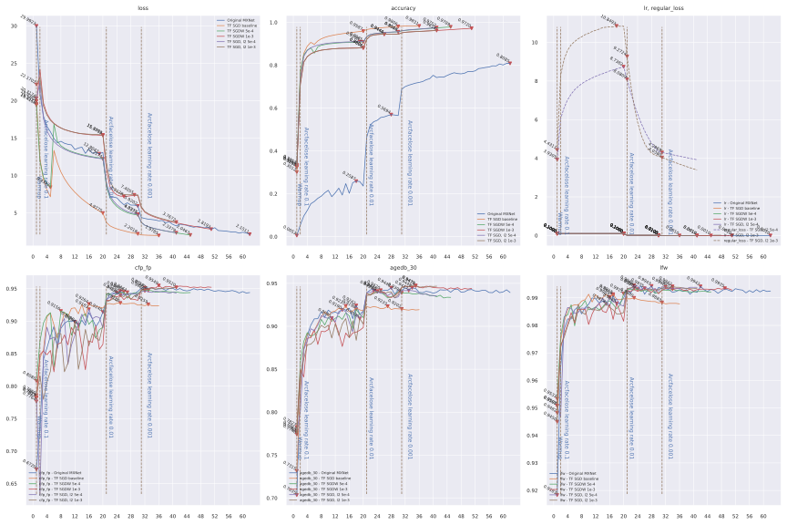

# ___Keras insightface___
***

# License
  This is the keras implementation of [deepinsight/insightface](https://github.com/deepinsight/insightface), and is released under the MIT License. There is no limitation for both acadmic and commercial usage.

  The training data containing the annotation (and the models trained with these data) are available for non-commercial research purposes only.
# Table of Contents
  <!-- TOC depthFrom:1 depthTo:6 withLinks:1 updateOnSave:1 orderedList:0 -->

  - [___Keras insightface___](#keras-insightface)
  - [License](#license)
  - [Table of Contents](#table-of-contents)
  - [Current accuracy](#current-accuracy)
  - [Comparing Resnet34 with original MXNet version](#comparing-resnet34-with-original-mxnet-version)
  - [Usage](#usage)
  	- [Environment](#environment)
  	- [Beforehand Data Prepare](#beforehand-data-prepare)
  	- [Training scripts](#training-scripts)
  	- [Learning rate](#learning-rate)
  	- [Other backbones](#other-backbones)
  	- [Optimizer with weight decay](#optimizer-with-weight-decay)
  	- [Multi GPU train using horovod or distribute strategy](#multi-gpu-train-using-horovod-or-distribute-strategy)
  - [TFLite model inference time test on ARM32](#tflite-model-inference-time-test-on-arm32)
  - [Sub Center ArcFace](#sub-center-arcface)
  - [Knowledge distillation](#knowledge-distillation)
  - [Evaluating on IJB datasets](#evaluating-on-ijb-datasets)
  - [Related Projects](#related-projects)

  <!-- /TOC -->
***

# Current accuracy

  | Model backbone   | Dataset | lfw      | cfp_fp   | agedb_30 | Epochs |
  | ---------------- | ------- | -------- | -------- | -------- | ------ |
  | [Mobilenet](https://drive.google.com/file/d/1Sumc1LvVKJ4j1adD4zLEMw_XZgv9akFp/view?usp=sharing)        | Emore |0.996167 | 0.948429 | 0.955333 | 120    |
  | [se_mobilefacenet](https://drive.google.com/file/d/1AjoIxOkiKIzAGml5Jdpq05Y4vM4Ke-Kj/view?usp=sharing) | Emore | 0.996333 | 0.964714 | 0.958833 | 100    |
  | [Resnet34](https://drive.google.com/file/d/1qmUcSDyftp7TScJHQQXm33wEwDfuTc4l/view?usp=sharing) | CASIA | 0.993667 | 0.949143 | 0.946333 | 40     |
  | [ResNet101V2](https://drive.google.com/file/d/1-5YHQmT1iNI5-jKogJ1-sh94CS7ptHgb/view?usp=sharing)      | Emore | 0.997833 | 0.946 | 0.972833 | 40    |
  | [ResNeSt101](https://drive.google.com/file/d/1RVjTRhE8Evqyjl83EVBMOjInxtDtxGyH/view?usp=sharing)       | Emore | 0.997667 | 0.981000 | 0.973333 | 100    |
***

# Comparing Resnet34 with original MXNet version
  - The [original MXNet version](https://github.com/deepinsight/insightface) has a self defined [resnet](https://github.com/deepinsight/insightface/blob/master/recognition/symbol/fresnet.py) which is different with keras build-in version.
    - Basic block is different, containing less layers.
    - In `Resnet50` case , blocks number changes from `[3, 4, 6, 3]` to `[3, 4, 14, 3]`.
    - Remove `bias` from `Conv2D` layers.
    - Use `PReLU` instead of `relu`.
  - **Original MXNet version** Train `Resnet34` on `CASIA` dataset.
    - `CASIA` dataset contains `490623` images belongs to `10572` classes, for `batch_size = 512`, means `959 steps` per epoch.
    - Learning rate decay on `epochs = [20, 30]`, means `--lr-steps '19180,28770'`.
    ```sh
    cd ~/workspace/insightface/recognition/ArcFace
    CUDA_VISIBLE_DEVICES='0' python train.py --network r34 --dataset casia --loss 'arcface' --per-batch-size 512 --lr-steps '19180,28770' --verbose 959
    ```
  - **Keras version**
    - Use a self defined `Resnet34` based on [keras application resnet](https://github.com/tensorflow/tensorflow/blob/master/tensorflow/python/keras/applications/resnet.py), which is similar with the MXNet version. Other parameters is almost a mimic of the MXNet version.
    - `MXNet SGD` behaves different with `tfa SGDW`, detail explains [here the discussion](https://github.com/leondgarse/Keras_insightface/discussions/19). It's mathematically `adding l2 regularizer` works same with `MXNet SGD weight_decay with momentum`, as long as applying `wd_mult`.
    - In my test, `MXNet wd_mult` is NOT working if just added in `mx.symbol.Variable`, has to be added by `opt.set_wd_mult`.
    - Have to train 1 epoch to warmup first, maybe caused be the initializer.
    - The difference in training accuracy is that the MXNet version calculating accuracy **after** applying `arcface` conversion, mine is before.
    ```py
    # import tensorflow_addons as tfa
    import train, losses

    data_basic_path = '/datasets/'
    data_path = data_basic_path + 'faces_casia_112x112_folders'
    eval_paths = [data_basic_path + ii for ii in ['faces_casia/lfw.bin', 'faces_casia/cfp_fp.bin', 'faces_casia/agedb_30.bin']]

    basic_model = train.buildin_models("r34", dropout=0.4, emb_shape=512, output_layer='E', bn_momentum=0.9, bn_epsilon=2e-5)
    basic_model = train.add_l2_regularizer_2_model(basic_model, 1e-3, apply_to_batch_normal=True)
    tt = train.Train(data_path, save_path='resnet34_MXNET_E_SGD_REG_1e3_lr1e1_random0_arc_S32_E1_BS512_casia.h5',
        eval_paths=eval_paths, basic_model=basic_model, model=None, lr_base=0.1, lr_decay=0.1, lr_decay_steps=[20, 30],
        batch_size=512, random_status=0, output_weight_decay=1)

    # optimizer = tfa.optimizers.SGDW(learning_rate=0.1, weight_decay=5e-4, momentum=0.9)
    optimizer = keras.optimizers.SGD(learning_rate=0.1, momentum=0.9)
    sch = [
        {"loss": losses.ArcfaceLoss(scale=32), "epoch": 1, "optimizer": optimizer},
        {"loss": losses.ArcfaceLoss(scale=64), "epoch": 40},
    ]
    tt.train(sch, 0)
    ```
  - **Results** This result is just showing `Keras` is able to reproduce `MXNet` accuracy using similar strategy and backbone.

    | Backbone    | Optimizer | wd   | l2_reg | lfw,cfp_fp,agedb_30,epoch       |
    | ----------- | --------- | ---- | ------ | ------------------------------- |
    | MXNet r34   | SGD       | 5e-4 | None   | 0.9933, 0.9514, 0.9448, E31     |
    | TF resnet34 | SGD       | None | None   | 0.9897, 0.9269, 0.9228, E20     |
    | TF resnet34 | SGDW      | 5e-4 | None   | 0.9927, 0.9476, 0.9388, E32     |
    | TF resnet34 | SGDW      | 1e-3 | None   | 0.9935, **0.9549**, 0.9458, E35 |
    | TF resnet34 | SGD       | None | 5e-4   | **0.9940**, 0.9466, 0.9415, E31 |
    | TF resnet34 | SGD       | None | 1e-3   | 0.9937, 0.9491, **0.9463**, E31 |

    
***

# Usage
## Environment
  - **Nvidia CUDA and cudnn** `Tensorflow 2.4.0` now using `cuda==11.0` `cudnn==8.0`
    - [Install cuda-toolkit](https://developer.nvidia.com/cuda-toolkit)
    - [Install cudnn](https://developer.nvidia.com/rdp/cudnn-download)
  - **python and tensorflow version**
    ```py
    # $ ipython
    Python 3.7.6 | packaged by conda-forge | (default, Mar 23 2020, 23:03:20)
    In [1]: tf.__version__
    Out[1]: '2.4.0'

    In [2]: import tensorflow_addons as tfa
    In [3]: tfa.__version__
    Out[3]: '0.12.0-dev'
    ```
    Or `tf-nightly`
    ```py
    In [1]: tf.__version__
    Out[1]: '2.5.0-dev20201218'
    ```
  - **Default import**
    ```py
    import os
    import sys
    import pandas as pd
    import numpy as np
    import tensorflow as tf
    from tensorflow import keras

    gpus = tf.config.experimental.list_physical_devices("GPU")
    for gpu in gpus:
        tf.config.experimental.set_memory_growth(gpu, True)
    ```
  - **Conda install `tf-nightly`**
    ```sh
    conda create -n tf-nightly
    conda activate tf-nightly
    pip install tf-nightly tfa-nightly glob2 pandas tqdm scikit-image scikit-learn ipython
    ```
## Beforehand Data Prepare
  - **Training Data** in this project is downloaded from [Insightface Dataset Zoo](https://github.com/deepinsight/insightface/wiki/Dataset-Zoo)
  - **Evaluating data** is `LFW` `CFP-FP` `AgeDB-30` bin files included in `MS1M-ArcFace` dataset
  - Any other data is also available just in the right format
  - **[prepare_data.py](prepare_data.py)** script, Extract data from mxnet record format to `folders`.
    ```sh
    # Convert `/datasets/faces_emore` to `/datasets/faces_emore_112x112_folders`
    CUDA_VISIBLE_DEVICES='-1' ./prepare_data.py -D /datasets/faces_emore
    # Convert evaluating bin files
    CUDA_VISIBLE_DEVICES='-1' ./prepare_data.py -D /datasets/faces_emore -T lfw.bin cfp_fp.bin agedb_30.bin
    ```
    Executing again will skip `dataset` conversion.
  - **Training dataset Required** is a `folder` including `person folders`, each `person folder` including multi `face images`. Format like
    ```sh
    .               # dataset folder
    ├── 0           # person folder
    │   ├── 100.jpg # face image
    │   ├── 101.jpg # face image
    │   └── 102.jpg # face image
    ├── 1           # person folder
    │   ├── 111.jpg
    │   ├── 112.jpg
    │   └── 113.jpg
    ├── 10
    │   ├── 707.jpg
    │   ├── 708.jpg
    │   └── 709.jpg
    ```
  - **Evaluating bin files** include jpeg image data pairs, and a label indicating if it's a same person, so there are double images than labels
    ```sh
    #    bins   | issame_list
    img_1 img_2 | 1
    img_3 img_4 | 1
    img_5 img_6 | 0
    img_7 img_8 | 0
    ```
    Image data in bin files like `CFP-FP` `AgeDB-30` is not compatible with `tf.image.decode_jpeg`, we need to reformat it, which is done by `-T` parameter.
    ```py
    ''' Throw error if not reformated yet '''
    ValueError: Can't convert non-rectangular Python sequence to Tensor.
    ```
## Training scripts
  - **Basic Scripts**
    - [backbones](backbones) basic model implementation of `mobilefacenet` / `mobilenetv3` / `resnest` / `efficientnet`. Most of them are copied from `keras.applications` source code and modified. Other backbones like `ResNet101V2` is loaded from `keras.applications` in `train.buildin_models`.
    - [data.py](data.py) loads image data as `tf.dataset` for training. `Triplet` dataset is different from others.
    - [evals.py](evals.py) contains evaluating callback using `bin` files.
    - [losses.py](losses.py) contains `softmax` / `arcface` / `centerloss` / `triplet` loss functions.
    - [myCallbacks.py](myCallbacks.py) contains my other callbacks, like saving model / learning rate adjusting / save history.
    - [train.py](train.py) contains a `Train` class. It uses a `scheduler` to connect different `loss` / `optimizer` / `epochs`. The basic function is simply `basic_model` --> `build dataset` --> `add output layer` --> `add callbacks` --> `compile` --> `fit`.
  - **Other Scripts**
    - [IJB_evals.py](IJB_evals.py) evaluates model accuracy using [insightface/evaluation/IJB/](https://github.com/deepinsight/insightface/tree/master/evaluation/IJB) datasets.
    - [data_drop_top_k.py](data_drop_top_k.py) create dataset after trained with [Sub Center ArcFace](#sub-center-arcface) method.
    - [data_distiller.py](data_distiller.py) create dataset for [Knowledge distillation](#knowledge-distillation).
    - [plot.py](plot.py) contains a history plot function.
    - [video_test.py](video_test.py) can be used to test model using video camera.
  - **Model** contains two part
    - **Basic model** is layers from `input` to `embedding`.
    - **Model** is `Basic model` + `bottleneck` layer, like `softmax` / `arcface` layer. For triplet training, `Model` == `Basic model`. For combined `loss` training, it may have multiple outputs.
  - **Training example** `train.Train` is mostly functioned as a scheduler.
    ```py
    from tensorflow import keras
    import losses
    import train
    import tensorflow_addons as tfa

    # basic_model = train.buildin_models("ResNet101V2", dropout=0.4, emb_shape=512, output_layer="E")
    # basic_model = train.buildin_models("ResNest50", dropout=0.4, emb_shape=512, output_layer="E")
    # basic_model = train.buildin_models('EfficientNetB4', dropout=0, emb_shape=256, output_layer="GDC")
    # basic_model = mobile_facenet.mobile_facenet(256, dropout=0, name="mobile_facenet_256")
    # basic_model = mobile_facenet.mobile_facenet(256, dropout=0, name="se_mobile_facenet_256", use_se=True)
    basic_model = train.buildin_models("MobileNet", dropout=0, emb_shape=256, output_layer="GDC")
    data_path = '/datasets/faces_emore_112x112_folders'
    eval_paths = ['/datasets/faces_emore/lfw.bin', '/datasets/faces_emore/cfp_fp.bin', '/datasets/faces_emore/agedb_30.bin']

    tt = train.Train(data_path, save_path='keras_mobilenet_emore.h5', eval_paths=eval_paths,
                    basic_model=basic_model, lr_base=0.001, batch_size=512, random_status=2)
    optimizer = tfa.optimizers.AdamW(weight_decay=5e-5)
    sch = [
      {"loss": keras.losses.CategoricalCrossentropy(label_smoothing=0.1), "centerloss": 0.01, "optimizer": optimizer, "epoch": 20},
      {"loss": keras.losses.CategoricalCrossentropy(label_smoothing=0.1), "centerloss": 0.1, "epoch": 20},
      {"loss": keras.losses.CategoricalCrossentropy(label_smoothing=0.1), "centerloss": 1, "epoch": 20},
      {"loss": losses.ArcfaceLoss(), "epoch": 20, "triplet": 64, "alpha": 0.3},
      {"loss": losses.ArcfaceLoss(), "epoch": 20, "triplet": 64, "alpha": 0.25},
      {"loss": losses.ArcfaceLoss(), "epoch": 20, "triplet": 64, "alpha": 0.2},
    ]
    tt.train(sch, 0)
    ```
  - **train.print_buildin_models** is used to print build-in model names in `train.py`.
    ```py
    >>>> buildin_models
    MXNet version resnet: r34, r50, r100, r101,
    Keras application: mobilenet, mobilenetv2, resnet50, resnet50v2, resnet101, resnet101v2, resnet152, resnet152v2
    EfficientNet: efficientnetb[0-7], efficientnetl2,
    Custom: se_resnext, resnest50, resnest101, mobilenetv3_small, mobilenetv3_large, mobilefacenet, se_mobilefacenet,
    Or other names from keras.applications like DenseNet121 / InceptionV3 / NASNetMobile / VGG19.
    ```
  - **train.add_l2_regularizer_2_model** will add `l2_regularizer` to model layers. The actual added `l2` value is divided by `2`.
    ```py
    # Will add keras.regularizers.L2(5e-4) to all layers
    basic_model = train.add_l2_regularizer_2_model(basic_model, 1e-3, apply_to_batch_normal=True)
    ```
  - **train.Train model parameters** including `basic_model` / `model`. Combine them to initialize model from different sources. Sometimes may need `custom_objects` to load model.
    | basic_model                                                     | model           | Used for                                   |
    | --------------------------------------------------------------- | --------------- | ------------------------------------------ |
    | model structure                                                 | None            | Scratch train                              |
    | basic model .h5 file                                            | None            | Continue training from a saved basic model |
    | None for 'embedding' layer or layer index of basic model output | model .h5 file  | Continue training from last saved model    |
    | None for 'embedding' layer or layer index of basic model output | model structure | Continue training from a modified model    |
  - **train.Train output_weight_decay** controls `L2 regularizer` value added to `output_layer`.
    - `0` for None.
    - `(0, 1)` for specific value, actual added value will also divided by `2`.
    - `>= 1` will be value multiplied by `L2 regularizer` value in `basic_model` if added.
  - **Scheduler** is a list of dicts, each contains a training plan
    - **loss** indicates the loss function. **Required**.
    - **optimizer** is the optimizer used in this plan, `None` indicates using the last one.
    - **epoch** indicates how many epochs will be trained. **Required**.
    - **bottleneckOnly** True / False, `True` will set `basic_model.trainable = False`, train the output layer only.
    - **centerloss** float value, if set a non zero value, attach a `CenterLoss` to `logits_loss`, and the value means `loss_weight`.
    - **triplet** float value, if set a non zero value, attach a `BatchHardTripletLoss` to `logits_loss`, and the value means `loss_weight`.
    - **alpha** float value, default to `0.35`. Alpha value for `BatchHardTripletLoss` if attached.
    - **lossTopK** indicates the `top K` value for [Sub Center ArcFace](#sub-center-arcface) method.
    - **distill** indicates the `loss_weight` for `distiller_loss` using [Knowledge distillation](#knowledge-distillation), default `7`.
    - **type** `softmax` / `arcface` / `triplet` / `center`, but mostly this could be guessed from `loss`.
    ```py
    # Scheduler examples
    sch = [
        {"loss": losses.scale_softmax, "optimizer": "adam", "epoch": 2},
        {"loss": keras.losses.CategoricalCrossentropy(label_smoothing=0.1), "centerloss": 0.01, "epoch": 2},
        {"loss": losses.ArcfaceLoss(scale=32.0, label_smoothing=0.1), "optimizer": keras.optimizers.SGD(0.1, momentum=0.9), "epoch": 2},
        {"loss": losses.BatchAllTripletLoss(0.3), "epoch": 2},
        {"loss": losses.BatchHardTripletLoss(0.25), "epoch": 2},
        {"loss": losses.CenterLoss(num_classes=85742, emb_shape=256), "epoch": 2},
    ]
    ```
    Some more complicated combinations are also supported.
    ```py
    # `softmax` / `arcface` + `triplet`
    sch = [{"loss": keras.losses.CategoricalCrossentropy(label_smoothing=0.1), "triplet": 1, "alpha": 0.3, "epoch": 2}]
    # `triplet` + `centerloss`
    sch = [{"loss": losses.BatchHardTripletLoss(0.25), "centerloss": 0.01, "epoch": 2}]
    sch = [{"loss": losses.CenterLoss(num_classes=85742, emb_shape=256), "triplet": 10, "alpha": 0.25, "epoch": 2}]
    # `softmax` / `arcface` + `triplet` + `centerloss`
    sch = [{"loss": losses.ArcfaceLoss(), "centerloss": 1, "triplet": 32, "alpha": 0.2, "epoch": 2}]
    ```
  - **Saving strategy**
    - **Model** will save the latest one on every epoch end to local path `./checkpoints`, name is specified by `train.Train` `save_path`.
    - **basic_model** will be saved monitoring on the last `eval_paths` evaluating `bin` item, and save the best only.
    ```py
    ''' Continue training from last saved file '''
    from tensorflow import keras
    import losses, train
    data_path = '/datasets/faces_emore_112x112_folders'
    eval_paths = ['/datasets/faces_emore/lfw.bin', '/datasets/faces_emore/cfp_fp.bin', '/datasets/faces_emore/agedb_30.bin']
    tt = train.Train(data_path, 'keras_mobilenet_emore_II.h5', eval_paths, model='./checkpoints/keras_mobilenet_emore.h5',
                    compile=True, lr_base=0.001, batch_size=480, random_status=3)
    sch = [
      # {"loss": keras.losses.CategoricalCrossentropy(label_smoothing=0.1), "centerloss": 0.01, "optimizer": optimizer, "epoch": 20},
      # {"loss": keras.losses.CategoricalCrossentropy(label_smoothing=0.1), "centerloss": 0.1, "epoch": 20},
      {"loss": keras.losses.CategoricalCrossentropy(label_smoothing=0.1), "centerloss": 1, "epoch": 5},
      {"loss": losses.ArcfaceLoss(), "epoch": 20, "triplet": 64, "alpha": 0.3},
      {"loss": losses.ArcfaceLoss(), "epoch": 20, "triplet": 64, "alpha": 0.25},
      {"loss": losses.ArcfaceLoss(), "epoch": 20, "triplet": 64, "alpha": 0.2},
    ]
    tt.train(sch, 45) # 45 is the initial_epoch
    ```
    If reload a `centerloss` trained model, please keep `save_path` same as previous, as `centerloss` needs to reload saved `xxx_centers.npy` by `save_path` name.
  - **Gently stop** is a callback to stop training gently. Input an `n` and `<Enter>` anytime during training, will set training stop on that epoch ends.
  - **My history**
    - This is a callback collecting training `loss`, `accuracy` and `evaluating accuracy`.
    - On every epoch end, backup to the path `save_path` defined in `train.Train` with suffix `_hist.json`.
    - Reload when initializing, if the backup `<save_path>_hist.json` file exists.
  - **Evaluation**
    ```py
    import evals
    basic_model = keras.models.load_model('checkpoints/keras_mobilefacenet_256_basic_agedb_30_epoch_39_0.942500.h5', compile=False)
    ee = evals.eval_callback(basic_model, '/datasets/faces_emore/lfw.bin')
    ee.on_epoch_end(0)
    # >>>> lfw evaluation max accuracy: 0.993167, thresh: 0.316535, previous max accuracy: 0.000000, PCA accuray = 0.993167 ± 0.003905
    # >>>> Improved = 0.993167
    ```
    Default evaluating strategy is `on_epoch_end`. Setting an `eval_freq` greater than `1` in `train.Train` will also **add** an `on_batch_end` evaluation.
    ```py
    # Change evaluating strategy to `on_epoch_end`, as long as `on_batch_end` for every `1000` batch.
    tt = train.Train(data_path, 'keras_mobilefacenet_256.h5', eval_paths, basic_model=basic_model, eval_freq=1000)
    ```
## Learning rate
  - `train.Train` parameters `lr_base` / `lr_decay` / `lr_decay_steps` set different decay strategies and their parameters.
  - **Exponential decay** default one, `lr_base` and `lr_decay` in `train.Train` set it. Default is `lr_base=0.001, lr_decay=0.05`.
  - **Cosine decay with restart**
    - Set `lr_decay` with a value `> 1` will use `cosine lr decay`, in this case `lr_decay` means `total decay steps`.
    - Set `lr_decay_steps` with a value `> 1` will set decay on every `NUM` batches, default `lr_decay_steps=0` means decay on every epoch.
    - Other default values `restarts=4, t_mul=2.0, m_mul=0.5` are set in `myCallbacks.py`. See `keras.experimental.CosineDecayRestarts` for detail.
  - **Constant decay**
    - Set `lr_decay_steps` a list will use `Constant lr decay`, in this case `lr_decay_steps` means the decay epochs.
    - `lr_base` and `lr_decay` set the lr base and decay rate on each decay epoch.
  ```py
  # Exponential, lr_decay < 1
  tt = train.Train(..., lr_base=0.001, lr_decay=0.05, ...)
  # Cosine with restarts on epoch, lr_decay > 1
  tt = train.Train(..., lr_base=0.001, lr_decay=105, lr_decay_steps=0, lr_min=1e-7, ...)
  # Cosine with restarts on batch, lr_decay > 1 and lr_decay_steps > 1
  tt = train.Train(..., lr_base=0.001, lr_decay=105 * 1000, lr_decay_steps=1000, lr_min=1e-7, ...)
  # Constant, lr_decay_steps is a list
  tt = train.Train(..., lr_base=0.1, lr_decay=0.1, lr_decay_steps=[3, 5, 7, 16, 20, 24], ...)
  ```
  ```py
  import myCallbacks
  epochs = np.arange(120)
  plt.figure(figsize=(14, 6))
  plt.plot(epochs, [myCallbacks.scheduler(ii, 0.001, 0.1) for ii in epochs], label="lr=0.001, decay=0.1")
  plt.plot(epochs, [myCallbacks.scheduler(ii, 0.001, 0.05) for ii in epochs], label="lr=0.001, decay=0.05")
  plt.plot(epochs, [myCallbacks.scheduler(ii, 0.001, 0.02) for ii in epochs], label="lr=0.001, decay=0.02")
  aa = myCallbacks.CosineLrScheduler(0.001, 100, 1e-6, 0, restarts=1)
  plt.plot(epochs, [aa.on_epoch_begin(ii) for ii in epochs], label="Cosine, lr=0.001, decay_steps=100, min=1e-6")

  bb = myCallbacks.CosineLrScheduler(0.001, 105 * 1000, lr_min=1e-7, warmup_iters=4 * 1000, lr_on_batch=1000, restarts=4)
  plt.plot([bb.on_train_batch_begin(ii * 1000) for ii in range(120)], label="Cosine restart, lr=0.001, decay_steps=105000, on batch, min=1e-7, warmup=5000, restarts=4")
  bb_25 = bb.on_train_batch_begin(25 * 1000).numpy()
  plt.plot((25, 25), (1e-6, bb_25), 'k:')
  plt.text(25, bb_25, (25, bb_25))

  cc = myCallbacks.CosineLrScheduler(0.001, 120, 1e-7, warmup_iters=1, restarts=4, m_mul=0.5)
  plt.plot(epochs, [cc.on_epoch_begin(ii) for ii in epochs], label="Cosine restart, lr=0.001, decay_steps=120, min=1e-7, warmup=1, restarts=4")

  dd = myCallbacks.ConstantDecayScheduler(sch=[10, 20, 30, 40], lr_base=0.001, decay_rate=0.1)
  plt.plot(epochs, [dd.on_epoch_begin(ii) for ii in epochs], label="Constant, lr=0.001, decay_steps=[10, 20, 30, 40], decay_rate=0.1")

  plt.legend()
  plt.tight_layout()
  ```
  
## Other backbones
  - **EfficientNet** `tf-nightly` / `tf 2.3.0` now includes all `EfficientNet` backbone in `tensorflow.keras.applications`, but it has a `Rescaling` and `Normalization` layer on the head.
    ```py
    tf.__version__
    # '2.3.0-dev20200523'
    mm = tf.keras.applications.efficientnet.EfficientNetB4(include_top=False, weights='imagenet', input_shape=(112, 112, 3))
    [ii.name for ii in mm.layers[:6]]
    # ['input_17', 'rescaling_2', 'normalization_2', 'stem_conv_pad', 'stem_conv', 'stem_bn']
    ```
    So I'm using a modified version in `backbones/efficientnet.py`
    ```py
    from backbones import efficientnet
    mm = efficientnet.EfficientNetB0(weights='imagenet', include_top=False, input_shape=(112, 112, 3))
    [ii.name for ii in mm.layers[:3]]
    # ['input_1', 'stem_conv_pad', 'stem_conv']
    ```
    Other's implementation can be found here [Github qubvel/EfficientNet](https://github.com/qubvel/efficientnet).
  - **ResNeSt / RegNet** [Github QiaoranC/tf_ResNeSt_RegNet_model](https://github.com/QiaoranC/tf_ResNeSt_RegNet_model)
    ```py
    from models.model_factory import get_model
    input_shape = [112, 112, 3]
    n_classes = 100
    fc_activation = 'softmax'
    mm = get_model(model_name="ResNest101",input_shape=input_shape,n_classes=n_classes, verbose=False,fc_activation=fc_activation)
    ```
  - [SE nets](https://github.com/titu1994/keras-squeeze-excite-network)
    ```py
    # This should be under tf 2.3, NOT tf nightly
    tf.__version__
    # '2.3.0'

    !pip install -U git+https://github.com/titu1994/keras-squeeze-excite-network

    from keras_squeeze_excite_network import se_resnext
    mm = se_resnext.SEResNextImageNet(weights='imagenet', input_shape=(112, 112, 3), include_top=False)
    ```
    It's TOO slow training a `se_resnext 101`，takes almost 4 times longer than `ResNet101V2`.
## Optimizer with weight decay
  - [PDF DECOUPLED WEIGHT DECAY REGULARIZATION](https://arxiv.org/pdf/1711.05101.pdf)
  - [tensorflow_addons](https://www.tensorflow.org/addons/api_docs/python/tfa/optimizers/AdamW) provides `SGDW` / `AdamW`.
    ```py
    !pip install tensorflow-addons

    import tensorflow_addons as tfa
    optimizer = tfa.optimizers.SGDW(learning_rate=0.1, weight_decay=5e-4, momentum=0.9)
    optimizer = tfa.optimizers.AdamW(learning_rate=0.001, weight_decay=5e-5)
    ```
    `weight_decay` and `learning_rate` should share the same decay strategy. A callback `OptimizerWeightDecay` will set `weight_decay` according to `learning_rate`.
    ```py
    opt = tfa.optimizers.AdamW(weight_decay=5e-5)
    sch = [{"loss": keras.losses.CategoricalCrossentropy(label_smoothing=0.1), "centerloss": True, "epoch": 60, "optimizer": opt}]
    ```
    The different behavior of `mx.optimizer.SGD weight_decay` / `tfa.optimizers.SGDW weight_decay` / `L2_regulalizer` is explained [here the discussion](https://github.com/leondgarse/Keras_insightface/discussions/19).
  - [Train test on cifar10](https://colab.research.google.com/drive/1tD2OrnrYtFPC7q_i62b8al1o3qelU-Vi?usp=sharing)
## Multi GPU train using horovod or distribute strategy
  - **Horovod** usage is still under test. [Tensorflow multi GPU training using distribute strategies vs Horovod](https://github.com/leondgarse/Keras_insightface/discussions/17)
  - Add an overall `tf.distribute.MirroredStrategy().scope()` `with` block. This is just working in my case... The `batch_size` will be multiplied by `count of GPUs`.
    ```py
    with tf.distribute.MirroredStrategy().scope():
        basic_model = ...
        tt = train.Train(..., batch_size=1024, ...) # With 2 GPUs, `batch_size` will be 2048
        sch = [...]
        tt.train(sch, 0)
    ```
  - Using build-in loss functions like `keras.losses.CategoricalCrossentropy` should specify the `reduction` parameter.
    ```py
    sch = [{"loss": keras.losses.CategoricalCrossentropy(label_smoothing=0.1, reduction=tf.keras.losses.Reduction.NONE), "epoch": 25}]
    ```
***

# TFLite model inference time test on ARM32
  - Test using [TFLite Model Benchmark Tool](https://github.com/tensorflow/tensorflow/tree/master/tensorflow/lite/tools/benchmark)
  - **Platform**
    - CPU: `rk3288`
    - System: `Android`
    - Inference: `TFLite`
  - **mobilenet_v2** comparing `orignal` / `dynamic` / `float16` / `uint8` conversion of `TFLite` model.
    | mobilenet_v2 | threads=1 (ms) | threads=4 (ms) | Size (MB) |
    | ------------ | -------------- | -------------- | --------- |
    | orignal      | 73.930         | 39.180         | 12.049    |
    | orignal xnn  | 55.806         | 23.844         | 12.049    |
    | dynamic      | 65.858         | 53.397         | 3.11019   |
    | dynamic xnn  | 61.564         | 99.096         | 3.11019   |
    | float16      | 73.648         | 38.593         | 6.06125   |
    | float16 xnn  | 56.231         | 23.904         | 6.06125   |
    | uint8        | 41.593         | 23.179         | 3.69072   |
    | MNN          | 47.583         | 27.574         | 12        |
  - **Model comparing**
    | Model                      | threads=1 (ms) | threads=4 (ms) | Size (MB) |
    | -------------------------- | -------------- | -------------- | --------- |
    | mobilenet_v1 float16       | 111.696        | 50.433         | 7.74493   |
    | mobilenet_v1 float16 xnn   | 94.774         | 37.345         | 7.74493   |
    | mobilenet_v1 uint8         | 47.551         | 22.335         | 4.31061   |
    | EB0 float16                | 139.394        | 95.317         | 9.8998    |
    | EB0 float16 xnn            | 117.684        | 69.567         | 9.8998    |
    | EB0 uint8                  | 80.863         | 64.178         | 5.99462   |
    | mobilefacenet float16      | 188.111        | 111.990        | 2.14302   |
    | mobilefacenet float16 xnn  | 118.711        | 54.152         | 2.14302   |
    | mobilefacenet uint8        | 191.208        | 158.794        | 1.30752   |
    | se_mobilefacenet float16   | 191.044        | 118.211        | 2.32702   |
    | mobilenet_v3_small f16 xnn | 22.056         | 14.156         | 3.63155   |
    | mobilenet_v3_large f16 xnn | 59.167         | 34.316         | 9.13332   |
***

# Sub Center ArcFace
  - [Original MXNet Subcenter ArcFace](https://github.com/deepinsight/insightface/tree/master/recognition/SubCenter-ArcFace)
  - [PDF Sub-center ArcFace: Boosting Face Recognition by Large-scale Noisy Web Faces](https://ibug.doc.ic.ac.uk/media/uploads/documents/eccv_1445.pdf)
  - **This is still under test, Multi GPU is NOT tested**
  - As far as I can see
    - `Sub Center ArcFace` works like cleaning the dataset.
    - In `lossTopK=3` case, it will train `3 sub classes` in each label, and each `sub class` is a `center`.
    - Then choose a `domain center`, and remove those are too far away from this `center`.
    - So it's better train a `large model` to clean the `dataset`, and then train other models on the `cleaned dataset`.
  - **Train Original MXNet version**
    ```sh
    cd ~/workspace/insightface/recognition/SubCenter-ArcFace
    cp sample_config.py config.py
    sed -i 's/config.ckpt_embedding = True/config.ckpt_embedding = False/' config.py
    CUDA_VISIBLE_DEVICES='1' python train_parall.py --network r50 --per-batch-size 512
    # Iter[20] Batch [8540], accuracy 0.80078125, loss 1.311261, lfw 0.99817, cfp_fp 0.97557, agedb_30 0.98167

    CUDA_VISIBLE_DEVICES='1' python drop.py --data /datasets/faces_emore --model models/r50-arcface-emore/model,1 --threshold 75 --k 3 --output /datasets/faces_emore_topk3_1
    # header0 label [5822654. 5908396.] (5822653, 4)
    # total: 5800493

    sed -i 's/config.ckpt_embedding = False/config.ckpt_embedding = True/' config.py
    sed -i 's/config.loss_K = 3/config.loss_K = 1/' config.py
    sed -i 's#/datasets/faces_emore#/datasets/faces_emore_topk3_1#' config.py
    ls -1 /datasets/faces_emore/*.bin | xargs -I '{}' ln -s {} /datasets/faces_emore_topk3_1/
    CUDA_VISIBLE_DEVICES='1' python train_parall.py --network r50 --per-batch-size 512
    # 5800493
    # Iter[20] Batch [5400], accuracy 0.8222656, loss 1.469272, lfw 0.99833, cfp_fp 0.97986, agedb_30 0.98050
    ```
  - **Keras version train mobilenet on CASIA test**
    ```py
    import tensorflow_addons as tfa
    import train, losses

    data_basic_path = '/datasets/faces_casia'
    data_path = data_basic_path + '_112x112_folders'
    eval_paths = [os.path.join(data_basic_path, ii) for ii in ['lfw.bin', 'cfp_fp.bin', 'agedb_30.bin']]

    """ First, Train with `lossTopK = 3` """
    basic_model = train.buildin_models("mobilenet", dropout=0, emb_shape=256, output_layer='E')
    tt = train.Train(data_path, save_path='TT_mobilenet_topk_bs256.h5', eval_paths=eval_paths,
        basic_model=basic_model, model=None, lr_base=0.1, lr_decay=0.1, lr_decay_steps=[20, 30],
        batch_size=256, random_status=0, output_wd_multiply=1)

    optimizer = tfa.optimizers.SGDW(learning_rate=0.1, weight_decay=5e-4, momentum=0.9)
    sch = [
        {"loss": losses.ArcfaceLoss(scale=16), "epoch": 5, "optimizer": optimizer, "lossTopK": 3},
        {"loss": losses.ArcfaceLoss(scale=32), "epoch": 5, "lossTopK": 3},
        {"loss": losses.ArcfaceLoss(scale=64), "epoch": 40, "lossTopK": 3},
    ]
    tt.train(sch, 0)

    """ Then drop non-dominant subcenters and high-confident noisy data, which is `>75 degrees` """
    import data_drop_top_k
    # data_drop_top_k.data_drop_top_k('./checkpoints/TT_mobilenet_topk_bs256.h5', '/datasets/faces_casia_112x112_folders/', limit=20)
    new_data_path = data_drop_top_k.data_drop_top_k(tt.model, tt.data_path)

    """ Train with the new dataset again, this time `lossTopK = 1` """
    tt.reset_dataset(new_data_path)
    optimizer = tfa.optimizers.SGDW(learning_rate=0.1, weight_decay=5e-4, momentum=0.9)
    sch = [
        {"loss": losses.ArcfaceLoss(scale=16), "epoch": 5, "optimizer": optimizer},
        {"loss": losses.ArcfaceLoss(scale=32), "epoch": 5},
        {"loss": losses.ArcfaceLoss(scale=64), "epoch": 40},
    ]
    tt.train(sch, 0)
    ```
  - `data_drop_top_k.py` can also be used as a script. `-M` and `-D` are required.
    ```sh
    $ CUDA_VISIBLE_DEVICES='-1' ./data_drop_top_k.py -h
    # usage: data_drop_top_k.py [-h] -M MODEL_FILE -D DATA_PATH [-d DEST_FILE]
    #                           [-t DEG_THRESH] [-L LIMIT]
    #
    # optional arguments:
    #   -h, --help            show this help message and exit
    #   -M MODEL_FILE, --model_file MODEL_FILE
    #                         Saved model file path, NOT basic_model (default: None)
    #   -D DATA_PATH, --data_path DATA_PATH
    #                         Original dataset path (default: None)
    #   -d DEST_FILE, --dest_file DEST_FILE
    #                         Dest file path to save the processed dataset npz
    #                         (default: None)
    #   -t DEG_THRESH, --deg_thresh DEG_THRESH
    #                         Thresh value in degree, [0, 180] (default: 75)
    #   -L LIMIT, --limit LIMIT
    #                         Test parameter, limit converting only the first [NUM]
    #                         ones (default: 0)
    ```
    ```sh
    $ CUDA_VISIBLE_DEVICES='-1' ./data_drop_top_k.py -M checkpoints/TT_mobilenet_topk_bs256.h5 -D /datasets/faces_casia_112x112_folders/ -L 20
    ```
  - **[[Discussions] SubCenter_training_Mobilenet_on_CASIA](https://github.com/leondgarse/Keras_insightface/discussions/20)**

    | Scenario                                    | Max lfw    | Max cfp_fp | Max agedb_30 |
    | ------------------------------------------- | ---------- | ---------- | ------------ |
    | Baseline, topk 1                            | 0.9822     | 0.8694     | 0.8695       |
    | TopK 3                                      | 0.9838     | **0.9044** | 0.8743       |
    | TopK 3->1                                   | 0.9838     | 0.8960     | 0.8768       |
    | TopK 3->1, bottleneckOnly, initial_epoch=0  | **0.9878** | 0.8920     | **0.8857**   |
    | TopK 3->1, bottleneckOnly, initial_epoch=40 | 0.9835     | **0.9030** | 0.8763       |
***

# Knowledge distillation
  - [PDF Improving Face Recognition from Hard Samples via Distribution Distillation Loss](https://arxiv.org/pdf/2002.03662.pdf)
  - [PDF VarGFaceNet: An Efficient Variable Group Convolutional Neural Network for Lightweight Face Recognition](https://arxiv.org/pdf/1910.04985.pdf)
  - `data_distiller.py` works to extract `embedding` data from images and save locally. `MODEL_FILE` can be ether `Keras h5` / `MXNet model`.
    ```sh
    $ CUDA_VISIBLE_DEVICES='-1' ./data_distiller.py -h
    # usage: data_distiller.py [-h] -M MODEL_FILE -D DATA_PATH [-d DEST_FILE]
    #                          [-b BATCH_SIZE] [-L LIMIT]
    #
    # optional arguments:
    #   -h, --help            show this help message and exit
    #   -M MODEL_FILE, --model_file MODEL_FILE
    #                         Saved basic_model file path, NOT model, could be keras
    #                         / mxnet one (default: None)
    #   -D DATA_PATH, --data_path DATA_PATH
    #                         Original dataset path (default: None)
    #   -d DEST_FILE, --dest_file DEST_FILE
    #                         Dest file path to save the processed dataset npz
    #                         (default: None)
    #   -b BATCH_SIZE, --batch_size BATCH_SIZE
    #                         Batch size (default: 256)
    #   -L LIMIT, --limit LIMIT
    #                         Test parameter, limit converting only the first [NUM]
    #                         ones (default: 0)
    ```
    ```sh
    $ CUDA_VISIBLE_DEVICES='0' ./data_distiller.py -M subcenter-arcface-logs/r100-arcface-msfdrop75/model,0 -D /datasets/faces_casia_112x112_folders/ -b 32
    # >>>> Output: faces_casia_112x112_folders_shuffle_label_embs_normed_512.npz
    ```
  - Then this dataset can be used to train a new model.
    - Just specify `data_path` as the new dataset path. If key `embeddings` is in, then it will be a `distiller train`.
    - A new loss `distiller_loss` will be added to match this `embeddings` data, default `loss_weights = [1, 7]`. Parameter `distill` in `scheduler` set this loss weight.
    - The `emb_shape` should be same with `teacher`.
    ```py
    import train, losses
    import tensorflow_addons as tfa

    data_basic_path = '/datasets/'
    data_path = 'faces_casia_112x112_folders_shuffle_label_embs_normed_512.npz'
    eval_paths = [data_basic_path + ii for ii in ['faces_casia/lfw.bin', 'faces_casia/cfp_fp.bin', 'faces_casia/agedb_30.bin']]

    basic_model = train.buildin_models("mobilenet", dropout=0.4, emb_shape=512, output_layer='E')
    tt = train.Train(data_path, save_path='TT_mobilenet_distill_bs400.h5', eval_paths=eval_paths,
        basic_model=basic_model, model=None, lr_base=0.1, lr_decay=0.1, lr_decay_steps=[20, 30],
        batch_size=400, random_status=0, output_wd_multiply=1)

    optimizer = tfa.optimizers.SGDW(learning_rate=0.1, weight_decay=5e-4, momentum=0.9)
    sch = [
        {"loss": losses.ArcfaceLoss(scale=16), "epoch": 5, "optimizer": optimizer, "distill": 64},
        {"loss": losses.ArcfaceLoss(scale=32), "epoch": 5, "distill": 64},
        {"loss": losses.ArcfaceLoss(scale=64), "epoch": 40, "distill": 64},
    ]
    tt.train(sch, 0)
    ```
  - **[[Discussions] Knowledge_distillation_training_Mobilenet_on_CASIA](https://github.com/leondgarse/Keras_insightface/discussions/22)**

    | Teacher | Dropout | Optimizer | Distill | Max lfw    | Max cfp_fp | Max agedb_30 |
    | ------- | ------- | --------- | ------- | ---------- | ---------- | ------------ |
    | None    | 0       | SGDW      | 7       | 0.9838     | 0.8730     | 0.8697       |
    | None    | 0.4     | SGDW      | 7       | 0.9837     | 0.8491     | 0.8745       |
    | r34     | 0       | SGDW      | 7       | 0.9890     | 0.9099     | 0.9058       |
    | r100    | 0       | SGDW      | 7       | 0.9900     | 0.9111     | 0.9068       |
    | r100    | 0.4     | SGDW      | 7       | 0.9905     | 0.9170     | 0.9112       |
    | r100    | 0.4     | SGDW      | 64      | **0.9938** | 0.9333     | **0.9435**   |
    | r100    | 0.4     | AdamW     | 64      | 0.9920     | **0.9346** | 0.9387       |
***

# Evaluating on IJB datasets
  - [IJB_evals.py](IJB_evals.py) evaluates model accuracy using [insightface/evaluation/IJB/](https://github.com/deepinsight/insightface/tree/master/evaluation/IJB) datasets.
  - In case placing `IJB` dataset `/media/SD/IJB_release`, basic usage will be:
    ```sh
    # Test mxnet model, default scenario N0D1F1
    CUDA_VISIBLE_DEVICES='1' python IJB_evals.py -m '/media/SD/IJB_release/pretrained_models/MS1MV2-ResNet100-Arcface/model,0' -d /media/SD/IJB_release -L

    # Test keras h5 model, default scenario N0D1F1
    CUDA_VISIBLE_DEVICES='1' python IJB_evals.py -m 'checkpoints/basic_model.h5' -d /media/SD/IJB_release -L

    # `-B` to run all 8 tests N{0,1}D{0,1}F{0,1}
    CUDA_VISIBLE_DEVICES='1' python IJB_evals.py -m 'checkpoints/basic_model.h5' -d /media/SD/IJB_release -B -L

    # `-N` to run 1N test
    CUDA_VISIBLE_DEVICES='1' python IJB_evals.py -m 'checkpoints/basic_model.h5' -d /media/SD/IJB_release -N -L

    # `-E` to save embeddings data
    CUDA_VISIBLE_DEVICES='1' python IJB_evals.py -m 'checkpoints/basic_model.h5' -d /media/SD/IJB_release -E
    # Then can be restored for other tests, add `-E` to save again
    python IJB_evals.py -R IJB_result/MS1MV2-ResNet100-Arcface_IJBB.npz -d /media/SD/IJB_release -B

    # Plot result only, this needs the `label` data, which can be saved using `-L` parameter.
    # Or should provide the label txt file.
    python IJB_evals.py --plot_only /media/SD/IJB_release/IJBB/result/*100*.npy /media/SD/IJB_release/IJBB/meta/ijbb_template_pair_label.txt
    ```
  - See `-h` for detail usage.
    ```sh
    python IJB_evals.py -h
    ```
***

# Related Projects
  - [TensorFlow Addons Losses: TripletSemiHardLoss](https://www.tensorflow.org/addons/tutorials/losses_triplet)
  - [TensorFlow Addons Layers: WeightNormalization](https://www.tensorflow.org/addons/tutorials/layers_weightnormalization)
  - [deepinsight/insightface](https://github.com/deepinsight/insightface)
  - [Github titu1994/keras-squeeze-excite-network](https://github.com/titu1994/keras-squeeze-excite-network)
  - [Github qubvel/EfficientNet](https://github.com/qubvel/efficientnet)
  - [Github QiaoranC/tf_ResNeSt_RegNet_model](https://github.com/QiaoranC/tf_ResNeSt_RegNet_model)
  - [Partial FC: Training 10 Million Identities on a Single Machine](https://arxiv.org/pdf/2010.05222.pdf)
***
