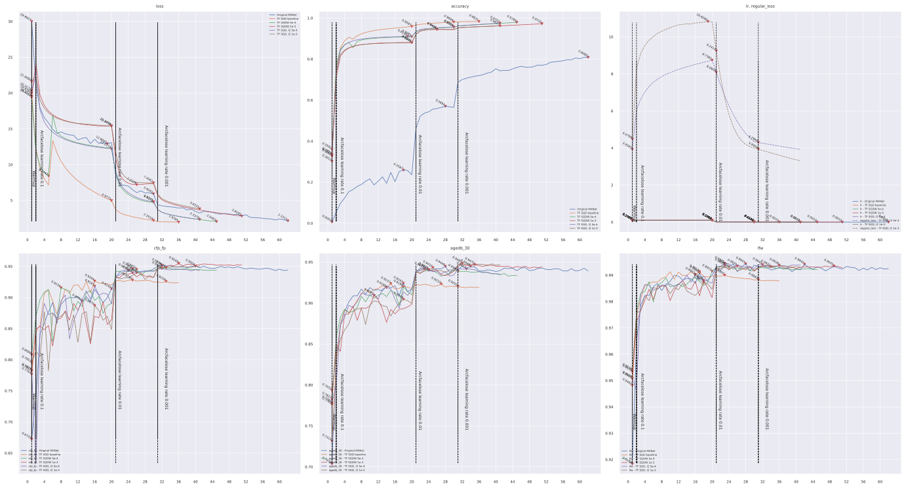

# ___Keras insightface___
  - Keras Insightface implementation.
  - This is still under working, many things are still testing here, so there may lots of errors atm.
  - **Any advise is welcome**!
  - **Environment**
    ```py
    # $ ipython
    Python 3.7.6 | packaged by conda-forge | (default, Mar 23 2020, 23:03:20)
    In [1]: tf.__version__
    Out[1]: '2.3.1'
    ```
    Or `tf-nightly`
    ```py
    In [1]: tf.__version__
    Out[1]: '2.4.0-dev20200806'
    ```
  - **Default import**
    ```py
    import os
    import sys
    import pandas as pd
    import numpy as np
    import tensorflow as tf
    from tensorflow import keras

    gpus = tf.config.experimental.list_physical_devices("GPU")
    for gpu in gpus:
        tf.config.experimental.set_memory_growth(gpu, True)
    ```
  - **Conda install `tf-nightly`**
    ```sh
    conda create -n tf-nightly
    conda activate tf-nightly
    pip install tf-nightly glob2 pandas tqdm scikit-image scikit-learn ipython

    # Install cuda 10.1 if not installed
    conda install cudnn=7.6.5=cuda10.1_0
    ```
# Table of Contents
  <!-- TOC depthFrom:1 depthTo:6 withLinks:1 updateOnSave:1 orderedList:0 -->

  - [___Keras insightface___](#keras-insightface)
  - [Table of Contents](#table-of-contents)
  - [Current accuracy](#current-accuracy)
  - [Comparing Resnet34 with original MXNet version](#comparing-resnet34-with-original-mxnet-version)
  - [Usage](#usage)
  	- [Beforehand Data Prepare](#beforehand-data-prepare)
  	- [Training scripts](#training-scripts)
  	- [Learning rate](#learning-rate)
  	- [Other backbones](#other-backbones)
  	- [Optimizer with weight decay](#optimizer-with-weight-decay)
  	- [Multi GPU train](#multi-gpu-train)
  	- [TFLite model inference time test on ARM32](#tflite-model-inference-time-test-on-arm32)
  - [Sub Center ArcFace](#sub-center-arcface)
  	- [Loss TopK Usage](#loss-topk-usage)
  	- [Mobilenet test on CASIA dataset](#mobilenet-test-on-casia-dataset)
  - [Related Projects](#related-projects)

  <!-- /TOC -->
***

# Current accuracy

  | Model backbone   | lfw      | cfp_fp   | agedb_30 | Epochs |
  | ---------------- | -------- | -------- | -------- | ------ |
  | [Mobilenet](checkpoints/mobilenet_adamw_BS256_E80_arc_tripD_basic_agedb_30_epoch_123_0.955333.h5)        | 0.996167 | 0.948429 | 0.955333 | 120    |
  | [se_mobilefacenet](checkpoints/keras_se_mobile_facenet_emore_triplet_basic_agedb_30_epoch_100_0.958333.h5) | 0.996333 | 0.964714 | 0.958833 | 100    |
  | [Resnet34 on CASIA](https://drive.google.com/file/d/1EoYQytka3w7EeTh1v9WioBNxolGnPWp6/view?usp=sharing) | 0.994000 | 0.965429 | 0.942333 | 40     |
  | ResNet101V2      | 0.997333 | 0.976714 | 0.971000 | 110    |
  | ResNeSt101       | 0.997667 | 0.981000 | 0.973333 | 100    |
***

# Comparing Resnet34 with original MXNet version
  - The [original MXNet version](https://github.com/deepinsight/insightface) has a self defined [resnet](https://github.com/deepinsight/insightface/blob/master/src/symbols/fresnet.py) which is different with the typical one.
    - Basic block is different, containing less layers.
    - In `Resnet50` case , blocks number changes from `[3, 4, 6, 3]` to `[3, 4, 14, 3]`.
    - Remove `bias` from `Conv2D` layers.
    - Use `PReLU` instead of `relu`.
  - **Original MXNet version** Train `Resnet34` on `CASIA` dataset.
    - `CASIA` dataset contains `490623` images belongs to `10572` classes, for `batch_size = 512`, means `959 steps` per epoch.
    - Learning rate decay on `epochs = [20, 30]`, means `--lr-steps '19180,28770'`.
    ```sh
    CUDA_VISIBLE_DEVICES='0' python -u train_softmax.py --data-dir /datasets/faces_casia --network "r34" \
        --loss-type 4 --prefix "./model/mxnet_r34_casia" --per-batch-size 512 --lr-steps '19180,28770' \
        --margin-s 64.0 --margin-m 0.5 --ckpt 1 --emb-size 512 --fc7-wd-mult 10.0 --wd 0.0005 \
        --verbose 959 --end-epoch 38400 --ce-loss
    ```
  - **Keras version**
    - Use a self defined `Resnet34` based on [keras application resnet](https://github.com/tensorflow/tensorflow/blob/master/tensorflow/python/keras/applications/resnet.py), which is similar with the MXNet version. Other parameters is almost a mimic of the MXNet version.
    - I have to train 1 epoch to warmup first, but still, sometimes the `SGDW` loss value will go very high...
    ```py
    import tensorflow_addons as tfa
    import train, losses

    data_basic_path = '/datasets/'
    data_path = data_basic_path + 'faces_casia_112x112_folders'
    eval_paths = [data_basic_path + ii for ii in ['faces_casia/lfw.bin', 'faces_casia/cfp_fp.bin', 'faces_casia/agedb_30.bin']]

    basic_model = train.buildin_models("resnet34", dropout=0.4, emb_shape=512, output_layer='E', bn_momentum=0.9, bn_epsilon=2e-5)
    tt = train.Train(data_path, save_path='NNNN_resnet34_MXNET_E_sgdw_5e4_dr4_lr1e1_wd10_random0_arc32_E1_arcT4_BS512_casia.h5',
        eval_paths=eval_paths, basic_model=basic_model, model=None, lr_base=0.1, lr_decay=0.1, lr_decay_steps=[20, 30],
        batch_size=512, random_status=0, output_wd_multiply=10)

    optimizer = tfa.optimizers.SGDW(learning_rate=0.1, weight_decay=5e-4, momentum=0.9)
    sch = [
        # {"loss": keras.losses.CategoricalCrossentropy(), "epoch": 1, "optimizer": optimizer},
        {"loss": losses.ArcfaceLossT4(scale=32), "epoch": 1, "optimizer": optimizer},
        {"loss": losses.ArcfaceLossT4(scale=64), "epoch": 40},
    ]
    tt.train(sch, 0)
    ```
  - **Other tests and plot** Keep other parameters fixed, like `lr_decay_steps=[20, 30]` `"epoch": 40`.
    - Original MXNet r34 max accuracy and its epoch: `lfw, cfp_fp, agedb_30 = 0.9940, 0.9496, 0.9477, epoch 35`
    - Original Tensorflow Resnet50 max accuracy and its epoch: `lfw, cfp_fp, agedb_30 = 0.9898, 0.8756, 0.9038, epoch 34`

    | Optimizer | weight decay | lr_base | output layer | output wd multiply | random status | lfw,cfp_fp,agedb_30,epoch   |
    | --------- | ------------ | ------- | ------------ | ------------------ | ------------- | --------------------------- |
    | SGDW      | 5e-4         | 0.1     | E            | 10                 | 0             | 0.9945, 0.9627, 0.9423, E37 |
    | SGDW      | 5e-4         | 0.1     | GDC          | 10                 | 0             | 0.9923, 0.9523, 0.9363, E30 |
    | SGDW      | 5e-4         | 0.1     | E            | 10                 | 3             | 0.9940, 0.9654, 0.9423, E40 |
    | SGDW      | 5e-4         | 0.1     | E            | 1                  | 3             | 0.9940, 0.9637, 0.9383, E38 |
    | AdamW     | 5e-5         | 0.001   | E            | 10                 | 3             | 0.9928, 0.9619, 0.9328, E40 |
    | AdamW     | 5e-5         | 0.001   | E            | 1                  | 3             | 0.9922, 0.9544, 0.9300, E20 |

    - limit the max loss value as `80` when plot.

    
***

# Usage
## Beforehand Data Prepare
  - **Training Data** in this project is `MS1M-ArcFace` downloaded from [Insightface Dataset Zoo](https://github.com/deepinsight/insightface/wiki/Dataset-Zoo)
  - **Evaluating data** is `LFW` `CFP-FP` `AgeDB-30` bin files included in `MS1M-ArcFace` dataset
  - Any other data is also available just in the right format
  - **[prepare_data.py](prepare_data.py)** script, Extract data from mxnet record format to `folders`.
    ```sh
    # Convert `/datasets/faces_emore` to `/datasets/faces_emore_112x112_folders`
    CUDA_VISIBLE_DEVICES='-1' ./prepare_data.py -D /datasets/faces_emore
    # Convert evaluating bin files
    CUDA_VISIBLE_DEVICES='-1' ./prepare_data.py -D /datasets/faces_emore -T lfw.bin cfp_fp.bin agedb_30.bin
    ```
    Executing again will skip `dataset` conversion.
  - **Training dataset Required** is a `folder` including `person folders`, each `person folder` including multi `face images`. Format like
    ```sh
    .               # dataset folder
    ├── 0           # person folder
    │   ├── 100.jpg # face image
    │   ├── 101.jpg # face image
    │   └── 102.jpg # face image
    ├── 1           # person folder
    │   ├── 111.jpg
    │   ├── 112.jpg
    │   └── 113.jpg
    ├── 10
    │   ├── 707.jpg
    │   ├── 708.jpg
    │   └── 709.jpg
    ```
  - **Evaluting bin files** include jpeg image data pairs, and a label indicating if it's a same person, so there are double images than labels
    ```sh
    #    bins   | issame_list
    img_1 img_2 | 1
    img_3 img_4 | 1
    img_5 img_6 | 0
    img_7 img_8 | 0
    ```
    Image data in bin files like `CFP-FP` `AgeDB-30` is not compatible with `tf.image.decode_jpeg`, we need to reformat it.
    ```py
    ''' Throw error if not reformated yet '''
    ValueError: Can't convert non-rectangular Python sequence to Tensor.
    ```
## Training scripts
  - **Scripts**
    - [backbones](backbones) basic model implementation of `mobilefacenet` / `mobilenetv3` / `resnest` / `efficientnet`. Most of them are copied from `keras.applications` source code and modified. Other backbones like `ResNet101V2` is loaded from `keras.applications` in `train.buildin_models`.
    - [data.py](data.py) loads image data as `tf.dataset` for training. `Triplet` dataset is different from others.
    - [data_drop_top_k.py](data_drop_top_k.py) drop `top K` images after trained with `Sub-center ArcFace` method.
    - [data_gen.py](data_gen.py) NOT working, accuracy wont increase. Using `ImageDataGenerator` and `AutoAugment` to load images.
    - [evals.py](evals.py) contains evaluating callback using `bin` files.
    - [losses.py](losses.py) contains `softmax` / `arcface` / `centerloss` / `triplet` loss functions.
    - [myCallbacks.py](myCallbacks.py) contains my other callbacks, like saving model / learning rate adjusting / save history.
    - [plot.py](plot.py) contains a history plot function.
    - [train.py](train.py) contains a `Train` class. It uses a `scheduler` to connect different `loss` / `optimizer` / `epochs`. The basic function is simple `load data --> model --> compile --> fit`.
  - **Model** contains two part
    - **Basic model** is layers from `input` to `embedding`.
    - **Model** is `Basic model` + `bottleneck` layer, like `softmax` / `arcface` layer. For triplet training, `Model` == `Basic model`. For combined `loss` training, it may have multiple outputs.
  - **Training example**
    ```py
    from tensorflow import keras
    import losses
    import train
    import tensorflow_addons as tfa

    basic_model = train.buildin_models("MobileNet", dropout=0, emb_shape=256)
    # basic_model = train.buildin_models("ResNet101V2", dropout=0, emb_shape=512)
    # basic_model = train.buildin_models("ResNest101", dropout=0, emb_shape=512)
    # basic_model = train.buildin_models('EfficientNetB0', dropout=0, emb_shape=256)
    # basic_model = train.buildin_models('EfficientNetB4', dropout=0, emb_shape=256)
    # basic_model = mobile_facenet.mobile_facenet(256, dropout=0, name="mobile_facenet_256")
    # basic_model = mobile_facenet.mobile_facenet(256, dropout=0, name="se_mobile_facenet_256", use_se=True)
    data_path = '/datasets/faces_emore_112x112_folders'
    eval_paths = ['/datasets/faces_emore/lfw.bin', '/datasets/faces_emore/cfp_fp.bin', '/datasets/faces_emore/agedb_30.bin']

    tt = train.Train(data_path, save_path='keras_mobilenet_emore.h5', eval_paths=eval_paths, basic_model=basic_model, lr_base=0.001, batch_size=640, random_status=3)
    optimizer = tfa.optimizers.AdamW(weight_decay=5e-5)
    sch = [
      {"loss": keras.losses.CategoricalCrossentropy(label_smoothing=0.1), "centerloss": 1, "optimizer": optimizer, "epoch": 20},
      {"loss": keras.losses.CategoricalCrossentropy(label_smoothing=0.1), "centerloss": 32, "epoch": 20},
      {"loss": keras.losses.CategoricalCrossentropy(label_smoothing=0.1), "centerloss": 64, "epoch": 20},
      {"loss": losses.ArcfaceLoss(), "epoch": 20, "triplet": 64, "alpha": 0.3},
      {"loss": losses.ArcfaceLoss(), "epoch": 20, "triplet": 64, "alpha": 0.25},
      {"loss": losses.ArcfaceLoss(), "epoch": 20, "triplet": 64, "alpha": 0.2},
    ]
    tt.train(sch, 0)
    ```
    Buildin model names in `train.Train` can be printed by
    ```py
    train.print_buildin_models()
    ```
    `train.Train` is mostly functioned as a scheduler, the basic strategy is simple
    ```py
    from tensorflow import keras
    import losses, data, evals, myCallbacks
    from backbones import mobile_facenet
    # Dataset
    data_path = '/datasets/faces_emore_112x112_folders'
    train_ds = data.prepare_dataset(data_path, batch_size=512, random_status=3, random_crop=(100, 100, 3))
    classes = train_ds.element_spec[-1].shape[-1]
    # Model
    basic_model = mobile_facenet.mobile_facenet(256, dropout=0, name="mobile_facenet_256")
    model_output = keras.layers.Dense(classes, activation="softmax")(basic_model.outputs[0])
    model = keras.models.Model(basic_model.inputs[0], model_output)
    # Evals and basic callbacks
    eval_paths = ['/datasets/faces_emore/lfw.bin', '/datasets/faces_emore/cfp_fp.bin', '/datasets/faces_emore/agedb_30.bin']
    my_evals = [evals.eval_callback(basic_model, ii, batch_size=512, eval_freq=1) for ii in eval_paths]
    my_evals[-1].save_model = 'keras_mobilefacenet'
    basic_callbacks = myCallbacks.basic_callbacks(checkpoint='keras_mobilefacenet.h5', evals=my_evals, lr=0.001)
    callbacks = my_evals + basic_callbacks
    # Compile and fit
    model.compile(optimizer='nadam', loss=keras.losses.CategoricalCrossentropy(label_smoothing=0.1), metrics=["accuracy"])
    model.fit(train_ds, epochs=15, callbacks=callbacks, verbose=1)
    ```
  - **train.Train** `basic_model` and `model` parameters. Combine these two parameters to initializing model from different sources. Sometimes may need `custom_objects` to load model.
    | basic_model                                                     | model           | Used for                                   |
    | --------------------------------------------------------------- | --------------- | ------------------------------------------ |
    | model structure                                                 | None            | Scratch train                              |
    | basic model .h5 file                                            | None            | Continue training from a saved basic model |
    | None for 'embedding' layer or layer index of basic model output | model .h5 file  | Continue training from last saved model    |
    | None for 'embedding' layer or layer index of basic model output | model structure | Continue training from a modified model    |
  - **Scheduler** is a list of dicts, each contains a training plan
    - **loss** indicates the loss function. **Required**.
    - **lossTopK** indicates the `top K` value for [Sub Center ArcFace](#sub-center-arcface) method.
    - **optimizer** is the optimizer used in this plan, `None` indicates using the last one.
    - **epoch** indicates how many epochs will be trained. **Required**.
    - **bottleneckOnly** True / False, `True` will set `basic_model.trainable = False`, train the bottleneck layer only.
    - **centerloss** float value, if set a non zero value, attach a `CenterLoss` to `logits_loss`, and the value means `loss_weight`.
    - **triplet** float value, if set a non zero value, attach a `BatchHardTripletLoss` to `logits_loss`, and the value means `loss_weight`.
    - **alpha** float value, default to `0.35`. Alpha value for `BatchHardTripletLoss` if attached.
    - **type** `softmax` / `arcface` / `triplet` / `center`, but mostly this could be guessed from `loss`.
    ```py
    # Scheduler examples
    sch = [
        {"loss": losses.scale_softmax, "optimizer": "adam", "epoch": 2},
        {"loss": keras.losses.CategoricalCrossentropy(label_smoothing=0.1), "centerloss": 10, "epoch": 2},
        {"loss": losses.ArcfaceLoss(scale=32.0, label_smoothing=0.1), "optimizer": keras.optimizers.SGD(0.1, momentum=0.9), "epoch": 2},
        {"loss": losses.BatchAllTripletLoss(0.3), "epoch": 2},
        {"loss": losses.BatchHardTripletLoss(0.25), "epoch": 2},
        {"loss": losses.CenterLoss(num_classes=85742, emb_shape=256), "epoch": 2},
    ]
    ```
    Some more complicated combinations are also supported, but it may lead to nowhere...
    ```py
    # `softmax` / `arcface` + `triplet`
    sch = [{"loss": keras.losses.CategoricalCrossentropy(label_smoothing=0.1), "triplet": 1, "alpha": 0.3, "epoch": 2}]
    # `triplet` + `centerloss`
    sch = [{"loss": losses.BatchHardTripletLoss(0.25), "centerloss": 1, "epoch": 2}]
    sch = [{"loss": losses.CenterLoss(num_classes=85742, emb_shape=256), "triplet": 10, "alpha": 0.25, "epoch": 2}]
    # `softmax` / `arcface` + `triplet` + `centerloss`
    sch = [{"loss": losses.ArcfaceLoss(), "centerloss": 32, "triplet": 32, "alpha": 0.2, "epoch": 2}]
    ```
  - **Saving strategy**
    - **Model** will save the latest one on every epoch end to local path `./checkpoints`, name is specified by `train.Train` `save_path`.
    - **basic_model** will be saved monitoring on the last `eval_paths` evaluating `bin` item, and save the best only.
    ```py
    ''' Continue training from last saved file '''
    from tensorflow import keras
    import losses
    import train
    data_path = '/datasets/faces_emore_112x112_folders'
    eval_paths = ['/datasets/faces_emore/lfw.bin', '/datasets/faces_emore/cfp_fp.bin', '/datasets/faces_emore/agedb_30.bin']
    tt = train.Train(data_path, 'keras_mobilefacenet_256_II.h5', eval_paths, model='./checkpoints/keras_mobilefacenet_256.h5', compile=True, lr_base=0.001, batch_size=768, random_status=3)
    sch = [
      # {"loss": keras.losses.CategoricalCrossentropy(label_smoothing=0.1), "centerloss": True, "optimizer": "nadam", "epoch": 25},
      {"loss": keras.losses.CategoricalCrossentropy(label_smoothing=0.1), "centerloss": True, "optimizer": "nadam", "epoch": 6},
      # {"loss": losses.scale_softmax, "epoch": 10},
      {"loss": losses.ArcfaceLoss(), "centerloss": True, "epoch": 35},
      {"loss": losses.BatchHardTripletLoss(0.35), "epoch": 10},
      {"loss": losses.BatchHardTripletLoss(0.33), "epoch": 10},
    ]
    tt.train(sch, 19) # 19 is the initial_epoch
    ```
    If reload a `centerloss` trained model, please keep `save_path` same as previous, as `centerloss` needs to reload saved `xxx_centers.npy` by `save_path` name.
  - **Gently stop** is a callback to stop training gently. Input an `n` and `<Enter>` anytime during training, will set training stop on that epoch ends.
  - **My history**
    - This is a callback collecting training `loss`, `accuracy` and `evaluating accuracy`.
    - On every epoch end, backup to the path `save_path` defined in `train.Train` with suffix `_hist.json`.
    - Reload when initializing, if the backup `<save_path>_hist.json` file exists.
  - **Evaluation**
    ```py
    import evals
    basic_model = keras.models.load_model('checkpoints/keras_mobilefacenet_256_basic_agedb_30_epoch_39_0.942500.h5', compile=False)
    ee = evals.eval_callback(basic_model, '/datasets/faces_emore/lfw.bin')
    ee.on_epoch_end(0)
    # >>>> lfw evaluation max accuracy: 0.993167, thresh: 0.316535, previous max accuracy: 0.000000, PCA accuray = 0.993167 ± 0.003905
    # >>>> Improved = 0.993167
    ```
    Default evaluating strategy is `on_epoch_end`. Setting an `eval_freq` greater than `1` in `train.Train` will also **add** an `on_batch_end` evaluation.
    ```py
    # Change evaluating strategy to `on_epoch_end`, as long as `on_batch_end` for every `1000` batch.
    tt = train.Train(data_path, 'keras_mobilefacenet_256.h5', eval_paths, basic_model=basic_model, eval_freq=1000)
    ```
## Learning rate
  - `train.Train` parameters `lr_base` / `lr_decay` / `lr_decay_steps` set different decay strategies and their parameters.
  - `Exponential decay`, default one, `lr_base` and `lr_decay` in `train.Train` set it. Default is `lr_base=0.001, lr_decay=0.05`.
  - `Cosine decay with restart`
    - Set `lr_decay` with a value `> 1` will use `cosine lr decay`, in this case `lr_decay` means `total decay steps`.
    - Set `lr_decay_steps` with a value `> 1` will set decay on every `NUM` batches, default `lr_decay_steps=0` means decay on every epoch.
    - Other default values `restarts=4, t_mul=2.0, m_mul=0.5` are set in `myCallbacks.py`. See `keras.experimental.CosineDecayRestarts` for detail.
  - `Constant decay`
    - Set `lr_decay_steps` a list will use `Constant lr decay`, in this case `lr_decay_steps` means the decay epochs.
    - `lr_base` and `lr_decay` set the lr base and decay rate on each decay epoch.
  ```py
  # Exponential
  tt = train.Train(data_path, save_path='keras_mobile_facenet_emore.h5', eval_paths=eval_paths, basic_model=basic_model, lr_base=0.001, lr_decay=0.05, batch_size=640, random_status=3)
  # Cosine with restarts on epoch
  tt = train.Train(data_path, save_path='keras_mobile_facenet_emore.h5', eval_paths=eval_paths, basic_model=basic_model, lr_base=0.001, lr_decay=105, lr_decay_steps=0, lr_min=1e-7, batch_size=640, random_status=3)
  # Cosine with restarts on batch
  tt = train.Train(data_path, save_path='keras_mobile_facenet_emore.h5', eval_paths=eval_paths, basic_model=basic_model, lr_base=0.001, lr_decay=105 * 1000, lr_decay_steps=1000, lr_min=1e-7, batch_size=640, random_status=3)
  # Constant
  tt = train.Train(data_path, save_path='keras_mobile_facenet_emore.h5', eval_paths=eval_paths, basic_model=basic_model, lr_base=0.1, lr_decay=0.1, lr_decay_steps=[3, 5, 7, 16, 20, 24], batch_size=640, random_status=3)
  ```
  ```py
  import myCallbacks
  epochs = np.arange(120)
  plt.figure(figsize=(14, 6))
  plt.plot(epochs, [myCallbacks.scheduler(ii, 0.001, 0.1) for ii in epochs], label="lr=0.001, decay=0.1")
  plt.plot(epochs, [myCallbacks.scheduler(ii, 0.001, 0.05) for ii in epochs], label="lr=0.001, decay=0.05")
  plt.plot(epochs, [myCallbacks.scheduler(ii, 0.001, 0.02) for ii in epochs], label="lr=0.001, decay=0.02")
  aa = myCallbacks.CosineLrScheduler(0.001, 100, 1e-6, 0, restarts=1)
  plt.plot(epochs, [aa.on_epoch_begin(ii) for ii in epochs], label="Cosine, lr=0.001, decay_steps=100, min=1e-6")

  bb = myCallbacks.CosineLrScheduler(0.001, 105 * 1000, lr_min=1e-7, warmup_iters=4 * 1000, lr_on_batch=1000, restarts=4)
  plt.plot([bb.on_train_batch_begin(ii * 1000) for ii in range(120)], label="Cosine restart, lr=0.001, decay_steps=105000, on batch, min=1e-7, warmup=5000, restarts=4")
  bb_25 = bb.on_train_batch_begin(25 * 1000).numpy()
  plt.plot((25, 25), (1e-6, bb_25), 'k:')
  plt.text(25, bb_25, (25, bb_25))

  cc = myCallbacks.CosineLrScheduler(0.001, 120, 1e-7, warmup_iters=1, restarts=4, m_mul=0.5)
  plt.plot(epochs, [cc.on_epoch_begin(ii) for ii in epochs], label="Cosine restart, lr=0.001, decay_steps=120, min=1e-7, warmup=1, restarts=4")

  dd = myCallbacks.ConstantDecayScheduler(sch=[10, 20, 30, 40], lr_base=0.001, decay_rate=0.1)
  plt.plot(epochs, [dd.on_epoch_begin(ii) for ii in epochs], label="Constant, lr=0.001, decay_steps=[10, 20, 30, 40], decay_rate=0.1")

  plt.legend()
  plt.tight_layout()
  ```
  
## Other backbones
  - **EfficientNet** `tf-nightly` / `tf 2.3.0` now includes all `EfficientNet` backbone in `tensorflow.keras.applications`, but it has a `Rescaling` and `Normalization` layer on the head.
    ```py
    tf.__version__
    # '2.3.0-dev20200523'
    mm = tf.keras.applications.efficientnet.EfficientNetB4(include_top=False, weights='imagenet', input_shape=(112, 112, 3))
    [ii.name for ii in mm.layers[:6]]
    # ['input_17', 'rescaling_2', 'normalization_2', 'stem_conv_pad', 'stem_conv', 'stem_bn']
    ```
    So I'm using a modified version in `backbones/efficientnet.py`
    ```py
    from backbones import efficientnet
    mm = efficientnet.EfficientNetB0(weights='imagenet', include_top=False, input_shape=(112, 112, 3))
    [ii.name for ii in mm.layers[:3]]
    # ['input_1', 'stem_conv_pad', 'stem_conv']
    ```
    Other implementation here can be found here [Github qubvel/EfficientNet](https://github.com/qubvel/efficientnet).
  - **ResNeSt / RegNet** [Github QiaoranC/tf_ResNeSt_RegNet_model](https://github.com/QiaoranC/tf_ResNeSt_RegNet_model)
    ```py
    from models.model_factory import get_model
    input_shape = [112, 112, 3]
    n_classes = 100
    fc_activation = 'softmax'
    mm = get_model(model_name="ResNest101",input_shape=input_shape,n_classes=n_classes, verbose=False,fc_activation=fc_activation)
    ```
  - [SE nets](https://github.com/titu1994/keras-squeeze-excite-network)
    ```py
    # This should be under tf 2.3, NOT tf nightly
    tf.__version__
    # '2.3.0'

    !pip install -U git+https://github.com/titu1994/keras-squeeze-excite-network

    from keras_squeeze_excite_network import se_resnext
    mm = se_resnext.SEResNextImageNet(weights='imagenet', input_shape=(112, 112, 3), include_top=False)
    ```
    It's TOO slow training a `se_resnext 101`，takes almost 4 times longer than `ResNet101V2`.
## Optimizer with weight decay
  - [tensorflow_addons](https://www.tensorflow.org/addons/api_docs/python/tfa/optimizers/AdamW) provides `SGDW` / `AdamW`.
    ```py
    !pip install tensorflow-addons

    import tensorflow_addons as tfa
    optimizer = tfa.optimizers.SGDW(learning_rate=0.1, weight_decay=5e-4, momentum=0.9)
    optimizer = tfa.optimizers.AdamW(learning_rate=0.001, weight_decay=5e-5)
    ```
    `weight_decay` and `learning_rate` should share the same decay strategy. A callback `OptimizerWeightDecay` will set `weight_decay` according to `learning_rate`.
    ```py
    opt = tfa.optimizers.AdamW(weight_decay=5e-5)
    sch = [{"loss": keras.losses.CategoricalCrossentropy(label_smoothing=0.1), "centerloss": True, "epoch": 60, "optimizer": opt}]
    ```
  - [Train test on cifar10](https://colab.research.google.com/drive/1tD2OrnrYtFPC7q_i62b8al1o3qelU-Vi?usp=sharing)
## Multi GPU train
  - Add an overall `tf.distribute.MirroredStrategy().scope()` `with` block. This is just working in my case... The `batch_size` will be multiplied by `GPU numbers`.
    ```py
    tf.__version__
    # 2.3.0-dev20200523

    with tf.distribute.MirroredStrategy().scope():
        basic_model = ...
        tt = train.Train(..., batch_size=1024, ...) # With 2 GPUs, `batch_size` will be 2048
        sch = [...]
        tt.train(sch, 0)
    ```
  - Using build-in loss functions like `keras.losses.CategoricalCrossentropy` should specify the `reduction` parameter.
    ```py
    sch = [{"loss": keras.losses.CategoricalCrossentropy(label_smoothing=0.1, reduction=tf.keras.losses.Reduction.NONE), "epoch": 25}]
    ```
## TFLite model inference time test on ARM32
  - Test using [TFLite Model Benchmark Tool](https://github.com/tensorflow/tensorflow/tree/master/tensorflow/lite/tools/benchmark)
  - **Platform**
    - CPU: `rk3288`
    - System: `Android`
    - Inference: `TFLite`
  - **mobilenet_v2** comparing `orignal` / `dynamic` / `float16` / `uint8` conversion of `TFLite` model.
    | mobilenet_v2 | threads=1 (ms) | threads=4 (ms) | Size (MB) |
    | ------------ | -------------- | -------------- | --------- |
    | orignal      | 73.930         | 39.180         | 12.049    |
    | orignal xnn  | 55.806         | 23.844         | 12.049    |
    | dynamic      | 65.858         | 53.397         | 3.11019   |
    | dynamic xnn  | 61.564         | 99.096         | 3.11019   |
    | float16      | 73.648         | 38.593         | 6.06125   |
    | float16 xnn  | 56.231         | 23.904         | 6.06125   |
    | uint8        | 41.593         | 23.179         | 3.69072   |
    | MNN          | 47.583         | 27.574         | 12        |
  - **Model comparing**
    | Model                      | threads=1 (ms) | threads=4 (ms) | Size (MB) |
    | -------------------------- | -------------- | -------------- | --------- |
    | mobilenet_v1 float16       | 111.696        | 50.433         | 7.74493   |
    | mobilenet_v1 float16 xnn   | 94.774         | 37.345         | 7.74493   |
    | mobilenet_v1 uint8         | 47.551         | 22.335         | 4.31061   |
    | EB0 float16                | 139.394        | 95.317         | 9.8998    |
    | EB0 float16 xnn            | 117.684        | 69.567         | 9.8998    |
    | EB0 uint8                  | 80.863         | 64.178         | 5.99462   |
    | mobilefacenet float16      | 188.111        | 111.990        | 2.14302   |
    | mobilefacenet float16 xnn  | 118.711        | 54.152         | 2.14302   |
    | mobilefacenet uint8        | 191.208        | 158.794        | 1.30752   |
    | se_mobilefacenet float16   | 191.044        | 118.211        | 2.32702   |
    | mobilenet_v3_small f16 xnn | 22.056         | 14.156         | 3.63155   |
    | mobilenet_v3_large f16 xnn | 59.167         | 34.316         | 9.13332   |
***

# Sub Center ArcFace
## Loss TopK Usage
  - [Original MXNet Subcenter ArcFace](https://github.com/deepinsight/insightface/tree/master/recognition/SubCenter-ArcFace)
  - [eccv_1445 Sub-center ArcFace: Boosting Face Recognition by Large-scale Noisy Web Faces.pdf](https://ibug.doc.ic.ac.uk/media/uploads/documents/eccv_1445.pdf)
  - **This is still under test, Multi GPU is NOT tested**
  - **Train Original MXNet version**
    ```sh
    cd ~/workspace/insightface/recognition/SubCenter-ArcFace
    cp sample_config.py config.py
    sed -i 's/config.ckpt_embedding = True/config.ckpt_embedding = False/' config.py
    CUDA_VISIBLE_DEVICES='1' python train_parall.py --network r50 --per-batch-size 512

    python drop.py --data <ms1mv0-path> --model <step-1-pretrained-model> --threshold 75 --k 3 --output <ms1mv0-drop75-path>
    sed -i 's/config.ckpt_embedding = False/config.ckpt_embedding = True/' config.py
    sed -i 's/config.loss_K = 3/config.loss_K = 1/' config.py
    CUDA_VISIBLE_DEVICES='1' python train_parall.py --network r50 --per-batch-size 512
    ```
  - **Keras version train mobilenet on CASIA test**
    ```py
    import tensorflow_addons as tfa
    import train, losses

    data_basic_path = '/datasets/faces_casia'
    data_path = data_basic_path + '_112x112_folders'
    eval_paths = [os.path.join(data_basic_path, ii) for ii in ['lfw.bin', 'cfp_fp.bin', 'agedb_30.bin']]

    """ First, Train with `lossTopK = 3` """
    basic_model = train.buildin_models("mobilenet", dropout=0, emb_shape=256, output_layer='E')
    tt = train.Train(data_path, save_path='TT_mobilenet_topk_bs256.h5', eval_paths=eval_paths,
        basic_model=basic_model, model=None, lr_base=0.1, lr_decay=0.1, lr_decay_steps=[20, 30],
        batch_size=256, random_status=0, output_wd_multiply=1)

    optimizer = tfa.optimizers.SGDW(learning_rate=0.1, weight_decay=5e-4, momentum=0.9)
    sch = [
        {"loss": losses.ArcfaceLoss(scale=16), "epoch": 5, "optimizer": optimizer, "lossTopK": 3},
        {"loss": losses.ArcfaceLoss(scale=32), "epoch": 5, "lossTopK": 3},
        {"loss": losses.ArcfaceLoss(scale=64), "epoch": 40, "lossTopK": 3},
    ]
    tt.train(sch, 0)

    """ Then drop non-dominant subcenters and high-confident noisy data, which is `>75 degrees` """
    import data_drop_top_k
    # data_drop_top_k.data_drop_top_k('./checkpoints/TT_mobilenet_topk_bs256.h5', '/datasets/faces_casia_112x112_folders/', limit=20)
    new_data_path = data_drop_top_k.data_drop_top_k(tt.model, tt.data_path)

    """ Train with the new dataset again, this time `lossTopK = 1` """
    tt.reset_dataset(new_data_path)
    optimizer = tfa.optimizers.SGDW(learning_rate=0.1, weight_decay=5e-4, momentum=0.9)
    sch = [
        {"loss": losses.ArcfaceLoss(scale=16), "epoch": 5, "optimizer": optimizer},
        {"loss": losses.ArcfaceLoss(scale=32), "epoch": 5},
        {"loss": losses.ArcfaceLoss(scale=64), "epoch": 40},
    ]
    tt.train(sch, 0)
    ```
  - `data_drop_top_k.py` can also be used as a script. `-M` and `-D` are required.
    ```sh
    $ CUDA_VISIBLE_DEVICES='-1' ./data_drop_top_k.py -h
    usage: data_drop_top_k.py [-h] -M MODEL_FILE -D DATA_PATH
                              [-d DATASET_PICKLE_FILE_DEST] [-t DEG_THRESH]
                              [-L LIMIT]

    optional arguments:
      -h, --help            show this help message and exit
      -M MODEL_FILE, --model_file MODEL_FILE
                            Saved model file path, NOT basic_model (default: None)
      -D DATA_PATH, --data_path DATA_PATH
                            Original dataset path (default: None)
      -d DATASET_PICKLE_FILE_DEST, --dataset_pickle_file_dest DATASET_PICKLE_FILE_DEST
                            Dest file path to save the processed dataset pickle
                            (default: None)
      -t DEG_THRESH, --deg_thresh DEG_THRESH
                            Thresh value in degree, [0, 180] (default: 75)
      -L LIMIT, --limit LIMIT
                            Test parameter, limit converting only the first [NUM]
                            ones (default: 0)
    ```
    ```sh
    $ CUDA_VISIBLE_DEVICES='-1' ./data_drop_top_k.py -M checkpoints/TT_mobilenet_topk_bs256.h5 -D /datasets/faces_casia_112x112_folders/ -L 20
    ```
## Mobilenet test on CASIA dataset
  - [SubCenter training Mobilenet on CASIA.ipynb](https://colab.research.google.com/drive/1h9363f6m43WRtlJ7qSXBpOzca8e6eVU4?usp=sharing)
  - **Result**

  | Scenario                                    | Max lfw    | Max cfp_fp | Max agedb_30 |
  | ------------------------------------------- | ---------- | ---------- | ------------ |
  | Baseline, topk 1                            | 0.9822     | 0.8694     | 0.8695       |
  | TopK 3                                      | 0.9838     | **0.9044** | 0.8743       |
  | TopK 3->1                                   | 0.9838     | 0.8960     | 0.8768       |
  | TopK 3->1, bottleneckOnly, initial_epoch=0  | **0.9878** | 0.8920     | **0.8857**   |
  | TopK 3->1, bottleneckOnly, initial_epoch=40 | 0.9835     | **0.9030** | 0.8763       |
***

# Related Projects
  - [TensorFlow Addons Losses: TripletSemiHardLoss](https://www.tensorflow.org/addons/tutorials/losses_triplet)
  - [TensorFlow Addons Layers: WeightNormalization](https://www.tensorflow.org/addons/tutorials/layers_weightnormalization)
  - [deepinsight/insightface](https://github.com/deepinsight/insightface)
  - [Github titu1994/keras-squeeze-excite-network](https://github.com/titu1994/keras-squeeze-excite-network)
  - [Github qubvel/EfficientNet](https://github.com/qubvel/efficientnet)
  - [Github QiaoranC/tf_ResNeSt_RegNet_model](https://github.com/QiaoranC/tf_ResNeSt_RegNet_model)
***
