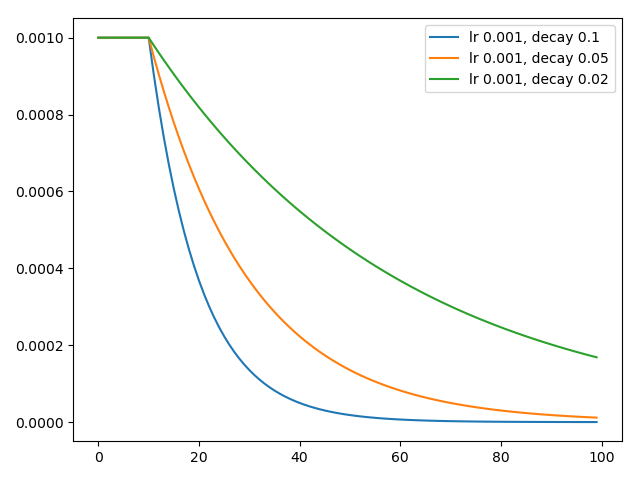
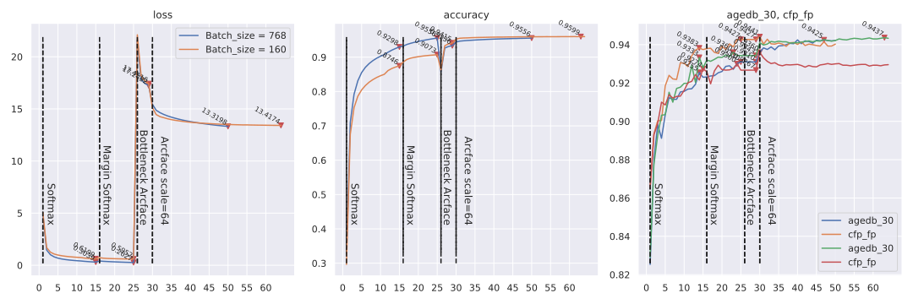
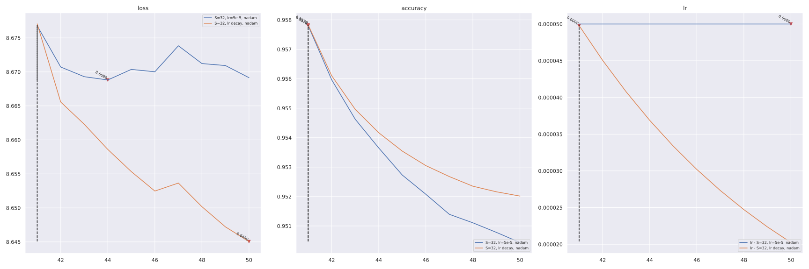
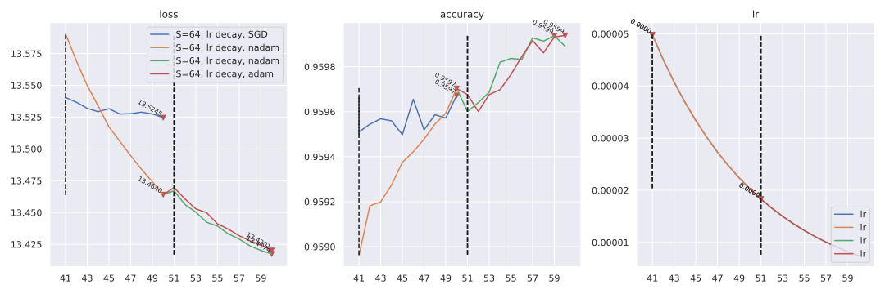
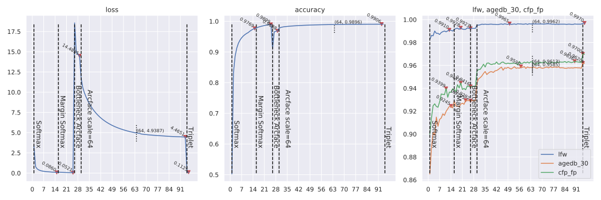
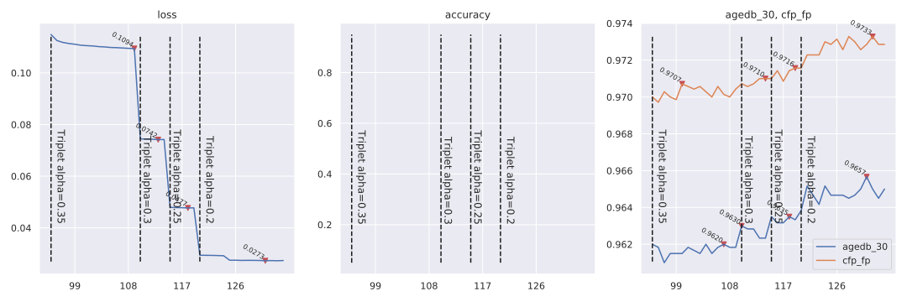
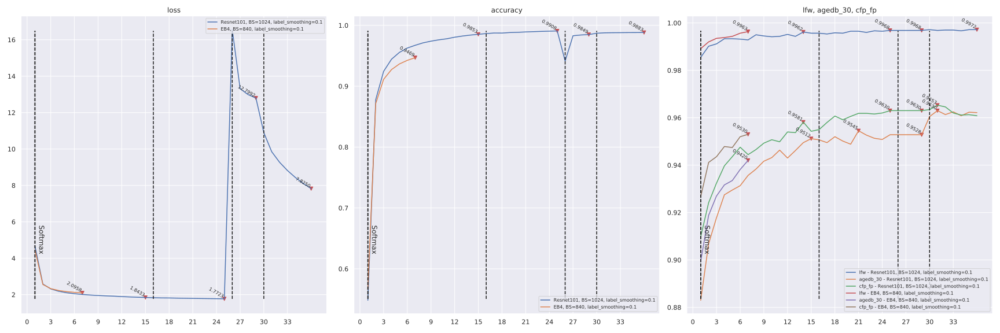
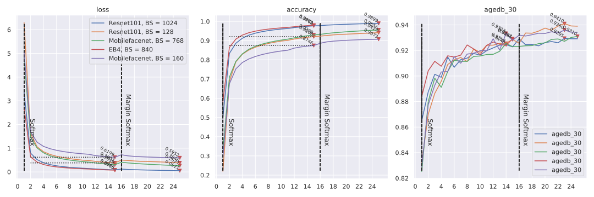
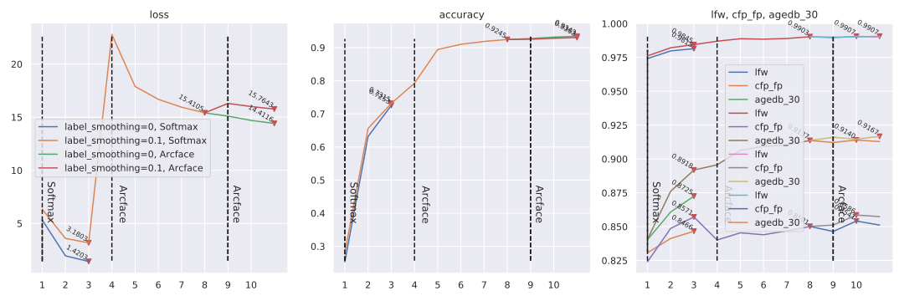

# ___Keras insightface___
  - Keras Insightface implementation.
  - This is still under working, many things are still testing here, so there may lots of errors atm.
  - **Environment**
    ```py
    # $ ipython
    Python 3.7.6 (default, Jan  8 2020, 19:59:22)
    In [1]: tf.__version__
    Out[1]: '2.1.0'
    ```
  - **Default import**
    ```py
    import os
    import sys
    import pandas as pd
    import numpy as np
    import tensorflow as tf
    from tensorflow import keras

    gpus = tf.config.experimental.list_physical_devices("GPU")
    for gpu in gpus:
        tf.config.experimental.set_memory_growth(gpu, True)
    ```
# Catalog
  <!-- TOC depthFrom:1 depthTo:6 withLinks:1 updateOnSave:1 orderedList:0 -->

  - [___Keras insightface___](#keras-insightface)
  - [Catalog](#catalog)
  - [Current accuracy](#current-accuracy)
  - [Usage](#usage)
  	- [Beforehand Data Prepare](#beforehand-data-prepare)
  	- [Training scripts](#training-scripts)
  	- [Multi GPU train](#multi-gpu-train)
  - [Training Record](#training-record)
  	- [Loss function test on Mobilenet](#loss-function-test-on-mobilenet)
  	- [Mobilefacenet](#mobilefacenet)
  	- [Loss function test on Mobilefacenet epoch 44](#loss-function-test-on-mobilefacenet-epoch-44)
  	- [ResNet101V2](#resnet101v2)
  - [Model conversion](#model-conversion)
  	- [ONNX](#onnx)
  	- [TFlite](#tflite)
  	- [MXNet format](#mxnet-format)
  	- [Pytorch and Caffe2](#pytorch-and-caffe2)
  - [Related Projects](#related-projects)

  <!-- /TOC -->
***

# Current accuracy
  - Rerunning all with `label smothing`.

  | Model backbone   | lfw      | cfp_fp   | agedb_30 | Epochs |
  | ---------------- | -------- | -------- | -------- | ------ |
  | Mobilefacenet    | 0.994167 | 0.944143 | 0.942500 | 50     |
  | ResNet101V2      | 0.997000 | 0.973286 | 0.965667 | 100    |
  | EfficientNetB4   | 0.997167 | 0.967000 | 0.962500 | 54     |
  | se_mobilefacenet | 0.995000 | 0.945000 | 0.956333 | 45     |
***

# Usage
## Beforehand Data Prepare
  - **Training Data** in this project is `MS1M-ArcFace` downloaded from [Insightface Dataset Zoo](https://github.com/deepinsight/insightface/wiki/Dataset-Zoo)
  - **Evaluating data** is `LFW` `CFP-FP` `AgeDB-30` bin files included in `MS1M-ArcFace` dataset
  - Any other data is also available just in the right format
  - **[prepare_data.py](prepare_data.py)** script, Extract data from mxnet record format to `folders`.
    ```sh
    # Convert `/datasets/faces_emore` to `/datasets/faces_emore_112x112_folders`
    CUDA_VISIBLE_DEVICES='-1' ./prepare_data.py -D /datasets/faces_emore
    # Convert evaluating bin files
    CUDA_VISIBLE_DEVICES='-1' ./prepare_data.py -D /datasets/faces_emore -T lfw.bin cfp_fp.bin agedb_30.bin
    ```
    Executing again will skip `dataset` conversion.
  - **Training dataset Required** is a `folder` including `person folders`, each `person folder` including multi `face images`. Format like
    ```sh
    .               # dataset folder
    ├── 0           # person folder
    │   ├── 100.jpg # face image
    │   ├── 101.jpg # face image
    │   └── 102.jpg # face image
    ├── 1           # person folder
    │   ├── 111.jpg
    │   ├── 112.jpg
    │   └── 113.jpg
    ├── 10
    │   ├── 707.jpg
    │   ├── 708.jpg
    │   └── 709.jpg
    ```
  - **Evaluting bin files** include jpeg image data pairs, and a label indicating if it's a same person, so there are double images than labels
    ```sh
    #    bins   | issame_list
    img_1 img_2 | 1
    img_3 img_4 | 1
    img_5 img_6 | 0
    img_7 img_8 | 0
    ```
    Image data in bin files like `CFP-FP` `AgeDB-30` is not compatible with `tf.image.decode_jpeg`, we need to reformat it.
    ```py
    ''' Throw error if not reformated yet '''
    ValueError: Can't convert non-rectangular Python sequence to Tensor.
    ```
## Training scripts
  - **Scripts**
    - [data.py](data.py) loads image data as `tf.dataset` for training. `Triplet` dataset is different from others.
    - [data_gen.py](data_gen.py) NOT working, accuracy wont increase. Using `ImageDataGenerator` and `AutoAugment` to load images.
    - [evals.py](evals.py) contains evaluating callback using `bin` files.
    - [losses.py](losses.py) contains `softmax` / `arcface` / `centerloss` / `triplet` loss functions.
    - [mobile_facenet.py](mobile_facenet.py) / [mobilenetv3.py](mobilenetv3.py) basic model implementation. Other backbones like `ResNet101V2` is loaded from `keras.applications` in `train.buildin_models`.
    - [myCallbacks.py](myCallbacks.py) contains my other callbacks, like saving model / learning rate adjusting / save history.
    - [plot.py](plot.py) contains a history plot function.
    - [train.py](train.py) contains a `Train` class. It uses a `scheduler` to connect different `loss` / `optimizer` / `epochs`. The basic function is simple `load data --> model --> compile --> fit`.
  - **Model** contains two part
    - **Basic model** is layers from `input` to `embedding`.
    - **Model** is `Basic model` + `bottleneck` layer, like `softmax` / `arcface` layer. For triplet training, `Model` == `Basic model`.
  - **Training example**
    ```py
    from tensorflow import keras
    import mobile_facenet
    import losses
    import train
    # basic_model = train.buildin_models("MobileNet", dropout=0.4, emb_shape=256)
    # basic_model = train.buildin_models("ResNet101V2", dropout=0.4, emb_shape=512)
    # basic_model = train.buildin_models('EfficientNetB0', dropout=0.4, emb_shape=256)
    basic_model = mobile_facenet.mobile_facenet(256, dropout=0.4, name="mobile_facenet_256")
    data_path = '/datasets/faces_emore_112x112_folders'
    eval_paths = ['/datasets/faces_emore/lfw.bin', '/datasets/faces_emore/cfp_fp.bin', '/datasets/faces_emore/agedb_30.bin']
    tt = train.Train(data_path, save_path='keras_mobile_facenet_emore.h5', eval_paths=eval_paths, basic_model=basic_model, lr_base=0.001, batch_size=768, random_status=0)
    sch = [
      {"loss": keras.losses.categorical_crossentropy, "optimizer": "nadam", "epoch": 15},
      {"loss": losses.margin_softmax, "epoch": 10},
      {"loss": losses.ArcfaceLoss(), "bottleneckOnly": True, "epoch": 4},
      {"loss": losses.ArcfaceLoss(), "epoch": 35},
      {"loss": losses.batch_hard_triplet_loss, "optimizer": "nadam", "epoch": 30},
    ]
    tt.train(sch, 0)
    ```
    `train.Train` is mostly functioned as a scheduler, the basic strategy is simple
    ```py
    from tensorflow import keras
    import losses, data, evals, myCallbacks, mobile_facenet
    # Dataset
    data_path = '/datasets/faces_emore_112x112_folders'
    train_ds, steps_per_epoch, classes = data.prepare_dataset(data_path, batch_size=512, random_status=0)
    # Model
    basic_model = mobile_facenet.mobile_facenet(256, dropout=0.4, name="mobile_facenet_256")
    model_output = keras.layers.Dense(classes, activation="softmax")(basic_model.outputs[0])
    model = keras.models.Model(basic_model.inputs[0], model_output)
    # Evals and basic callbacks
    eval_paths = ['/datasets/faces_emore/lfw.bin', '/datasets/faces_emore/cfp_fp.bin', '/datasets/faces_emore/agedb_30.bin']
    my_evals = [evals.eval_callback(basic_model, ii, batch_size=512, eval_freq=1) for ii in eval_paths]
    my_evals[-1].save_model = 'keras_mobilefacenet'
    basic_callbacks = myCallbacks.basic_callbacks(checkpoint='keras_mobilefacenet.h5', evals=my_evals, lr=0.001)
    callbacks = my_evals + basic_callbacks
    # Compile and fit
    model.compile(optimizer='nadam', loss=losses.arcface_loss, metrics=["accuracy"])
    model.fit(train_ds, epochs=15, steps_per_epoch=steps_per_epoch, callbacks=callbacks, verbose=1)
    ```
  - **train.Train** `basic_model` and `model` parameters. Combine these two parameters to initializing model from different sources. Sometimes may need `custom_objects` to load model.
    | basic_model                              | model           | Use for                                    |
    | ---------------------------------------- | --------------- | ------------------------------------------ |
    | model structure                          | None            | Scratch train                              |
    | model layer index for basic model output | model .h5 file  | Continue training from last saved model    |
    | basic model .h5 file                     | None            | Continue training from a saved basic model |
    | model layer index for basic model output | model structure | Continue training from a modified model    |
  - **Scheduler** is a list of dicts, each contains a training plan
    - **loss** indicates the loss function.
    - **optimizer** is the optimizer used in this plan, `None` indicates using the last one.
    - **epoch** indicates how many epochs will be trained.
    - **bottleneckOnly** True / False, `True` will set `basic_model.trainable = False`, train the bottleneck layer only.
    - **centerloss** True / False, if set `True`, `loss` will be the `logits_loss` add to `center_loss`, `loss` could also be an instance of `CenterLoss`.
    - **type** `softmax` / `arcface` / `triplet`, but mostly this could be guessed from `loss`.
    ```py
    # Scheduler examples
    sch = [{"loss": keras.losses.categorical_crossentropy, "optimizer": "adam", "epoch": 1}]
    sch = [{"loss": keras.losses.CategoricalCrossentropy(label_smoothing=0.1), "epoch": 2}]
    sch = [{"loss": losses.ArcfaceLoss(scale=32.0, label_smoothing=0.1), "optimizer": keras.optimizers.SGD(0.001, momentum=0.9), "epoch": 1}]
    sch = [{"loss": losses.ArcfaceLoss(), "optimizer": None, "bottleneckOnly": True, "epoch": 1}]
    sch = [{"loss": losses.arcface_loss, "optimizer": "adam", "centerloss": True, "epoch": 1}]
    sch = [{"loss": losses.ArcfaceLoss(), "bottleneckOnly": True, "centerloss": True, "epoch": 1}]
    sch = [{"loss": losses.CenterLoss(num_classes=85742), "centerloss": True, "epoch": 1}]
    sch = [{"loss": losses.batch_hard_triplet_loss, "optimizer": "adam", "epoch": 1}]
    sch = [{"loss": losses.BatchHardTripletLoss(0.3), "epoch": 1}]
    ```
    Some combinations are errors, like `centerloss` + `triplet`, and training `bottleneckOnly` + `triplet` will change nothing.
    ```py
    ''' Continue training from last saved file '''
    from tensorflow import keras
    import losses
    import train
    data_path = '/datasets/faces_emore_112x112_folders'
    eval_paths = ['/datasets/faces_emore/lfw.bin', '/datasets/faces_emore/cfp_fp.bin', '/datasets/faces_emore/agedb_30.bin']
    tt = train.Train(data_path, 'keras_mobilefacenet_256_II.h5', eval_paths, basic_model=-2, model='./checkpoints/keras_mobilefacenet_256.h5', compile=True, lr_base=0.001, batch_size=768, random_status=0, custom_objects={'margin_softmax': losses.margin_softmax})
    sch = [
      # {"loss": keras.losses.categorical_crossentropy, "optimizer": "nadam", "epoch": 15},
      {"loss": losses.margin_softmax, "epoch": 6},
      {"loss": losses.ArcfaceLoss(), "bottleneckOnly": True, "epoch": 4},
      {"loss": losses.ArcfaceLoss(), "epoch": 35},
      {"loss": losses.batch_hard_triplet_loss, "optimizer": "nadam", "epoch": 30},
    ]
    tt.train(sch, 19) # 19 is the initial_epoch
    ```
  - **Saving strategy**
    - **Model** will save the latest one on every epoch end to local path `./checkpoints`, name is specified by `train.Train` `save_path`.
    - **basic_model** will be saved monitoring on the last `eval_paths` evaluating `bin` item, and save the best only.
  - **Gently stop** is a callback to stop training gently. Input an `n` and `<Enter>` anytime during training, will set training stop on that epoch ends.
  - **My history**
    - This is a callback collecting training `loss`, `accuracy` and `evaluating accuracy`.
    - On every epoch end, backup to the path `save_path` defined in `train.Train` with suffix `_hist.json`.
    - Reload when initializing, if the backup `<save_path>_hist.json` file exists.
  - **Learning rate** uses `exponential decay`, `lr_base` and `lr_decay` in `train.Train` set it. Default is `lr_base=0.1, lr_decay=0.05`.
    ```py
    import myCallbacks
    epochs = np.arange(100)
    plt.plot(epochs, [myCallbacks.scheduler(ii, 0.001, 0.1) for ii in epochs], label="lr 0.001, decay 0.1")
    plt.plot(epochs, [myCallbacks.scheduler(ii, 0.001, 0.05) for ii in epochs], label="lr 0.001, decay 0.05")
    plt.plot(epochs, [myCallbacks.scheduler(ii, 0.001, 0.02) for ii in epochs], label="lr 0.001, decay 0.02")
    plt.legend()
    ```
    
  - **Evaluation**
    ```py
    import evals
    basic_model = keras.models.load_model('checkpoints/keras_mobilefacenet_256_basic_agedb_30_epoch_39_0.942500.h5', compile=False)
    ee = evals.eval_callback(basic_model, '/datasets/faces_emore/lfw.bin')
    ee.on_epoch_end(0)
    # >>>> lfw evaluation max accuracy: 0.993167, thresh: 0.316535, previous max accuracy: 0.000000, PCA accuray = 0.993167 ± 0.003905
    # >>>> Improved = 0.993167
    ```
    Default evaluating strategy is `on_epoch_end`. Setting a `eval_freq` greater than `1` in `train.Train` will also **add** an `on_batch_end` evaluation.
    ```py
    # Change evaluating strategy to `on_epoch_end`, as long as `on_batch_end` for every `1000` batch.
    tt = train.Train(data_path, 'keras_mobilefacenet_256.h5', eval_paths, basic_model=basic_model, eval_freq=1000)
    ```
  - [EfficientNet](https://github.com/qubvel/efficientnet)
    ```py
    !pip install -U git+https://github.com/qubvel/efficientnet

    import efficientnet.tfkeras as efntf
    mm = efntf.EfficientNetB0(weights='imagenet', include_top=False, input_shape=(112, 112, 3))
    ```
  - [SE nets](https://github.com/titu1994/keras-squeeze-excite-network)
    ```py
    # This should be under tf 2.1, NOT tf nightly
    tf.__version__
    # '2.1.0'

    !pip install -U git+https://github.com/titu1994/keras-squeeze-excite-network

    from keras_squeeze_excite_network import se_resnext
    mm = se_resnext.SEResNextImageNet(weights='imagenet', input_shape=(112, 112, 3), include_top=False)
    ```
    It's TOO slow training a `se_resnext 101`，takes almost 4 times longer than `ResNet101V2`.
## Multi GPU train
  - For multi GPU train, should better use `tf-nightly`
    ```sh
    conda create -n tf-nightly
    conda activate tf-nightly
    pip install tf-nightly glob2 pandas tqdm scikit-image scikit-learn
    ```
  - Add an overall `tf.distribute.MirroredStrategy().scope()` `with` block. This is just working in my case... The `batch_size` will be multiplied by `GPU numbers`.
    ```py
    tf.__version__
    # 2.2.0-dev20200324

    with tf.distribute.MirroredStrategy().scope():
        basic_model = ...
        tt = train.Train(..., batch_size=1024, ...) # With 2 GPUs, `batch_size` will be 2048
        sch = [...]
        tt.train(sch, 0)
    ```
***

# Training Record
## Loss function test on Mobilenet
  - This tests loss functions on `Mobilenet` for their efficiency, but only one epoch training may not be very valuable.
  - **Initialize training from scratch for 6 epochs**
    ```py
    from tensorflow import keras
    import losses
    import train
    basic_model = train.buildin_models("MobileNet", dropout=0.4, emb_shape=256)
    data_path = '/datasets/faces_emore_112x112_folders'
    eval_paths = ['/datasets/faces_emore/lfw.bin', '/datasets/faces_emore/cfp_fp.bin', '/datasets/faces_emore/agedb_30.bin']
    tt = train.Train(data_path, 'keras_mobilenet_256.h5', eval_paths, basic_model=basic_model, model=None, compile=False, lr_base=0.001, batch_size=128, random_status=0)
    sch = [{"loss": losses.ArcfaceLoss(), "optimizer": None, "epoch": 6}]
    tt.train(sch, 0)
    ```
  - **Train next epoch 7 using different loss functions**
    ```py
    ''' Load saved basic model '''
    import losses
    import train
    data_path = '/datasets/faces_emore_112x112_folders'
    eval_paths = ['/datasets/faces_emore/lfw.bin', '/datasets/faces_emore/cfp_fp.bin', '/datasets/faces_emore/agedb_30.bin']
    tt = train.Train(data_path, 'keras_mobilenet_256_V.h5', eval_paths, basic_model="./checkpoints/keras_mobilenet_256_basic_agedb_30_epoch_6_0.900333.h5", model=None, compile=False, lr_base=0.001, batch_size=128, random_status=0)

    ''' Choose one loss function each time --> train one epoch --> reload'''
    sch = [{"loss": keras.losses.categorical_crossentropy, "optimizer": "adam", "epoch": 1}]
    sch = [{"loss": losses.margin_softmax, "optimizer": "adam", "epoch": 1}]
    sch = [{"loss": losses.scale_softmax, "optimizer": "adam", "epoch": 1}]
    sch = [{"loss": losses.arcface_loss, "optimizer": "adam", "epoch": 1}]
    sch = [{"loss": losses.arcface_loss, "optimizer": "adam", "centerloss": True, "epoch": 1}]
    sch = [{"loss": losses.batch_hard_triplet_loss, "optimizer": "adam", "epoch": 1}]
    sch = [{"loss": losses.batch_all_triplet_loss, "optimizer": "adam", "epoch": 1}]

    !pip install -q --no-deps tensorflow-addons
    import tensorflow_addons as tfa
    sch = [{"loss": tfa.losses.TripletSemiHardLoss(), "optimizer": "adam", "epoch": 1, "type": tt.triplet}]

    ''' Train '''
    tt.train(sch, 6)
    ```
  - **Loss and accuracy**

    | Loss type               | loss    | accuracy | lfw      | lfw thresh | cfp_fp   | cfp_fp thresh | agedb_30 | agedb_30 thresh | total time | per step |
    | ----------------------- | ------- | -------- | -------- | ---------- | -------- | ------------- | -------- | --------------- | ---------- | -------- |
    | **Original Epoch 6**    | 22.6342 | 0.7855   | 0.987833 | 0.307455   | 0.891714 | 0.201755      | 0.900333 | 0.229057        | 5653s      | 124ms    |
    | **Train Epoch 7**       |         |          |          |            |          |               |          |                 |            |          |
    | softmax                 | 1.8196  | 0.6941   | 0.987333 | 0.345970   | 0.895286 | 0.204387      | 0.901667 | 0.265905        | 5677s      | 125ms    |
    | margin_softmax          | 3.8359  | 0.6294   | 0.989000 | 0.317540   | 0.889000 | 0.210142      | 0.897833 | 0.246658        | 5716s      | 126ms    |
    | scale_softmax           | 2.2430  | 0.6779   | 0.987333 | 0.340417   | 0.887857 | 0.204122      | 0.900333 | 0.273266        | 5702s      | 125ms    |
    | arcface_loss            | 22.3337 | 0.7928   | 0.987500 | 0.293580   | 0.886857 | 0.199602      | 0.904833 | 0.247436        | 6133s      | 135ms    |
    | center arcface_loss     | 22.5102 | 0.7924   | 0.987833 | 0.321488   | 0.884000 | 0.200262      | 0.894833 | 0.263254        | 5861s      | 129ms    |
    | batch_hard_triplet_loss | 0.2276  |          | 0.986333 | 0.386425   | 0.910571 | 0.245836      | 0.891333 | 0.354833        | 4622s      | 156ms    |
    | batch_all_triplet_loss  | 0.4749  |          | 0.984333 | 0.417722   | 0.902571 | 0.240187      | 0.837167 | 0.475637        | 4708s      | 159ms    |
    | TripletSemiHardLoss     | 0.0047  |          | 0.957500 | 0.520159   | 0.837857 | 0.441421      | 0.778833 | 0.626684        | 4400s      | 148ms    |
## Mobilefacenet
  - Training script is the last exampled one.
  - **Record** Two models are trained, with `batch_size=160` and `batch_size=768` respectively.
    | Loss               | Epochs | First epoch (batch_size=768)                        |
    | ------------------ | ------ | --------------------------------------------------- |
    | Softmax            | 15     | 12744s 2s/step - loss: 4.8241 - accuracy: 0.3282    |
    | Margin Softmax     | 10     | 13041s 2s/step - loss: 0.4096 - accuracy: 0.9323    |
    | Bottleneck Arcface | 4      | 4292s 566ms/step - loss: 21.6166 - accuracy: 0.8569 |
    | Arcface 64         | 35     | 12793s 2s/step - loss: 15.4268 - accuracy: 0.9441   |

    ```py
    import plot
    # plot.hist_plot_split("./checkpoints/keras_mobile_facenet_emore_hist.json", [15, 10, 4, 35], ["Softmax", "Margin Softmax", "Bottleneck Arcface", "Arcface scale=64"])
    customs = ["agedb_30", "cfp_fp"]
    epochs = [15, 10, 4, 35]
    _, axes = plt.subplots(1, 3, figsize=(24, 8))
    axes, _ = plot.hist_plot_split("checkpoints/keras_mobile_facenet_emore_hist.json", epochs, ["", "", "", ""], customs=customs, save=None, axes=axes)
    axes[0].lines[0].set_label('Mobilefacenet, BS=768')
    pre_lines = len(axes[0].lines)

    axes, pre_1 = plot.hist_plot_split('checkpoints/keras_se_mobile_facenet_emore_hist.json', epochs, ["", ""], customs=customs, save=None, axes=axes)
    axes[0].lines[pre_lines].set_label('se, BS = 640, LS=0.1')
    pre_lines = len(axes[0].lines)
    axes, _ = plot.hist_plot_split('checkpoints/keras_se_mobile_facenet_emore_II_hist.json', [4, 35], ["", ""], customs=customs, save=None, init_epoch=25, pre_item=pre_1, axes=axes)
    axes[0].lines[pre_lines].set_label('se, BS = 640, LS=0.1')
    pre_lines = len(axes[0].lines)
    axes, _ = plot.hist_plot_split('checkpoints/keras_se_mobile_facenet_emore_III_hist.json', [4, 35], ["", ""], customs=customs, save=None, init_epoch=25, pre_item=pre_1, axes=axes)
    axes[0].lines[pre_lines].set_label('se, BS = 640, LS=0')
    pre_lines = len(axes[0].lines)

    axes, _ = plot.hist_plot_split("checkpoints/keras_mobilefacenet_256_hist_all.json", epochs, ["Softmax", "Margin Softmax", "Bottleneck Arcface", "Arcface scale=64"], customs=customs, save=None, axes=axes)
    axes[0].lines[pre_lines].set_label('Mobilefacenet, BS=160')

    axes[0].plot((30, 50), (13.3198, 13.3198), 'k:')

    axes[0].legend(loc='upper right')
    axes[0].figure.savefig('./checkpoints/keras_mobilefacenet_256_hist.svg')
    ```
    
    ```py
    import plot
    # plot.hist_plot_split("./checkpoints/keras_mobile_facenet_emore_hist.json", [15, 10, 4, 35], ["Softmax", "Margin Softmax", "Bottleneck Arcface", "Arcface scale=64"])
    customs = ["agedb_30", "cfp_fp"]
    epochs = [15, 10, 4, 35]
    _, axes = plt.subplots(1, 3, figsize=(24, 8))
    axes, _ = plot.hist_plot_split("checkpoints/keras_mobile_facenet_emore_hist.json", epochs, ["", "", "", ""], customs=customs, save=None, axes=axes)
    axes[0].lines[0].set_label('Mobilefacenet, BS=768')
    pre_lines = len(axes[0].lines)

    axes, pre_1 = plot.hist_plot_split('checkpoints/keras_se_mobile_facenet_emore_hist.json', epochs, ["", ""], customs=customs, save=None, axes=axes)
    axes[0].lines[pre_lines].set_label('se, BS = 640, LS=0.1')
    pre_lines = len(axes[0].lines)
    axes, _ = plot.hist_plot_split('checkpoints/keras_se_mobile_facenet_emore_II_hist.json', [4, 35], ["", ""], customs=customs, save=None, init_epoch=25, pre_item=pre_1, axes=axes)
    axes[0].lines[pre_lines].set_label('se, BS = 640, LS=0.1')
    pre_lines = len(axes[0].lines)
    axes, _ = plot.hist_plot_split('checkpoints/keras_se_mobile_facenet_emore_III_hist.json', [4, 35], ["", ""], customs=customs, save=None, init_epoch=25, pre_item=pre_1, axes=axes)
    axes[0].lines[pre_lines].set_label('se, BS = 640, LS=0')
    pre_lines = len(axes[0].lines)

    axes, _ = plot.hist_plot_split("checkpoints/keras_mobilefacenet_256_hist_all.json", epochs, ["Softmax", "Margin Softmax", "Bottleneck Arcface", "Arcface scale=64"], customs=customs, save=None, axes=axes)
    axes[0].lines[pre_lines].set_label('Mobilefacenet, BS=160')

    axes[0].plot((30, 50), (13.3198, 13.3198), 'k:')

    axes[0].legend(loc='upper right')
    axes[0].figure.savefig('./checkpoints/keras_mobilefacenet_256_hist.svg')
    ```
    
## Loss function test on Mobilefacenet epoch 44
  - For `Epoch 44`, trained steps are `15 epochs softmax + 10 epochs margin softmax + 4 epochs arcface bottleneck only + 15 epochs arcface`
  - Run a batch of `optimizer` + `loss` test. Each test run is `10 epochs`.
    ```py
    # This `train.Train` is the `batch_size = 160` one.
    sch = [{"loss": losses.ArcfaceLoss(), "epoch": 10}]  # Same as previous epochs
    sch = [{"loss": losses.Arcface(scale=32.0), "epoch": 10}] # fix lr == 1e-5
    sch = [{"loss": losses.Arcface(scale=32.0), "epoch": 10}] # lr decay, decay_rate = 0.1
    sch = [{"loss": losses.ArcfaceLoss(), "optimizer": keras.optimizers.SGD(0.001, momentum=0.9), "epoch": 10}]

    tt.train(sch, 40) # sub bottleneck only epochs
    ```
    From `Epoch 54`, Pick the best one `Scale=64.0, lr decay, optimizer=nadam`, run optimizer `nadam` / `adam` testing
    ```py
    sch = [{"loss": losses.ArcfaceLoss(), "epoch": 10}]
    sch = [{"loss": losses.ArcfaceLoss(), "optimizer": "adam", "epoch": 10}]
    tt.train(sch, 50) # sub bottleneck only epochs
    ```
  - **Result**
    ```py
    import plot
    axes, _ = plot.hist_plot_split('./checkpoints/keras_mobilefacenet_256_II_hist.json', [10], [""], customs=["lr"], save=None, init_epoch=40, axes=None)
    axes[0].lines[-2].set_label('S=32, lr=5e-5, nadam')
    axes, _ = plot.hist_plot_split('./checkpoints/keras_mobilefacenet_256_III_hist.json', [10], [""], customs=["lr"], save=None, init_epoch=40, axes=axes)
    axes[0].lines[-2].set_label('S=32, lr decay, nadam')
    axes[0].legend()
    axes[0].set_xticks(np.arange(41, 51))
    axes[0].figure.savefig('./checkpoints/keras_mobilefacenet_256_III_hist.svg')
    ```
    
    ```py
    import plot
    axes, _ = plot.hist_plot_split('./checkpoints/keras_mobilefacenet_256_IV_hist.json', [10], [""], customs=["lr"], save=None, init_epoch=40, axes=None)
    axes[0].lines[-2].set_label('S=64, lr decay, SGD')
    axes, pre_1 = plot.hist_plot_split('./checkpoints/keras_mobilefacenet_256_VI_hist.json', [10], [""], customs=["lr"], save=None, init_epoch=40, axes=axes)
    axes[0].lines[-2].set_label('S=64, lr decay, nadam')
    axes, _ = plot.hist_plot_split('./checkpoints/keras_mobilefacenet_256_VII_hist.json', [10], [""], customs=["lr"], save=None, init_epoch=50, pre_item=pre_1, axes=axes)
    axes[0].lines[-2].set_label('S=64, lr decay, nadam')
    axes, _ = plot.hist_plot_split('./checkpoints/keras_mobilefacenet_256_VIII_hist.json', [10], [""], customs=["lr"], save=None, init_epoch=50, pre_item=pre_1, axes=axes)
    axes[0].lines[-2].set_label('S=64, lr decay, adam')
    axes[0].legend()
    axes[0].set_xticks(np.arange(41, 61, 2))
    axes[0].figure.savefig('./checkpoints/keras_mobilefacenet_256_VIII_hist.svg')
    ```
    
## ResNet101V2
  - **Training script** is similar with `Mobilefacenet`, just replace `basic_model` with `ResNet101V2`, and set a new `save_path`
    ```py
    basic_model = train.buildin_models("ResNet101V2", dropout=0.4, emb_shape=512)
    tt = train.Train(data_path, 'keras_resnet101_512.h5', eval_paths, basic_model=basic_model, batch_size=1024)
    ```
  - **Record** Two models are trained, with `batch_size=128` and `batch_size=1024` respectively.
    | Loss               | epochs | First epoch (batch_size=1024)                       | First epoch (2 GPUs, batch_size=2048)           |
    | ------------------ | ------ | --------------------------------------------------- | ----------------------------------------------- |
    | Softamx            | 15     | 11538s 2s/step - loss: 3.3550 - accuracy: 0.5024    |                                                 |
    | Margin Softmax     | 10     | 11744s 2s/step - loss: 0.1193 - accuracy: 0.9778    |                                                 |
    | Bottleneck Arcface | 4      | 4627s 814ms/step - loss: 18.5677 - accuracy: 0.9113 |                                                 |
    | Arcface 64         | 65     | 11507s 2s/step - loss: 11.7330 - accuracy: 0.9774   | 6229s 2s/step - loss: 4.9359 - accuracy: 0.9896 |
    | Triplet            | 30     |                                                     | 5943s 3s/step - loss: 0.1149                    |

    ```py
    """ Evaluating accuracy is not improving from my end point """
    import plot
    # plot.hist_plot_split("./checkpoints/keras_resnet101_emore_hist.json", [15, 10, 4, 35], ["Softmax", "Margin Softmax", "Bottleneck Arcface", "Arcface scale=64"])
    customs = ["lfw", "agedb_30", "cfp_fp"]
    history = ['./checkpoints/keras_resnet101_emore_hist.json', './checkpoints/keras_resnet101_emore_basic_hist.json']
    axes, _ = plot.hist_plot_split(history, [15, 10, 4, 65, 15, 5, 5, 15], ["Softmax", "Margin Softmax", "Bottleneck Arcface", "Arcface scale=64", "Triplet alpha=0.35", "Triplet alpha=0.3", "Triplet alpha=0.25", "Triplet alpha=0.2"], customs=customs, save=None)

    for line in [axes[0].lines[0], axes[1].lines[0], *(axes[2].lines[:3])]:
        idd = 64
        ax = line.axes
        vvs = line.get_ydata()
        vv = vvs[idd]
        scale_min, scale_max = ax.get_ylim()
        scale = (scale_max - scale_min) / 20
        vvmin = max(vvs.min(), vv - scale)
        vvmax = min(vvs.max(), vv + scale)
        ax.plot([idd, idd], [vvmin, vvmax], 'k:')
        ax.text(idd, vv, '({}, {:.4f})'.format(idd, vv), va="bottom", ha="left", fontsize=8)
    axes[0].figure.savefig('./checkpoints/keras_resnet101_emore_hist.svg')
    ```
    
    ```py
    """ Plot triplet loss only """
    import plot
    customs = ["lfw", "agedb_30", "cfp_fp"]
    axes, _ = plot.hist_plot_split('./checkpoints/keras_resnet101_emore_basic_hist.json', [15, 5, 5, 15], ["Triplet alpha=0.35", "Triplet alpha=0.3", "Triplet alpha=0.25", "Triplet alpha=0.2"], customs=customs, init_epoch=94)
    ```
    
## EfficientNetB4
  - **Record**
    ```py
    with tf.distribute.MirroredStrategy().scope():
        basic_model = train.buildin_models('EfficientNetB4', 0.4, 512)
        tt = train.Train(data_path, 'keras_EB4_emore.h5', eval_paths, basic_model=basic_model, batch_size=420, random_status=0)
    ```
    | Loss               | epochs | First epoch (2 GPUs, batch_size=840)                |
    | ------------------ | ------ | --------------------------------------------------- |
    | Softamx            | 15     | 10881s 2s/step - loss: 2.7277 - accuracy: 0.5822    |
    | Margin Softmax     | 10     | 11068s 2s/step - loss: 0.1054 - accuracy: 0.9805    |
    | Bottleneck Arcface | 4      | 4364s 629ms/step - loss: 18.1350 - accuracy: 0.9166 |
    | Arcface 64         | 35     | 11047s 2s/step - loss: 11.3806 - accuracy: 0.9781   |
    | Triplet            | 30     |                                                     |

    ```py
    """ Comparing EfficientNetB4 and ResNet101 """
    import plot
    # plot.hist_plot_split("./checkpoints/keras_resnet101_emore_hist.json", [15, 10, 4, 35], ["Softmax", "Margin Softmax", "Bottleneck Arcface", "Arcface scale=64"])
    customs = ["lfw", "agedb_30", "cfp_fp"]
    epochs = [15, 10, 4, 30]
    axes, _ = plot.hist_plot_split("checkpoints/keras_EB4_emore_hist.json", epochs, ["", "", "", ""], customs=customs, save=None, axes=None)
    axes[0].lines[0].set_label('EB4, BS = 840')
    pre_lines = len(axes[0].lines)
    axes, _ = plot.hist_plot_split("checkpoints/keras_resnet101_emore_hist.json", epochs, ["Softmax", "Margin Softmax", "Bottleneck Arcface", "Arcface scale=64", "Triplet alpha=0.35", "Triplet alpha=0.3", "Triplet alpha=0.25", "Triplet alpha=0.2"], customs=customs, save=None, axes=axes)
    axes[0].lines[pre_lines].set_label('Resnet101, BS = 1024')
    axes[0].legend(loc='upper right')
    axes[0].figure.savefig('./checkpoints/keras_EB4_emore_hist.svg')
    ```
    
  - **Comparing softmax training for `MobileFaceNet` / `ResNet101` / `EfficientNetB4`**
    ```py
    import plot
    customs = ["agedb_30"]
    epochs = [15, 10]
    _, axes = plt.subplots(1, 3, figsize=(24, 8))
    axes, _ = plot.hist_plot_split("checkpoints/keras_resnet101_emore_hist.json", epochs, ["", "", "", ""], customs=customs, save=None, axes=axes)
    axes[0].lines[0].set_label('Resnet101, BS=1024')
    pre_lines = len(axes[0].lines)
    axes, _ = plot.hist_plot_split("./checkpoints/keras_resnet101_512_II_hist.json", epochs, ["", "", "", ""], customs=customs, save=None, axes=axes)
    axes[0].lines[pre_lines].set_label('Resnet101, BS=128')
    pre_lines = len(axes[0].lines)
    axes, _ = plot.hist_plot_split("checkpoints/keras_mobile_facenet_emore_hist.json", epochs, ["", "", "", ""], customs=customs, save=None, axes=axes)
    axes[0].lines[pre_lines].set_label('Mobilefacenet, BS=768')
    pre_lines = len(axes[0].lines)
    axes, _ = plot.hist_plot_split("checkpoints/keras_EB4_emore_hist.json", epochs, ["", "", "", ""], customs=customs, save=None, axes=axes)
    axes[0].lines[pre_lines].set_label('EB4, BS=840')
    pre_lines = len(axes[0].lines)
    axes, _ = plot.hist_plot_split("checkpoints/keras_se_mobile_facenet_emore_hist.json", epochs, ["", "", "", ""], customs=customs, save=None, axes=axes)
    axes[0].lines[pre_lines].set_label('se_mobilefacenet, BS=680, label_smothing=0.1')
    pre_lines = len(axes[0].lines)
    axes, _ = plot.hist_plot_split("checkpoints/keras_resnet101_emore_II_hist.json", epochs, ["", "", "", ""], customs=customs, save=None, axes=axes)
    axes[0].lines[pre_lines].set_label('Resnet101, BS=960, label_smothing=0.1')
    pre_lines = len(axes[0].lines)
    axes, _ = plot.hist_plot_split("checkpoints/keras_mobilefacenet_256_hist_all.json", epochs, ["Softmax", "Margin Softmax", "Bottleneck Arcface", "Arcface scale=64"], customs=customs, save=None, axes=axes)
    axes[0].lines[pre_lines].set_label('Mobilefacenet, BS=160')
    axes[0].legend(loc='upper right')

    axes[0].plot((2, 15), (0.3807, 0.3807), 'k:')
    axes[1].plot((2, 15), (0.9206, 0.9206), 'k:')
    axes[0].plot((2, 15), (0.6199, 0.6199), 'k:')
    axes[1].plot((2, 15), (0.8746, 0.8746), 'k:')
    axes[0].figure.savefig('./checkpoints/softmax_compare.svg')
    ```
    
## Label smoothing
  - **Train schedulers**
    ```py
    basic_model = train.buildin_models("MobileNet", dropout=0.4, emb_shape=256)
    tt = train.Train(..., random_status=0)
    sch = [{"loss": keras.losses.CategoricalCrossentropy(label_smoothing=0), "optimizer": "nadam", "epoch": 3}]
    sch = [{"loss": keras.losses.CategoricalCrossentropy(label_smoothing=0.1), "optimizer": "nadam", "epoch": 3}]
    tt.train(sch, 0)

    sch = [{"loss": losses.ArcfaceLoss(label_smoothing=0), "epoch": 5}]
    tt.train(sch, 3)

    sch = [{"loss": losses.ArcfaceLoss(label_smoothing=0), "epoch": 3}]
    sch = [{"loss": losses.ArcfaceLoss(label_smoothing=0.1), "epoch": 3}]
    tt.train(sch, 8)

    tt = train.Train(..., random_status=3)
    sch = [{"loss": losses.ArcfaceLoss(label_smoothing=0), "epoch": 3}]
    tt.train(sch, 8)
    ```
  - **Result**
    ```py
    import plot
    axes, _ = plot.hist_plot_split('checkpoints/keras_mobilenet_256_hist.json', [3], [""], save=None, init_epoch=0, axes=None)
    axes[0].lines[-2].set_label('LS=0, Softmax')
    axes, pre_1 = plot.hist_plot_split('checkpoints/keras_mobilenet_ls_0.1_256_hist.json', [3, 5], ["Softmax", "Arcface"], save=None, init_epoch=0, axes=axes)
    axes[0].lines[-3].set_label('LS=0.1, Softmax')
    axes, _ = plot.hist_plot_split('checkpoints/keras_mobilenet_arcface_ls_0_256_hist.json', [3], [""], save=None, init_epoch=8, pre_item=pre_1, axes=axes)
    axes[0].lines[-2].set_label('LS=0, Arcface')
    axes, _ = plot.hist_plot_split('checkpoints/keras_mobilenet_arcface_ls_0.1_256_hist.json', [3], [""], save=None, init_epoch=8, pre_item=pre_1, axes=axes)
    axes[0].lines[-2].set_label('LS=0.1, Arcface')
    axes, _ = plot.hist_plot_split('checkpoints/keras_mobilenet_arcface_randaug_256_hist.json', [3], [""], save=None, init_epoch=8, pre_item=pre_1, axes=axes)
    axes[0].lines[-2].set_label('Random=3, LS=0, Arcface')
    axes, _ = plot.hist_plot_split('checkpoints/keras_mobilenet_arcface_randaug_ls0.1_256_hist.json', [5], ["Arcface"], save=None, init_epoch=8, pre_item=pre_1, axes=axes)
    axes[0].lines[-2].set_label('Random=3, LS=0.1, Arcface')
    axes[0].legend(fontsize=8, loc='lower right')
    axes[2].legend(fontsize=8, loc='lower center')
    axes[0].figure.savefig('./checkpoints/label_smoothing.svg')
    ```
    
***

# Model conversion
## ONNX
  - Currently most frameworks support `tf1.x` only, so better convert it under `tf1.x` environment
    ```py
    tf.__version__
    # '1.15.0'

    # Convert to saved model first
    import glob2
    mm = tf.keras.models.load_model(glob2.glob('./keras_mobilefacenet_256_basic_*.h5')[0], compile=False)
    tf.keras.experimental.export_saved_model(mm, './saved_model')
    ```
    `tf2onnx` convert `saved model` to `tflite`, also `tf1.15.0`
    ```sh
    pip install -U tf2onnx
    python -m tf2onnx.convert --saved-model ./saved_model --output model.onnx
    ```
  - MXNet to onnx
    ```py
    #make sure to install onnx-1.2.1
    #pip install onnx==1.2.1
    import onnx
    assert onnx.__version__=='1.2.1'
    from mxnet.contrib import onnx as onnx_mxnet

    prefix, epoch = "model", 0
    sym_file = "%s-symbol.json" % prefix
    params_file = "%s-%04d.params" % (prefix, epoch)
    converted_model_path = onnx_mxnet.export_model(sym_file, params_file, [(1, 3, 112, 112)], np.float32, "mx_output.onnx")
    ```
## TFlite
  - Convert to TFlite
    ```py
    tf.__version__
    # '1.15.0'

    import glob2
    converter = tf.lite.TFLiteConverter.from_keras_model_file(glob2.glob('./keras_mobilefacenet_256_basic_*.h5')[0])
    tflite_model = converter.convert()
    open('./model.tflite', 'wb').write(tflite_model)
    ```
    ```py
    tf.__version__
    # '2.1.0'

    import glob2
    mm = tf.keras.models.load_model(glob2.glob('./keras_mobilefacenet_256_basic_*.h5')[0], compile=False)
    converter = tf.lite.TFLiteConverter.from_keras_model(mm)
    tflite_model = converter.convert()
    open('./model_tf2.tflite', 'wb').write(tflite_model)
    ```
  - interpreter test
    ```py
    tf.__version__
    # '2.1.0'

    import glob2
    interpreter = tf.lite.Interpreter('./model.tflite')
    interpreter.allocate_tensors()
    input_index = interpreter.get_input_details()[0]["index"]
    output_index = interpreter.get_output_details()[0]["index"]

    def tf_imread(file_path):
        img = tf.io.read_file(file_path)
        img = tf.image.decode_jpeg(img, channels=3)
        img = tf.image.convert_image_dtype(img, tf.float32)
        img = (img - 0.5) * 2
        return tf.expand_dims(img, 0)

    imm = tf_imread('/datasets/faces_emore_112x112_folders/0/1.jpg')
    # imm = tf_imread('./temp_test/faces_emore_test/0/1.jpg')
    interpreter.set_tensor(input_index, imm)
    interpreter.invoke()
    aa = interpreter.get_tensor(output_index)[0]

    def foo(imm):
        interpreter.set_tensor(input_index, imm)
        interpreter.invoke()
        return interpreter.get_tensor(output_index)[0]
    %timeit -n 100 foo(imm)
    # 36.7 ms ± 471 µs per loop (mean ± std. dev. of 7 runs, 100 loops each)

    mm = tf.keras.models.load_model(glob2.glob('./keras_mobilefacenet_256_basic_*.h5')[0], compile=False)
    bb = mm(imm).numpy()
    assert np.allclose(aa, bb, rtol=1e-3)
    %timeit mm(imm).numpy()
    # 71.6 ms ± 213 µs per loop (mean ± std. dev. of 7 runs, 10 loops each)
    ```
  - **On ARM64 board**
    ```sh
    lscpu
    # Architecture:        aarch64

    python --version
    # Python 3.6.9

    sudo apt install python3-pip ipython cython3
    pip install ipython

    git clone https://github.com/noahzhy/tf-aarch64.git
    cd tf-aarch64/
    pip install tensorflow-1.9.0rc0-cp36-cp36m-linux_aarch64.whl
    pip install https://dl.google.com/coral/python/tflite_runtime-2.1.0.post1-cp36-cp36m-linux_aarch64.whl
    ```
    ```py
    import tensorflow as tf
    tf.enable_eager_execution()
    tf.__version__
    # 1.9.0-rc0

    import tflite_runtime
    tflite_runtime.__version__
    # 2.1.0.post1

    import tflite_runtime.interpreter as tflite
    interpreter = tflite.Interpreter('./mobilefacenet_tf2.tflite')
    interpreter.allocate_tensors()
    input_index = interpreter.get_input_details()[0]["index"]
    output_index = interpreter.get_output_details()[0]["index"]

    imm = tf.convert_to_tensor(np.ones([1, 112, 112, 3]), dtype=tf.float32)
    interpreter.set_tensor(input_index, imm)
    interpreter.invoke()
    out = interpreter.get_tensor(output_index)[0]

    def foo(imm):
        interpreter.set_tensor(input_index, imm)
        interpreter.invoke()
        return interpreter.get_tensor(output_index)[0]
    %timeit -n 100 foo(imm)
    # 42.4 ms ± 43.1 µs per loop (mean ± std. dev. of 7 runs, 100 loops each)

    %timeit -n 100 foo(imm) # EfficientNetB0
    # 71.2 ms ± 52.5 µs per loop (mean ± std. dev. of 7 runs, 100 loops each)
    ```
## MXNet format
  - Here uses `keras-mxnet` to perform conversion from `Keras h5` to `MXNet param + json` format.
    ```sh
    $ pip install keras-mxnet
    $ KERAS_BACKEND='mxnet' ipython
    ```
  - **[Issue](https://github.com/awslabs/keras-apache-mxnet/pull/258)**
    ```py
    ''' Q: TypeError: tuple indices must be integers or slices, not list
    /opt/anaconda3/lib/python3.7/site-packages/keras/layers/normalization.py in build(self, input_shape)
         98
         99     def build(self, input_shape):
    --> 100         dim = input_shape[self.axis]
        101         print(input_shape, self.axis, dim)
        102         if dim is None
    '''
    ''' A: Modify normalization.py
    $ vi /opt/anaconda3/lib/python3.7/site-packages/keras/layers/normalization.py + 97
        else:
    -       self.axis = axis
    +       self.axis = axis if isinstance(axis, int) else axis[-1]

    def build(self, input_shape):
    '''
    ```
  - **Convert**
    ```py
    import numpy as np
    import keras
    # from keras import backend as K
    # K.common.set_image_data_format('channels_first')
    from keras.initializers import glorot_normal, glorot_uniform
    from keras.utils import CustomObjectScope
    with CustomObjectScope({'GlorotNormal': glorot_normal(), "GlorotUniform": glorot_uniform()}):
        mm = keras.models.load_model('./checkpoints/keras_mobilefacenet_256_basic_agedb_30_epoch_39_0.942500.h5', compile=True)

    bb = keras.models.Model(mm.inputs[0], mm.layers[-2].output) # Have to exclude the last `batch_norm` layer.
    bb.compile(optimizer='adam', loss=keras.losses.categorical_crossentropy)
    # mm.compiled = True
    bb.predict(np.zeros((1, 112, 112, 3)))
    keras.models.save_mxnet_model(model=bb, prefix='mm')
    ```
  - **Test**
    ```py
    import numpy as np
    import mxnet as mx

    sym, arg_params, aux_params = mx.model.load_checkpoint(prefix='mm', epoch=0)
    mod = mx.mod.Module(symbol=sym, data_names=['/input_11'], context=mx.cpu(), label_names=None)
    mod.bind(for_training=False, data_shapes=[('/input_11', (1, 112, 112, 3))], label_shapes=mod._label_shapes)
    mod.set_params(arg_params, aux_params, allow_missing=True)
    data_iter = mx.io.NDArrayIter(np.zeros((1, 112, 112, 3)), None, 1)
    mod.predict(data_iter)
    ```
## Pytorch and Caffe2
  - **Caffe2 inference ONNX**
    ```py
    import caffe2.python.onnx.backend as onnx_caffe2_backend
    import onnx
    model = onnx.load("model.onnx")
    prepared_backend = onnx_caffe2_backend.prepare(model)
    x = torch.randn(batch_size, 1, 224, 224, requires_grad=True)
    W = {model.graph.input[0].name: x.data.numpy()}
    c2_out = prepared_backend.run(W)[0]

    %timeit prepared_backend.run(W)[0]
    # 26.4 ms ± 219 µs per loop (mean ± std. dev. of 7 runs, 10 loops each)

    import torch
    torch.save(model, 'tt')
    ```
  - **Save caffe2 format**
    ```py
    init_net, predict_net = onnx_caffe2_backend.Caffe2Backend.onnx_graph_to_caffe2_net(model)

    with open("onnx-init.pb", "wb") as f:
        f.write(init_net.SerializeToString())
    with open("onnx-predict.pb", "wb") as f:
        f.write(predict_net.SerializeToString())

    with open("onnx-init.pbtxt", "w") as f:
        f.write(str(init_net))
    with open("onnx-predict.pbtxt", "w") as f:
        f.write(str(predict_net))
    ```
  - **Caffe2 mobile format**
    ```py
    # extract the workspace and the model proto from the internal representation
    c2_workspace = prepared_backend.workspace
    c2_model = prepared_backend.predict_net

    # Now import the caffe2 mobile exporter
    from caffe2.python.predictor import mobile_exporter

    # call the Export to get the predict_net, init_net. These nets are needed for running things on mobile
    init_net, predict_net = mobile_exporter.Export(c2_workspace, c2_model, c2_model.external_input)

    # Let's also save the init_net and predict_net to a file that we will later use for running them on mobile
    with open('init_net.pb', "wb") as fopen:
        fopen.write(init_net.SerializeToString())
    with open('predict_net.pb', "wb") as fopen:
        fopen.write(predict_net.SerializeToString())
    ```
***

# Related Projects
  - [TensorFlow Addons Losses: TripletSemiHardLoss](https://www.tensorflow.org/addons/tutorials/losses_triplet)
  - [TensorFlow Addons Layers: WeightNormalization](https://www.tensorflow.org/addons/tutorials/layers_weightnormalization)
  - [deepinsight/insightface](https://github.com/deepinsight/insightface)
  - [Github titu1994/keras-squeeze-excite-network](https://github.com/titu1994/keras-squeeze-excite-network)
  - [Github qubvel/EfficientNet](https://github.com/qubvel/efficientnet)
***
