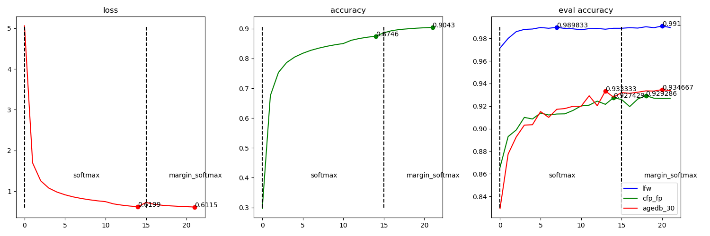

# ___Keras_insightface____
  - Keras Insightface implementation.
  - This is still under working, many things are still testing here, so there may lots of errors atm.
  - **Environment**
    ```py
    # $ ipython
    Python 3.7.6 (default, Jan  8 2020, 19:59:22)
    In [1]: tf.__version__
    Out[1]: '2.1.0'
    ```
# Catalog
  <!-- TOC depthFrom:1 depthTo:6 withLinks:1 updateOnSave:1 orderedList:0 -->

  - [___Keras_insightface____](#kerasinsightface)
  - [Catalog](#catalog)
  - [Current accuracy](#current-accuracy)
  - [Usage](#usage)
  	- [Beforehand Data Prepare](#beforehand-data-prepare)
  	- [Training scripts](#training-scripts)
  - [Training Record](#training-record)
  	- [Loss function test on Mobilenet](#loss-function-test-on-mobilenet)
  	- [Mobilefacenet](#mobilefacenet)
  - [Related Projects](#related-projects)

  <!-- /TOC -->
***

# Current accuracy
  | Model backbone | lfw      | cfp_fp   | agedb_30 |
  | -------------- | -------- | -------- | -------- |
  | ResNet50V2     | 0.995833 | 0.951143 | 0.959333 |
  | MobileNetV2    | 0.993000 | 0.930429 | 0.930000 |
  | Mobilefacenet  | 0.991000 | 0.926714 | 0.934667 |
***

# Usage
## Beforehand Data Prepare
  - **Training Data** in this project is `MS1M-ArcFace` downloaded from [Insightface Dataset Zoo](https://github.com/deepinsight/insightface/wiki/Dataset-Zoo)
  - **Evaluating data** is `LFW` `CFP-FP` `AgeDB-30` bin files included in `MS1M-ArcFace` dataset
  - Any other data is also available just in the right format
  - **[prepare_data.py](prepare_data.py)** script, Extract data from mxnet record format to `folders`. This may take hours.
    ```sh
    # Convert `/datasets/faces_emore` to `/datasets/faces_emore_112x112_folders`
    ./prepare_data.py -D /datasets/faces_emore

    # Convert training dataset, and convert evaluating bin files
    ./prepare_data.py -D /datasets/faces_emore -T cfp_fp.bin agedb_30.bin
    ```
  - **Training dataset** format like
    ```sh
    .
    ├── 0
    │   ├── 100.jpg
    │   ├── 101.jpg
    │   └── 102.jpg
    ├── 1
    │   ├── 111.jpg
    │   ├── 112.jpg
    │   └── 113.jpg
    ├── 10
    │   ├── 707.jpg
    │   ├── 708.jpg
    │   └── 709.jpg
    ```
  - **Evaluting bin files** include jpeg image data pairs, and a label indicating if it's a same person, so there are double images than labels
    ```sh
    #    bins   | issame_list
    img_1 img_2 | 1
    img_3 img_4 | 1
    img_5 img_6 | 0
    img_7 img_8 | 0
    ```
    Image data in bin files like `CFP-FP` `AgeDB-30` is not compatible with `tf.image.decode_jpeg`, we need to reformat it.
## Training scripts
  - **Scripts**
    - [data.py](data.py) loads image data as `tf.dataset` for training. `Triplet` dataset is different from others.
    - [evals.py](evals.py) contains evaluating callback using `bin` files.
    - [losses.py](losses.py) contains `softmax` / `arcface` / `centerloss` / `triplet` loss functions.
    - [myCallbacks.py](myCallbacks.py) contains my other callbacks, like saving model / learning rate adjusting.
    - [mobile_facenet.py](mobile_facenet.py) / [mobilenetv3.py](mobilenetv3.py) basic model implementation. Other models like `ResNet50V2` is loaded from `keras.applications`.
    - [train.py](train.py) contains a `Train` class. It uses a `scheduler` to connect different `loss` / `optimizer` / `epochs`.
  - **Model** contains two part
    - **Basic model** is layers from `input` to `embedding`.
    - **Model** is `Basic model` + `bottleneck` layer, like `softmax` / `arcface` layer. For triplet training, `Model` == `Basic model`.
  - **Training example**
    ```py
    from tensorflow import keras
    import mobile_facenet
    import losses
    import train
    # basic_model = train.buildin_models("MobileNet", dropout=0.4, emb_shape=256)
    basic_model = mobile_facenet.mobile_facenet(256, dropout=0.4, name="mobile_facenet_256")
    data_path = '/datasets/faces_emore_112x112_folders'
    eval_paths = ['/datasets/faces_emore/lfw.bin', '/datasets/faces_emore/cfp_fp.bin', '/datasets/faces_emore/agedb_30.bin']
    tt = train.Train(data_path, eval_paths, 'keras_mobilefacenet_256.h5', basic_model=basic_model, model=None, compile=False, lr_base=0.001, batch_size=160, random_status=3)
    sch = [
      {"loss": keras.losses.categorical_crossentropy, "optimizer": "nadam", "epoch": 15},
      {"loss": losses.margin_softmax, "optimizer": None, "epoch": 10},
      {"loss": losses.ArcfaceLoss(), "optimizer": None, "bottleneckOnly": True, "epoch": 4},
      {"loss": losses.ArcfaceLoss(), "optimizer": None, "epoch": 15},
      {"loss": losses.ArcfaceLoss(scale=32.0), "optimizer": None, "epoch": 15},
      {"loss": losses.batch_hard_triplet_loss, "optimizer": None, "epoch": 30},
    ]
    tt.train(sch, 0)
    ```
  - **train.Train** `basic_model` and `model` parameters. Combine these two parameters to initializing model from different sources. Sometimes may need `custom_objects` to load model.
    | basic_model                              | model          | Use for                                    |
    | ---------------------------------------- | -------------- | ------------------------------------------ |
    | model structure                          | None           | Scratch train                              |
    | model layer index for basic model output | model .h5 file | Continue training from last saved model    |
    | basic model .h5 file                     | None           | Continue training from a saved basic model |
  - **Scheduler** is a list of dicts, each contains a training plan
    - **loss** indicates the loss function.
    - **optimizer** is the optimizer used in this plan, `None` indicates using the last one.
    - **epoch** indicates how many epochs will be trained.
    - **bottleneckOnly** True / False, `True` will set `basic_model.trainable = False`, train the bottleneck layer only.
    - **centerloss** True / False, if set `True`, `loss` will be the `logits_loss` along with `center_loss`, it could also be an instance of `Center_loss`.
    - **type** `softmax` / `arcface` / `triplet`, but mostly this could be guessed from `loss`.
    ```py
    # Scheduler examples
    sch = [{"loss": keras.losses.categorical_crossentropy, "optimizer": "adam", "epoch": 1}]
    sch = [{"loss": losses.Arcface(scale=32.0), "optimizer": keras.optimizers.SGD(0.001, momentum=0.9), "epoch": 1}]
    sch = [{"loss": losses.arcface_loss, "optimizer": "adam", "centerloss": True, "epoch": 1}]
    sch = [{"loss": losses.Centerloss(num_classes=85742), "optimizer": "adam", "centerloss": True, "epoch": 1}]
    sch = [{"loss": losses.batch_hard_triplet_loss, "optimizer": "adam", "epoch": 1}]
    ```
    ```py
    ''' Continue training from last saved file '''
    from tensorflow import keras
    import losses
    import train
    data_path = '/datasets/faces_emore_112x112_folders'
    eval_paths = ['/datasets/faces_emore/lfw.bin', '/datasets/faces_emore/cfp_fp.bin', '/datasets/faces_emore/agedb_30.bin']
    tt = train.Train(data_path, eval_paths, 'keras_mobilefacenet_256_II.h5', basic_model=-2, model='./checkpoints/keras_mobilefacenet_256.h5', compile=True, lr_base=0.001, batch_size=160, random_status=3, custom_objects={'margin_softmax': losses.margin_softmax})
    sch = [
      # {"loss": keras.losses.categorical_crossentropy, "optimizer": "nadam", "type": tt.softmax, "epoch": 15},
      {"loss": losses.margin_softmax, "optimizer": None, "epoch": 6},
      {"loss": losses.ArcfaceLoss(), "optimizer": None, "bottleneckOnly": True, "epoch": 4},
      {"loss": losses.ArcfaceLoss(), "optimizer": None, "epoch": 15},
      {"loss": losses.ArcfaceLoss(scale=32.0), "optimizer": None, "epoch": 15},
      {"loss": losses.batch_hard_triplet_loss, "optimizer": None, "epoch": 30},
    ]
    tt.train(sch, 19) # 19 is the initial_epoch
    ```
  - **Saving strategy**
    - **Model** will save on every epoch end to local path `./checkpoints`, name is specified from `train.Train`.
    - **basic_model** will be saved monitoring on the last `eval_paths` evaluating `bin` item, and save the best only.
  - **Gently stop** is a callback to stop training gently. Input an `n` and `<Enter>` anytime during training, will set training stop on that epoch ends.
***

# Training Record
## Loss function test on Mobilenet
  - **Initialize training from scratch**
    ```py
    from tensorflow import keras
    import mobile_facenet
    import losses
    import train
    basic_model = train.buildin_models("MobileNet", dropout=0.4, emb_shape=256)
    data_path = '/datasets/faces_emore_112x112_folders'
    eval_paths = ['/datasets/faces_emore/lfw.bin', '/datasets/faces_emore/cfp_fp.bin', '/datasets/faces_emore/agedb_30.bin']
    tt = train.Train(data_path, eval_paths, 'keras_mobilenet_256.h5', basic_model=basic_model, model=None, compile=False, lr_base=0.001, batch_size=128, random_status=3)
    sch = [{"loss": losses.ArcfaceLoss(), "optimizer": None, "epoch": 6}]
    tt.train(sch, 0)
    ```
  - **Train next epoch using different loss functions**
    ```py
    ''' Load saved basic model '''
    import losses
    import train
    data_path = '/datasets/faces_emore_112x112_folders'
    eval_paths = ['/datasets/faces_emore/lfw.bin', '/datasets/faces_emore/cfp_fp.bin', '/datasets/faces_emore/agedb_30.bin']
    tt = train.Train(data_path, eval_paths, 'keras_mobilenet_256_V.h5', basic_model="./checkpoints/keras_mobilenet_256_basic_agedb_30_epoch_6_0.900333.h5", model=None, compile=False, lr_base=0.001, batch_size=128, random_status=3)

    ''' Choose one loss function each time --> train one epoch --> reload'''
    sch = [{"loss": keras.losses.categorical_crossentropy, "optimizer": "adam", "epoch": 1}]
    sch = [{"loss": losses.margin_softmax, "optimizer": "adam", "epoch": 1}]
    sch = [{"loss": losses.scale_softmax, "optimizer": "adam", "epoch": 1}]
    sch = [{"loss": losses.arcface_loss, "optimizer": "adam", "epoch": 1}]
    sch = [{"loss": losses.arcface_loss, "optimizer": "adam", "centerloss": True, "epoch": 1}]
    sch = [{"loss": losses.batch_hard_triplet_loss, "optimizer": "adam", "epoch": 1}]
    sch = [{"loss": losses.batch_all_triplet_loss, "optimizer": "adam", "epoch": 1}]

    ''' Train '''
    tt.train(sch, 6)
    ```
  - **Loss and accuracy**

    | Loss type                      | loss    | accuracy | lfw      | lfw thresh | cfp_fp   | cfp_fp thresh | agedb_30 | agedb_30 thresh | total time | per step |
    | ------------------------------ | ------- | -------- | -------- | ---------- | -------- | ------------- | -------- | --------------- | ---------- | -------- |
    | **Original Epoch 6**           | 22.6342 | 0.7855   | 0.987833 | 0.307455   | 0.891714 | 0.201755      | 0.900333 | 0.229057        | 5653s      | 124ms    |
    | **Train Epoch 7**              | adam    | lr 0.001 | bs 128   | rd 3   |          |               |          |                 |            |          |
    | softmax                        | 1.8196  | 0.6941   | 0.987333 | 0.345970   | 0.895286 | 0.204387      | 0.901667 | 0.265905        | 5677s      | 125ms    |
    | margin_softmax                 | 3.8359  | 0.6294   | 0.989000 | 0.317540   | 0.889000 | 0.210142      | 0.897833 | 0.246658        | 5716s      | 126ms    |
    | scale_softmax                  | 2.2430  | 0.6779   | 0.987333 | 0.340417   | 0.887857 | 0.204122      | 0.900333 | 0.273266        | 5702s      | 125ms    |
    | arcface_loss                   | 22.3337 | 0.7928   | 0.987500 | 0.293580   | 0.886857 | 0.199602      | 0.904833 | 0.247436        | 6133s      | 135ms    |
    | center arcface_loss            | 22.5102 | 0.7924   | 0.987833 | 0.321488   | 0.884000 | 0.200262      | 0.894833 | 0.263254        | 5861s      | 129ms    |
    | batch_hard_triplet_loss        | 0.2276  |          | 0.986333 | 0.386425   | 0.910571 | 0.245836      | 0.891333 | 0.354833        | 4622s      | 156ms    |
    | batch_all_triplet_loss         | 0.4749  |          | 0.984333 | 0.417722   | 0.902571 | 0.240187      | 0.837167 | 0.475637        | 4708s      | 159ms    |

## Mobilefacenet
  - Training script is the last exampled one.
  ```py
  '''
  >>>> Softmax 15
  Epoch 1/15
  36392/36392 [==============================] - 12820s 352ms/step - loss: 5.0583 - accuracy: 0.2964
  '''
  lfw = [0.971500,0.980000,0.986000,0.988000,0.988333,0.989667,0.989000,0.989833,0.988833,0.988500,0.987667,0.988667,0.988833,0.988167,0.989000,]
  cfp_fp = [0.865714,0.893000,0.898857,0.910000,0.908571,0.913857,0.912143,0.913000,0.913143,0.916143,0.920143,0.920857,0.924429,0.921571,0.927429,]
  agedb_30 = [0.829167,0.877500,0.892667,0.903167,0.903500,0.915167,0.910000,0.917167,0.917833,0.919833,0.919833,0.929167,0.920333,0.933333,0.928000,]
  loss = [5.0583, 1.6944, 1.2544, 1.0762, 0.9791, 0.9118, 0.8605, 0.8217, 0.7900, 0.7641, 0.7432, 0.6879, 0.6580, 0.6354, 0.6199,]
  accuracy = [0.2964, 0.6755, 0.7532, 0.7862, 0.8047, 0.8174, 0.8273, 0.8348, 0.8410, 0.8460, 0.8501, 0.8611, 0.8671, 0.8714, 0.8746,]

  '''
  >>>> margin_softmax 10
  Epoch 16/25
  36392/36392 [==============================] - 12623s 347ms/step - loss: 0.7236 - accuracy: 0.8861
  '''
  lfw_2 = [0.989000,0.989500,0.989167,0.990333,0.989500,0.991000,0.989667,0.991000,]
  cfp_fp_2 = [0.925857,0.919571,0.926286,0.929286,0.927000,0.926714,0.926857,0.927571,]
  agedb_30_2 = [0.932000,0.931333,0.932333,0.933500,0.933333,0.934667,0.933667,0.936000,]
  loss_2 = [0.7236,0.6785, 0.6545, 0.6401, 0.6290, 0.6199, 0.6115, 0.6046, ]
  accuracy_2 = [0.8861,0.8934, 0.8973, 0.8995, 0.9015, 0.9030, 0.9043, 0.9054, ]

  def peak_scatter(ax, array, peak_method, color):
    start = 0
    for ii in array:
      pp = peak_method(ii)
      ax.scatter(pp + start, ii[pp], color=color)
      ax.text(pp + start, ii[pp], str(ii[pp]))
      start += len(ii)

  def add_plot(lfws, cfp_fps, agedb_30s, losses, accuracies, names, fig=None, axes=None):
    if fig == None:
      fig, axes = plt.subplots(1, 3, sharex=True, figsize=(15, 5))

    tt = []
    for ii in losses: tt += ii
    xx = np.arange(len(tt))
    axes[0].plot(xx, tt, color="r")
    peak_scatter(axes[0], losses, np.argmin, "r")
    axes[0].set_title('loss')

    tt = []
    for ii in accuracies: tt += ii
    axes[1].plot(xx, tt, color="g")
    peak_scatter(axes[1], accuracies, np.argmax, "g")
    axes[1].set_title('accuracy')

    for ss, aa, cc in zip(['lfw', 'cfp_fp', 'agedb_30'], [lfws, cfp_fps, agedb_30s], ["b", "g", "r"]):
      tt = []
      for ii in aa: tt += ii
      axes[2].plot(xx, tt, label=ss, color=cc)
      peak_scatter(axes[2], aa, np.argmax, cc)
    axes[2].set_title('eval accuracy')
    axes[2].legend(loc='lower right')

    for ax in axes:
      ymin, ymax = ax.get_ylim()
      mm = (ymax - ymin) * 0.05
      start = 0
      for nn, loss in zip(names, losses):
        ax.plot([xx[start], xx[start]], [ymin + mm, ymax - mm], color='k', linestyle='--')
        # ax.text(xx[ss[0]], np.mean(ax.get_ylim()), nn)
        ax.text(start + len(loss) * 0.4, ymin + mm * 4, nn)
        start += len(loss)

    fig.tight_layout()

  add_plot([lfw, lfw_2], [cfp_fp, cfp_fp_2], [agedb_30, agedb_30_2], [loss, loss_2], [accuracy, accuracy_2], ["softmax", "margin_softmax"])
  ```
  
***

# Related Projects
  - [TensorFlow Addons Losses: TripletSemiHardLoss](https://www.tensorflow.org/addons/tutorials/losses_triplet)
  - [TensorFlow Addons Layers: WeightNormalization](https://www.tensorflow.org/addons/tutorials/layers_weightnormalization)
  - [deepinsight/insightface](https://github.com/deepinsight/insightface)
***
