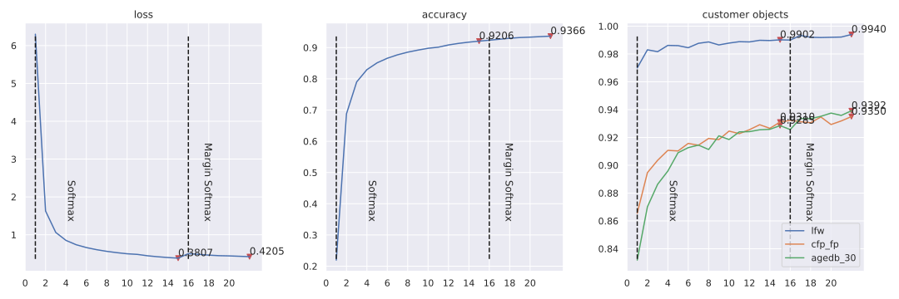

# ___Keras insightface___
  - Keras Insightface implementation.
  - This is still under working, many things are still testing here, so there may lots of errors atm.
  - **Environment**
    ```py
    # $ ipython
    Python 3.7.6 (default, Jan  8 2020, 19:59:22)
    In [1]: tf.__version__
    Out[1]: '2.1.0'
    ```
  - **Default import**
    ```py
    import os
    import sys
    import pandas as pd
    import numpy as np
    import tensorflow as tf
    from tensorflow import keras

    gpus = tf.config.experimental.list_physical_devices("GPU")
    for gpu in gpus:
        tf.config.experimental.set_memory_growth(gpu, True)
    ```
# Catalog
  <!-- TOC depthFrom:1 depthTo:6 withLinks:1 updateOnSave:1 orderedList:0 -->

  - [___Keras insightface___](#keras-insightface)
  - [Catalog](#catalog)
  - [Current accuracy](#current-accuracy)
  - [Usage](#usage)
  	- [Beforehand Data Prepare](#beforehand-data-prepare)
  	- [Training scripts](#training-scripts)
  - [Training Record](#training-record)
  	- [Loss function test on Mobilenet](#loss-function-test-on-mobilenet)
  	- [Mobilefacenet](#mobilefacenet)
  	- [ResNet101V2](#resnet101v2)
  - [Model conversion](#model-conversion)
  	- [ONNX](#onnx)
  	- [TFlite](#tflite)
  - [Related Projects](#related-projects)

  <!-- /TOC -->
***

# Current accuracy
  | Model backbone | lfw      | cfp_fp   | agedb_30 |
  | -------------- | -------- | -------- | -------- |
  | ResNet50V2     | 0.995833 | 0.951143 | 0.959333 |
  | MobileNetV2    | 0.993000 | 0.930429 | 0.930000 |
  | Mobilefacenet  | 0.993500 | 0.936000 | 0.942500 |
***

# Usage
## Beforehand Data Prepare
  - **Training Data** in this project is `MS1M-ArcFace` downloaded from [Insightface Dataset Zoo](https://github.com/deepinsight/insightface/wiki/Dataset-Zoo)
  - **Evaluating data** is `LFW` `CFP-FP` `AgeDB-30` bin files included in `MS1M-ArcFace` dataset
  - Any other data is also available just in the right format
  - **[prepare_data.py](prepare_data.py)** script, Extract data from mxnet record format to `folders`. This may take hours.
    ```sh
    # Convert `/datasets/faces_emore` to `/datasets/faces_emore_112x112_folders`
    CUDA_VISIBLE_DEVICES='-1' ./prepare_data.py -D /datasets/faces_emore

    # Convert training dataset, and convert evaluating bin files
    CUDA_VISIBLE_DEVICES='-1' ./prepare_data.py -D /datasets/faces_emore -T lfw.bin cfp_fp.bin agedb_30.bin
    ```
    Executing again will skip `dataset` conversion.
  - **Training dataset Required** is a `folder` including `person folders`, each `person folder` including multi `face images`. Format like
    ```sh
    .               # dataset folder
    ├── 0           # person folder
    │   ├── 100.jpg # face image
    │   ├── 101.jpg # face image
    │   └── 102.jpg # face image
    ├── 1           # person folder
    │   ├── 111.jpg
    │   ├── 112.jpg
    │   └── 113.jpg
    ├── 10
    │   ├── 707.jpg
    │   ├── 708.jpg
    │   └── 709.jpg
    ```
  - **Evaluting bin files** include jpeg image data pairs, and a label indicating if it's a same person, so there are double images than labels
    ```sh
    #    bins   | issame_list
    img_1 img_2 | 1
    img_3 img_4 | 1
    img_5 img_6 | 0
    img_7 img_8 | 0
    ```
    Image data in bin files like `CFP-FP` `AgeDB-30` is not compatible with `tf.image.decode_jpeg`, we need to reformat it.
    ```py
    ''' Throw error if not reformated yet '''
    ValueError: Can't convert non-rectangular Python sequence to Tensor.
    ```
## Training scripts
  - **Scripts**
    - [data.py](data.py) loads image data as `tf.dataset` for training. `Triplet` dataset is different from others.
    - [evals.py](evals.py) contains evaluating callback using `bin` files.
    - [losses.py](losses.py) contains `softmax` / `arcface` / `centerloss` / `triplet` loss functions.
    - [myCallbacks.py](myCallbacks.py) contains my other callbacks, like saving model / learning rate adjusting.
    - [mobile_facenet.py](mobile_facenet.py) / [mobilenetv3.py](mobilenetv3.py) basic model implementation. Other models like `ResNet50V2` is loaded from `keras.applications`.
    - [train.py](train.py) contains a `Train` class. It uses a `scheduler` to connect different `loss` / `optimizer` / `epochs`.
  - **Model** contains two part
    - **Basic model** is layers from `input` to `embedding`.
    - **Model** is `Basic model` + `bottleneck` layer, like `softmax` / `arcface` layer. For triplet training, `Model` == `Basic model`.
  - **Training example**
    ```py
    from tensorflow import keras
    import mobile_facenet
    import losses
    import train
    # basic_model = train.buildin_models("MobileNet", dropout=0.4, emb_shape=256)
    # basic_model = train.buildin_models("ResNet101V2", dropout=0.4, emb_shape=512)
    basic_model = mobile_facenet.mobile_facenet(256, dropout=0.4, name="mobile_facenet_256")
    data_path = '/datasets/faces_emore_112x112_folders'
    eval_paths = ['/datasets/faces_emore/lfw.bin', '/datasets/faces_emore/cfp_fp.bin', '/datasets/faces_emore/agedb_30.bin']
    tt = train.Train(data_path, eval_paths, 'keras_mobilefacenet_256.h5', basic_model=basic_model, model=None, compile=False, lr_base=0.001, batch_size=160, random_status=3)
    sch = [
      {"loss": keras.losses.categorical_crossentropy, "optimizer": "nadam", "epoch": 15},
      {"loss": losses.margin_softmax, "epoch": 10},
      {"loss": losses.ArcfaceLoss(), "bottleneckOnly": True, "epoch": 4},
      {"loss": losses.ArcfaceLoss(), "epoch": 15},
      {"loss": losses.ArcfaceLoss(scale=32.0), "epoch": 15},
      {"loss": losses.ArcfaceLoss(scale=32.0), "optimizer": keras.optimizers.SGD(momentum=0.9), "epoch": 10},
      {"loss": losses.batch_hard_triplet_loss, "optimizer": "nadam", "epoch": 30},
    ]
    tt.train(sch, 0)
    ```
  - **train.Train** `basic_model` and `model` parameters. Combine these two parameters to initializing model from different sources. Sometimes may need `custom_objects` to load model.
    | basic_model                              | model          | Use for                                    |
    | ---------------------------------------- | -------------- | ------------------------------------------ |
    | model structure                          | None           | Scratch train                              |
    | model layer index for basic model output | model .h5 file | Continue training from last saved model    |
    | basic model .h5 file                     | None           | Continue training from a saved basic model |
  - **Scheduler** is a list of dicts, each contains a training plan
    - **loss** indicates the loss function.
    - **optimizer** is the optimizer used in this plan, `None` indicates using the last one.
    - **epoch** indicates how many epochs will be trained.
    - **bottleneckOnly** True / False, `True` will set `basic_model.trainable = False`, train the bottleneck layer only.
    - **centerloss** True / False, if set `True`, `loss` will be the `logits_loss` add to `center_loss`, `loss` could also be an instance of `Center_loss`.
    - **type** `softmax` / `arcface` / `triplet`, but mostly this could be guessed from `loss`.
    ```py
    # Scheduler examples
    sch = [{"loss": keras.losses.categorical_crossentropy, "optimizer": "adam", "epoch": 1}]
    sch = [{"loss": losses.Arcface(scale=32.0), "optimizer": keras.optimizers.SGD(0.001, momentum=0.9), "epoch": 1}]
    sch = [{"loss": losses.ArcfaceLoss(), "optimizer": None, "bottleneckOnly": True, "epoch": 1}]
    sch = [{"loss": losses.arcface_loss, "optimizer": "adam", "centerloss": True, "epoch": 1}]
    sch = [{"loss": losses.ArcfaceLoss(), "bottleneckOnly": True, "centerloss": True, "epoch": 1}]
    sch = [{"loss": losses.Centerloss(num_classes=85742), "centerloss": True, "epoch": 1}]
    sch = [{"loss": losses.batch_hard_triplet_loss, "optimizer": "adam", "epoch": 1}]
    ```
    Some combinations are errors, like `centerloss` + `triplet`, and training `bottleneckOnly` + `triplet` will change nothing.
    ```py
    ''' Continue training from last saved file '''
    from tensorflow import keras
    import losses
    import train
    data_path = '/datasets/faces_emore_112x112_folders'
    eval_paths = ['/datasets/faces_emore/lfw.bin', '/datasets/faces_emore/cfp_fp.bin', '/datasets/faces_emore/agedb_30.bin']
    tt = train.Train(data_path, eval_paths, 'keras_mobilefacenet_256_II.h5', basic_model=-2, model='./checkpoints/keras_mobilefacenet_256.h5', compile=True, lr_base=0.001, batch_size=160, random_status=3, custom_objects={'margin_softmax': losses.margin_softmax})
    sch = [
      # {"loss": keras.losses.categorical_crossentropy, "optimizer": "nadam", "epoch": 15},
      {"loss": losses.margin_softmax, "epoch": 10},
      {"loss": losses.ArcfaceLoss(), "bottleneckOnly": True, "epoch": 4},
      {"loss": losses.ArcfaceLoss(), "epoch": 15},
      {"loss": losses.ArcfaceLoss(scale=32.0), "epoch": 15},
      {"loss": losses.ArcfaceLoss(scale=32.0), "optimizer": keras.optimizers.SGD(momentum=0.9), "epoch": 10},
      {"loss": losses.batch_hard_triplet_loss, "optimizer": "nadam", "epoch": 30},
    ]
    tt.train(sch, 19) # 19 is the initial_epoch
    ```
  - **Saving strategy**
    - **Model** will save on every epoch end to local path `./checkpoints`, name is specified from `train.Train`.
    - **basic_model** will be saved monitoring on the last `eval_paths` evaluating `bin` item, and save the best only.
  - **Gently stop** is a callback to stop training gently. Input an `n` and `<Enter>` anytime during training, will set training stop on that epoch ends.
  - **My history**
    - This is a callback collecting training `loss` and `accuracy`, and evaluating `accuracy`.
    - On every epoch end, backup to the path `save_path` defined in `train.Train` with suffix `_hist.json`.
    - Reload when initializing, if the backup `<save_path>_hist.json` file exists.
  - **Learning rate** uses `exponential decay`, `lr_base` and `lr_decay` in `train.Train` set it. Default is `lr_base=0.1, lr_decay=0.05`.
    ```py
    import myCallbacks
    epochs = np.arange(100)
    plt.plot(epochs, [myCallbacks.scheduler(ii, 0.001, 0.1) for ii in epochs], label="lr 0.001, decay 0.1")
    plt.plot(epochs, [myCallbacks.scheduler(ii, 0.001, 0.05) for ii in epochs], label="lr 0.001, decay 0.05")
    plt.plot(epochs, [myCallbacks.scheduler(ii, 0.001, 0.02) for ii in epochs], label="lr 0.001, decay 0.02")
    plt.legend()
    ```
    
  - **Evaluation**
    ```py
    import evals
    '/datasets/faces_emore/lfw.bin'
    basic_model = keras.models.load_model('checkpoints/keras_mobilefacenet_256_basic_agedb_30_epoch_39_0.942500.h5', compile=False)
    ee = evals.epoch_eval_callback(basic_model, '/datasets/faces_emore/lfw.bin')
    ee.on_epoch_end(0)
    # >>>> lfw evaluation max accuracy: 0.993167, thresh: 0.316535, previous max accuracy: 0.000000, PCA accuray = 0.993167 ± 0.003905
    # >>>> Improved = 0.993167
    ```
***

# Training Record
## Loss function test on Mobilenet
  - **Initialize training from scratch**
    ```py
    from tensorflow import keras
    import losses
    import train
    basic_model = train.buildin_models("MobileNet", dropout=0.4, emb_shape=256)
    data_path = '/datasets/faces_emore_112x112_folders'
    eval_paths = ['/datasets/faces_emore/lfw.bin', '/datasets/faces_emore/cfp_fp.bin', '/datasets/faces_emore/agedb_30.bin']
    tt = train.Train(data_path, eval_paths, 'keras_mobilenet_256.h5', basic_model=basic_model, model=None, compile=False, lr_base=0.001, batch_size=128, random_status=3)
    sch = [{"loss": losses.ArcfaceLoss(), "optimizer": None, "epoch": 6}]
    tt.train(sch, 0)
    ```
  - **Train next epoch using different loss functions**
    ```py
    ''' Load saved basic model '''
    import losses
    import train
    data_path = '/datasets/faces_emore_112x112_folders'
    eval_paths = ['/datasets/faces_emore/lfw.bin', '/datasets/faces_emore/cfp_fp.bin', '/datasets/faces_emore/agedb_30.bin']
    tt = train.Train(data_path, eval_paths, 'keras_mobilenet_256_V.h5', basic_model="./checkpoints/keras_mobilenet_256_basic_agedb_30_epoch_6_0.900333.h5", model=None, compile=False, lr_base=0.001, batch_size=128, random_status=3)

    ''' Choose one loss function each time --> train one epoch --> reload'''
    sch = [{"loss": keras.losses.categorical_crossentropy, "optimizer": "adam", "epoch": 1}]
    sch = [{"loss": losses.margin_softmax, "optimizer": "adam", "epoch": 1}]
    sch = [{"loss": losses.scale_softmax, "optimizer": "adam", "epoch": 1}]
    sch = [{"loss": losses.arcface_loss, "optimizer": "adam", "epoch": 1}]
    sch = [{"loss": losses.arcface_loss, "optimizer": "adam", "centerloss": True, "epoch": 1}]
    sch = [{"loss": losses.batch_hard_triplet_loss, "optimizer": "adam", "epoch": 1}]
    sch = [{"loss": losses.batch_all_triplet_loss, "optimizer": "adam", "epoch": 1}]

    ''' Train '''
    tt.train(sch, 6)
    ```
  - **Loss and accuracy**

    | Loss type               | loss    | accuracy | lfw      | lfw thresh | cfp_fp   | cfp_fp thresh | agedb_30 | agedb_30 thresh | total time | per step |
    | ----------------------- | ------- | -------- | -------- | ---------- | -------- | ------------- | -------- | --------------- | ---------- | -------- |
    | **Original Epoch 6**    | 22.6342 | 0.7855   | 0.987833 | 0.307455   | 0.891714 | 0.201755      | 0.900333 | 0.229057        | 5653s      | 124ms    |
    | **Train Epoch 7**       |         |          |          |            |          |               |          |                 |            |          |
    | softmax                 | 1.8196  | 0.6941   | 0.987333 | 0.345970   | 0.895286 | 0.204387      | 0.901667 | 0.265905        | 5677s      | 125ms    |
    | margin_softmax          | 3.8359  | 0.6294   | 0.989000 | 0.317540   | 0.889000 | 0.210142      | 0.897833 | 0.246658        | 5716s      | 126ms    |
    | scale_softmax           | 2.2430  | 0.6779   | 0.987333 | 0.340417   | 0.887857 | 0.204122      | 0.900333 | 0.273266        | 5702s      | 125ms    |
    | arcface_loss            | 22.3337 | 0.7928   | 0.987500 | 0.293580   | 0.886857 | 0.199602      | 0.904833 | 0.247436        | 6133s      | 135ms    |
    | center arcface_loss     | 22.5102 | 0.7924   | 0.987833 | 0.321488   | 0.884000 | 0.200262      | 0.894833 | 0.263254        | 5861s      | 129ms    |
    | batch_hard_triplet_loss | 0.2276  |          | 0.986333 | 0.386425   | 0.910571 | 0.245836      | 0.891333 | 0.354833        | 4622s      | 156ms    |
    | batch_all_triplet_loss  | 0.4749  |          | 0.984333 | 0.417722   | 0.902571 | 0.240187      | 0.837167 | 0.475637        | 4708s      | 159ms    |
## Mobilefacenet
  - Training script is the last exampled one.
  - **Record**
    | Loss               | Epochs | First epoch                                          |
    | ------------------ | ------ | ---------------------------------------------------- |
    | Softmax            | 15     | 12820s 352ms/step - loss: 5.0583 - accuracy: 0.2964  |
    | Margin Softmax     | 10     | 12623s 347ms/step - loss: 0.7236 - accuracy: 0.8861  |
    | Bottleneck Arcface | 4      | 4675s 128ms/step - loss: 22.1107 - accuracy: 0.8630  |
    | Arcface 64         | 15     | 12638s 347ms/step - loss: 15.1014 - accuracy: 0.9529 |

    ```py
    import train
    train.hist_plot_split("./checkpoints/keras_mobilefacenet_256_II_hist.json", [15, 10, 4, 15, 15], ["Softmax", "Margin Softmax", "Bottleneck Arcface", "Arcface scale=64",  "Arcface scale=32"])
    ```
    
## ResNet101V2
  - **Training script** is similar with `Mobilefacenet`, just replace `basic_model` with `ResNet101V2`, and set a new `save_path`
    ```py
    basic_model = train.buildin_models("ResNet101V2", dropout=0.4, emb_shape=512)
    tt = train.Train(data_path, eval_paths, 'keras_resnet101_512.h5', basic_model=basic_model, batch_size=128)
    ```
  - **Record**
    | Loss           | epochs | First epoch                                         |
    | -------------- | ------ | --------------------------------------------------- |
    | Softamx        | 15     | 12824s 282ms/step - loss: 6.3005 - accuracy: 0.2196 |
    | Margin Softmax | 10     | 12784s 281ms/step - loss: 0.5001 - accuracy: 0.9236 |

    ```py
    import train
    train.hist_plot_split("./checkpoints/keras_resnet101_512_II_hist.json", [15, 10, 4, 15, 15], ["Softmax", "Margin Softmax", "Bottleneck Arcface", "Arcface scale=64",  "Arcface scale=32"])
    ```
    
***

# Model conversion
## ONNX
  - Currently most frameworks support `tf1.x` only, so better convert it under `tf1.x` environment
    ```py
    tf.__version__
    # '1.15.0'

    # Convert to saved model first
    import glob2
    mm = tf.keras.models.load_model(glob2.glob('./keras_mobilefacenet_256_basic_*.h5')[0], compile=False)
    keras.experimental.export_saved_model(mm, './saved_model')
    ```
    `tf2onnx` convert `saved model` to `tflite`, also `tf1.15.0`
    ```sh
    pip install -U tf2onnx
    python -m tf2onnx.convert --saved-model ./saved_model --output model.onnx
    ```
## TFlite
  - Convert to TFlite
    ```py
    tf.__version__
    # '1.15.0'

    import glob2
    converter = tf.lite.TFLiteConverter.from_keras_model_file(glob2.glob('./keras_mobilefacenet_256_basic_*.h5')[0])
    tflite_model = converter.convert()
    open('./model.tflite', 'wb').write(tflite_model)
    ```
    ```py
    tf.__version__
    # '2.1.0'

    import glob2
    mm = tf.keras.models.load_model(glob2.glob('./keras_mobilefacenet_256_basic_*.h5')[0], compile=False)
    converter = tf.lite.TFLiteConverter.from_keras_model(mm)
    tflite_model = converter.convert()
    open('./model_tf2.tflite', 'wb').write(tflite_model)
    ```
  - interpreter test
    ```py
    tf.__version__
    # '2.1.0'

    import glob2
    interpreter = tf.lite.Interpreter('./model.tflite')
    interpreter.allocate_tensors()
    input_index = interpreter.get_input_details()[0]["index"]
    output_index = interpreter.get_output_details()[0]["index"]

    def tf_imread(file_path):
        img = tf.io.read_file(file_path)
        img = tf.image.decode_jpeg(img, channels=3)
        img = tf.image.convert_image_dtype(img, tf.float32)
        img = (img - 0.5) * 2
        return tf.expand_dims(img, 0)

    imm = tf_imread('/datasets/faces_emore_112x112_folders/0/1.jpg')
    interpreter.set_tensor(input_index, imm)
    interpreter.invoke()
    aa = interpreter.get_tensor(output_index)[0]

    mm = tf.keras.models.load_model(glob2.glob('./keras_mobilefacenet_256_basic_*.h5')[0], compile=False)
    bb = mm(imm).numpy()
    assert np.allclose(aa, bb, rtol=1e-3)
    ```
***

# Related Projects
  - [TensorFlow Addons Losses: TripletSemiHardLoss](https://www.tensorflow.org/addons/tutorials/losses_triplet)
  - [TensorFlow Addons Layers: WeightNormalization](https://www.tensorflow.org/addons/tutorials/layers_weightnormalization)
  - [deepinsight/insightface](https://github.com/deepinsight/insightface)
***
