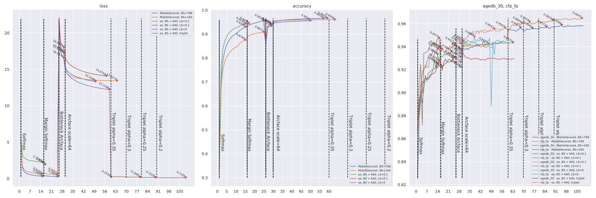
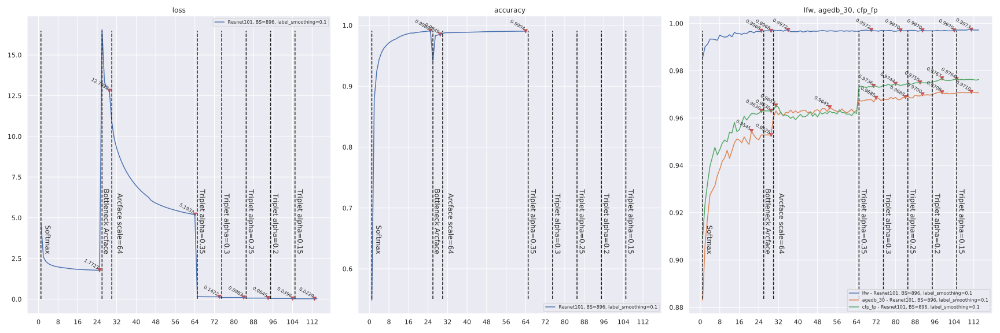
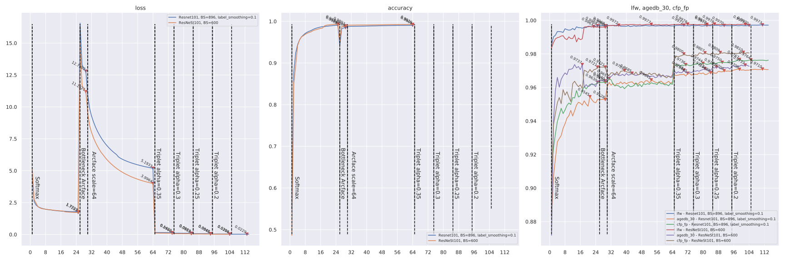

# ___Keras insightface___
  - Keras Insightface implementation.
  - This is still under working, many things are still testing here, so there may lots of errors atm.
  - **Any advise is welcome**!
  - **NOTE 1** Seems adding `weight_decay` to `optimizer` is essential for train `Arcloss`. My `weight_decay` value for `Adam` is `5e-5`.
  - **NOTE 2** Seems adding `dropout` is **NOT** good.
  - **NOTE 3** Seems combining `Arcloss` with `TripletLoss` improves accuracy performance on test datasets.
  - **Environment**
    ```py
    # $ ipython
    Python 3.7.6 | packaged by conda-forge | (default, Mar 23 2020, 23:03:20)
    In [1]: tf.__version__
    Out[1]: '2.3.0'
    ```
    Or `tf-nightly`
    ```py
    In [1]: tf.__version__
    Out[1]: '2.3.0-dev20200523'
    ```
  - **Default import**
    ```py
    import os
    import sys
    import pandas as pd
    import numpy as np
    import tensorflow as tf
    from tensorflow import keras

    gpus = tf.config.experimental.list_physical_devices("GPU")
    for gpu in gpus:
        tf.config.experimental.set_memory_growth(gpu, True)
    ```
  - **Conda install `tf-nightly`**
    ```sh
    conda create -n tf-nightly
    conda activate tf-nightly
    pip install tf-nightly glob2 pandas tqdm scikit-image scikit-learn ipython

    # Install cuda 10.1 if not installed
    conda install cudnn=7.6.5=cuda10.1_0
    ```
# Table of Contents
  <!-- TOC depthFrom:1 depthTo:6 withLinks:1 updateOnSave:1 orderedList:0 -->

  - [___Keras insightface___](#keras-insightface)
  - [Table of Contents](#table-of-contents)
  - [Current accuracy](#current-accuracy)
  - [Usage](#usage)
  	- [Beforehand Data Prepare](#beforehand-data-prepare)
  	- [Training scripts](#training-scripts)
  	- [Optimizer with weight decay](#optimizer-with-weight-decay)
  	- [Multi GPU train](#multi-gpu-train)
  	- [TFLite model inference time test on ARM32](#tflite-model-inference-time-test-on-arm32)
  - [Training Record](#training-record)
  	- [Loss function test on Mobilenet](#loss-function-test-on-mobilenet)
  	- [Mobilefacenet](#mobilefacenet)
  	- [Loss function test on Mobilefacenet epoch 44](#loss-function-test-on-mobilefacenet-epoch-44)
  	- [ResNet101V2](#resnet101v2)
  	- [EfficientNetB4](#efficientnetb4)
  	- [ResNeSt101](#resnest101)
  	- [Comparing early softmax training](#comparing-early-softmax-training)
  	- [Label smoothing](#label-smoothing)
  - [Model conversion](#model-conversion)
  	- [ONNX](#onnx)
  	- [TensorRT](#tensorrt)
  	- [TFlite](#tflite)
  - [Related Projects](#related-projects)
  - [Tests](#tests)

  <!-- /TOC -->
***

# Current accuracy
  - Rerunning all with `label smoothing`.

  | Model backbone   | lfw      | cfp_fp   | agedb_30 | Epochs |
  | ---------------- | -------- | -------- | -------- | ------ |
  | [Mobilenet](checkpoints/mobilenet_adamw_BS256_E80_arc_tripD_basic_agedb_30_epoch_123_0.955333.h5)        | 0.996167 | 0.948429 | 0.955333 | 120    |
  | [se_mobilefacenet](checkpoints/keras_se_mobile_facenet_emore_triplet_basic_agedb_30_epoch_100_0.958333.h5) | 0.996333 | 0.964714 | 0.958833 | 100    |
  | ResNet101V2      | 0.997333 | 0.976714 | 0.971000 | 110    |
  | ResNeSt101       | 0.997667 | 0.981000 | 0.973333 | 100    |
***

# Usage
## Beforehand Data Prepare
  - **Training Data** in this project is `MS1M-ArcFace` downloaded from [Insightface Dataset Zoo](https://github.com/deepinsight/insightface/wiki/Dataset-Zoo)
  - **Evaluating data** is `LFW` `CFP-FP` `AgeDB-30` bin files included in `MS1M-ArcFace` dataset
  - Any other data is also available just in the right format
  - **[prepare_data.py](prepare_data.py)** script, Extract data from mxnet record format to `folders`.
    ```sh
    # Convert `/datasets/faces_emore` to `/datasets/faces_emore_112x112_folders`
    CUDA_VISIBLE_DEVICES='-1' ./prepare_data.py -D /datasets/faces_emore
    # Convert evaluating bin files
    CUDA_VISIBLE_DEVICES='-1' ./prepare_data.py -D /datasets/faces_emore -T lfw.bin cfp_fp.bin agedb_30.bin
    ```
    Executing again will skip `dataset` conversion.
  - **Training dataset Required** is a `folder` including `person folders`, each `person folder` including multi `face images`. Format like
    ```sh
    .               # dataset folder
    ├── 0           # person folder
    │   ├── 100.jpg # face image
    │   ├── 101.jpg # face image
    │   └── 102.jpg # face image
    ├── 1           # person folder
    │   ├── 111.jpg
    │   ├── 112.jpg
    │   └── 113.jpg
    ├── 10
    │   ├── 707.jpg
    │   ├── 708.jpg
    │   └── 709.jpg
    ```
  - **Evaluting bin files** include jpeg image data pairs, and a label indicating if it's a same person, so there are double images than labels
    ```sh
    #    bins   | issame_list
    img_1 img_2 | 1
    img_3 img_4 | 1
    img_5 img_6 | 0
    img_7 img_8 | 0
    ```
    Image data in bin files like `CFP-FP` `AgeDB-30` is not compatible with `tf.image.decode_jpeg`, we need to reformat it.
    ```py
    ''' Throw error if not reformated yet '''
    ValueError: Can't convert non-rectangular Python sequence to Tensor.
    ```
## Training scripts
  - **Scripts**
    - [data.py](data.py) loads image data as `tf.dataset` for training. `Triplet` dataset is different from others.
    - [data_gen.py](data_gen.py) NOT working, accuracy wont increase. Using `ImageDataGenerator` and `AutoAugment` to load images.
    - [evals.py](evals.py) contains evaluating callback using `bin` files.
    - [losses.py](losses.py) contains `softmax` / `arcface` / `centerloss` / `triplet` loss functions.
    - [backbones](backbones) basic model implementation of `mobilefacenet` / `mobilenetv3` / `resnest`. Other backbones like `ResNet101V2` is loaded from `keras.applications` in `train.buildin_models`.
    - [myCallbacks.py](myCallbacks.py) contains my other callbacks, like saving model / learning rate adjusting / save history.
    - [plot.py](plot.py) contains a history plot function.
    - [train.py](train.py) contains a `Train` class. It uses a `scheduler` to connect different `loss` / `optimizer` / `epochs`. The basic function is simple `load data --> model --> compile --> fit`.
  - **Model** contains two part
    - **Basic model** is layers from `input` to `embedding`.
    - **Model** is `Basic model` + `bottleneck` layer, like `softmax` / `arcface` layer. For triplet training, `Model` == `Basic model`. For combined `loss` training, it may have multiple outputs.
  - **Training example**
    ```py
    from tensorflow import keras
    import losses
    import train
    import tensorflow_addons as tfa

    basic_model = train.buildin_models("MobileNet", dropout=0, emb_shape=256)
    # basic_model = train.buildin_models("ResNet101V2", dropout=0, emb_shape=512)
    # basic_model = train.buildin_models("ResNest101", dropout=0, emb_shape=512)
    # basic_model = train.buildin_models('EfficientNetB0', dropout=0, emb_shape=256)
    # basic_model = train.buildin_models('EfficientNetB4', dropout=0, emb_shape=256)
    # basic_model = mobile_facenet.mobile_facenet(256, dropout=0, name="mobile_facenet_256")
    # basic_model = mobile_facenet.mobile_facenet(256, dropout=0, name="se_mobile_facenet_256", use_se=True)
    data_path = '/datasets/faces_emore_112x112_folders'
    eval_paths = ['/datasets/faces_emore/lfw.bin', '/datasets/faces_emore/cfp_fp.bin', '/datasets/faces_emore/agedb_30.bin']

    tt = train.Train(data_path, save_path='keras_mobilenet_emore.h5', eval_paths=eval_paths, basic_model=basic_model, lr_base=0.001, batch_size=640, random_status=3)
    optimizer = tfa.optimizers.AdamW(weight_decay=5e-5)
    sch = [
      {"loss": keras.losses.CategoricalCrossentropy(label_smoothing=0.1), "centerloss": 1, "optimizer": optimizer, "epoch": 20},
      {"loss": keras.losses.CategoricalCrossentropy(label_smoothing=0.1), "centerloss": 32, "epoch": 20},
      {"loss": keras.losses.CategoricalCrossentropy(label_smoothing=0.1), "centerloss": 64, "epoch": 20},
      {"loss": losses.ArcfaceLoss(), "bottleneckOnly": True, "epoch": 2},
      {"loss": losses.ArcfaceLoss(), "epoch": 20, "triplet": 64, "alpha": 0.3},
      {"loss": losses.ArcfaceLoss(), "epoch": 20, "triplet": 64, "alpha": 0.25},
      {"loss": losses.ArcfaceLoss(), "epoch": 20, "triplet": 64, "alpha": 0.2},
    ]
    tt.train(sch, 0)
    ```
    Buildin model names in `train.Train` can be printed by
    ```py
    train.print_buildin_models()
    ```
    `train.Train` is mostly functioned as a scheduler, the basic strategy is simple
    ```py
    from tensorflow import keras
    import losses, data, evals, myCallbacks
    from backbones import mobile_facenet
    # Dataset
    data_path = '/datasets/faces_emore_112x112_folders'
    train_ds = data.prepare_dataset(data_path, batch_size=512, random_status=3, random_crop=(100, 100, 3))
    classes = train_ds.element_spec[-1].shape[-1]
    # Model
    basic_model = mobile_facenet.mobile_facenet(256, dropout=0.4, name="mobile_facenet_256")
    model_output = keras.layers.Dense(classes, activation="softmax")(basic_model.outputs[0])
    model = keras.models.Model(basic_model.inputs[0], model_output)
    # Evals and basic callbacks
    eval_paths = ['/datasets/faces_emore/lfw.bin', '/datasets/faces_emore/cfp_fp.bin', '/datasets/faces_emore/agedb_30.bin']
    my_evals = [evals.eval_callback(basic_model, ii, batch_size=512, eval_freq=1) for ii in eval_paths]
    my_evals[-1].save_model = 'keras_mobilefacenet'
    basic_callbacks = myCallbacks.basic_callbacks(checkpoint='keras_mobilefacenet.h5', evals=my_evals, lr=0.001)
    callbacks = my_evals + basic_callbacks
    # Compile and fit
    model.compile(optimizer='nadam', loss=keras.losses.CategoricalCrossentropy(label_smoothing=0.1), metrics=["accuracy"])
    model.fit(train_ds, epochs=15, callbacks=callbacks, verbose=1)
    ```
  - **train.Train** `basic_model` and `model` parameters. Combine these two parameters to initializing model from different sources. Sometimes may need `custom_objects` to load model.
    | basic_model                                                     | model           | Used for                                   |
    | --------------------------------------------------------------- | --------------- | ------------------------------------------ |
    | model structure                                                 | None            | Scratch train                              |
    | basic model .h5 file                                            | None            | Continue training from last saved model    |
    | None for 'embedding' layer or layer index of basic model output | model .h5 file  | Continue training from a saved basic model |
    | None for 'embedding' layer or layer index of basic model output | model structure | Continue training from a modified model    |
  - **Scheduler** is a list of dicts, each contains a training plan
    - **loss** indicates the loss function. **Required**.
    - **optimizer** is the optimizer used in this plan, `None` indicates using the last one.
    - **epoch** indicates how many epochs will be trained. **Required**.
    - **bottleneckOnly** True / False, `True` will set `basic_model.trainable = False`, train the bottleneck layer only.
    - **centerloss** float value, if set a non zero value, attach a `CenterLoss` to `logits_loss`, and the value means `loss_weight`.
    - **triplet** float value, if set a non zero value, attach a `BatchHardTripletLoss` to `logits_loss`, and the value means `loss_weight`.
    - **alpha** float value, default to `0.35`. Alpha value for `BatchHardTripletLoss` if attached.
    - **type** `softmax` / `arcface` / `triplet` / `center`, but mostly this could be guessed from `loss`.
    ```py
    # Scheduler examples
    sch = [
        {"loss": losses.scale_softmax, "optimizer": "adam", "epoch": 2},
        {"loss": keras.losses.CategoricalCrossentropy(label_smoothing=0.1), "centerloss": 10, "epoch": 2},
        {"loss": losses.ArcfaceLoss(), "bottleneckOnly": True, "epoch": 2},
        {"loss": losses.ArcfaceLoss(scale=32.0, label_smoothing=0.1), "optimizer": keras.optimizers.SGD(0.001, momentum=0.9), "epoch": 2},
        {"loss": losses.BatchAllTripletLoss(0.3), "epoch": 2},
        {"loss": losses.BatchHardTripletLoss(0.25), "epoch": 2},
        {"loss": losses.CenterLoss(num_classes=85742, emb_shape=256), "epoch": 2},
    ]
    ```
    Some more complicated combinations are also supported, but it may lead to nowhere...
    ```py
    # `softmax` / `arcface` + `triplet`
    sch = [{"loss": keras.losses.CategoricalCrossentropy(label_smoothing=0.1), "triplet": 1, "alpha": 0.3, "epoch": 2}]
    # `triplet` + `centerloss`
    sch = [{"loss": losses.BatchHardTripletLoss(0.25), "centerloss": 1, "epoch": 2}]
    sch = [{"loss": losses.CenterLoss(num_classes=85742, emb_shape=256), "triplet": 10, "alpha": 0.25, "epoch": 2}]
    # `softmax` / `arcface` + `triplet` + `centerloss`
    sch = [{"loss": losses.ArcfaceLoss(), "centerloss": 32, "triplet": 32, "alpha": 0.2, "epoch": 2}]
    ```
  - **Saving strategy**
    - **Model** will save the latest one on every epoch end to local path `./checkpoints`, name is specified by `train.Train` `save_path`.
    - **basic_model** will be saved monitoring on the last `eval_paths` evaluating `bin` item, and save the best only.
    ```py
    ''' Continue training from last saved file '''
    from tensorflow import keras
    import losses
    import train
    data_path = '/datasets/faces_emore_112x112_folders'
    eval_paths = ['/datasets/faces_emore/lfw.bin', '/datasets/faces_emore/cfp_fp.bin', '/datasets/faces_emore/agedb_30.bin']
    tt = train.Train(data_path, 'keras_mobilefacenet_256_II.h5', eval_paths, model='./checkpoints/keras_mobilefacenet_256.h5', compile=True, lr_base=0.001, batch_size=768, random_status=3)
    sch = [
      # {"loss": keras.losses.CategoricalCrossentropy(label_smoothing=0.1), "centerloss": True, "optimizer": "nadam", "epoch": 25},
      {"loss": keras.losses.CategoricalCrossentropy(label_smoothing=0.1), "centerloss": True, "optimizer": "nadam", "epoch": 6},
      # {"loss": losses.scale_softmax, "epoch": 10},
      {"loss": losses.ArcfaceLoss(), "bottleneckOnly": True, "epoch": 4},
      {"loss": losses.ArcfaceLoss(), "centerloss": True, "epoch": 35},
      {"loss": losses.BatchHardTripletLoss(0.35), "epoch": 10},
      {"loss": losses.BatchHardTripletLoss(0.33), "epoch": 10},
    ]
    tt.train(sch, 19) # 19 is the initial_epoch
    ```
    If reload a `centerloss` trained model, please keep `save_path` same as previous, as `centerloss` needs to reload saved `xxx_centers.npy` by `save_path` name.
  - **Gently stop** is a callback to stop training gently. Input an `n` and `<Enter>` anytime during training, will set training stop on that epoch ends.
  - **My history**
    - This is a callback collecting training `loss`, `accuracy` and `evaluating accuracy`.
    - On every epoch end, backup to the path `save_path` defined in `train.Train` with suffix `_hist.json`.
    - Reload when initializing, if the backup `<save_path>_hist.json` file exists.
  - **Learning rate**
    - `train.Train` parameters `lr_base` / `lr_decay` / `lr_decay_steps` set different decay strategies and their parameters.
    - `Exponential decay`, default one, `lr_base` and `lr_decay` in `train.Train` set it. Default is `lr_base=0.001, lr_decay=0.05`.
    - `Cosine decay with restart`
      - Set `lr_decay` with a value `> 1` will use `cosine lr decay`, in this case `lr_decay` means `total decay steps`.
      - Set `lr_decay_steps` with a value `> 1` will set decay on every `NUM` batches, default `lr_decay_steps=0` means decay on every epoch.
      - Other default values `restarts=4, t_mul=2.0, m_mul=0.5` are set in `myCallbacks.py`. See `keras.experimental.CosineDecayRestarts` for detail.
    - `Constant decay`
      - Set `lr_decay_steps` a list will use `Constant lr decay`, in this case `lr_decay_steps` means the decay epochs.
      - `lr_base` and `lr_decay` set the lr base and decay rate on each decay epoch.
    ```py
    # Exponential
    tt = train.Train(data_path, save_path='keras_mobile_facenet_emore.h5', eval_paths=eval_paths, basic_model=basic_model, lr_base=0.001, lr_decay=0.05, batch_size=640, random_status=3)
    # Cosine with restarts on epoch
    tt = train.Train(data_path, save_path='keras_mobile_facenet_emore.h5', eval_paths=eval_paths, basic_model=basic_model, lr_base=0.001, lr_decay=105, lr_decay_steps=0, lr_min=1e-7, batch_size=640, random_status=3)
    # Cosine with restarts on batch
    tt = train.Train(data_path, save_path='keras_mobile_facenet_emore.h5', eval_paths=eval_paths, basic_model=basic_model, lr_base=0.001, lr_decay=105 * 1000, lr_decay_steps=1000, lr_min=1e-7, batch_size=640, random_status=3)
    # Constant
    tt = train.Train(data_path, save_path='keras_mobile_facenet_emore.h5', eval_paths=eval_paths, basic_model=basic_model, lr_base=0.1, lr_decay=0.1, lr_decay_steps=[3, 5, 7, 16, 20, 24], batch_size=640, random_status=3)
    ```
    ```py
    import myCallbacks
    epochs = np.arange(120)
    plt.figure(figsize=(14, 6))
    plt.plot(epochs, [myCallbacks.scheduler(ii, 0.001, 0.1) for ii in epochs], label="lr=0.001, decay=0.1")
    plt.plot(epochs, [myCallbacks.scheduler(ii, 0.001, 0.05) for ii in epochs], label="lr=0.001, decay=0.05")
    plt.plot(epochs, [myCallbacks.scheduler(ii, 0.001, 0.02) for ii in epochs], label="lr=0.001, decay=0.02")
    aa = myCallbacks.CosineLrScheduler(0.001, 100, 1e-6, 0, restarts=1)
    plt.plot(epochs, [aa.on_epoch_begin(ii) for ii in epochs], label="Cosine, lr=0.001, decay_steps=100, min=1e-6")

    bb = myCallbacks.CosineLrScheduler(0.001, 105 * 1000, lr_min=1e-7, warmup_iters=4 * 1000, lr_on_batch=1000, restarts=4)
    plt.plot([bb.on_train_batch_begin(ii * 1000) for ii in range(120)], label="Cosine restart, lr=0.001, decay_steps=105000, on batch, min=1e-7, warmup=5000, restarts=4")
    bb_25 = bb.on_train_batch_begin(25 * 1000).numpy()
    plt.plot((25, 25), (1e-6, bb_25), 'k:')
    plt.text(25, bb_25, (25, bb_25))

    cc = myCallbacks.CosineLrScheduler(0.001, 120, 1e-7, warmup_iters=1, restarts=4, m_mul=0.5)
    plt.plot(epochs, [cc.on_epoch_begin(ii) for ii in epochs], label="Cosine restart, lr=0.001, decay_steps=120, min=1e-7, warmup=1, restarts=4")

    dd = myCallbacks.ConstantDecayScheduler(sch=[10, 20, 30, 40], lr_base=0.001, decay_rate=0.1)
    plt.plot(epochs, [dd.on_epoch_begin(ii) for ii in epochs], label="Constant, lr=0.001, decay_steps=[10, 20, 30, 40], decay_rate=0.1")

    plt.legend()
    plt.tight_layout()
    ```
    
  - **Evaluation**
    ```py
    import evals
    basic_model = keras.models.load_model('checkpoints/keras_mobilefacenet_256_basic_agedb_30_epoch_39_0.942500.h5', compile=False)
    ee = evals.eval_callback(basic_model, '/datasets/faces_emore/lfw.bin')
    ee.on_epoch_end(0)
    # >>>> lfw evaluation max accuracy: 0.993167, thresh: 0.316535, previous max accuracy: 0.000000, PCA accuray = 0.993167 ± 0.003905
    # >>>> Improved = 0.993167
    ```
    Default evaluating strategy is `on_epoch_end`. Setting an `eval_freq` greater than `1` in `train.Train` will also **add** an `on_batch_end` evaluation.
    ```py
    # Change evaluating strategy to `on_epoch_end`, as long as `on_batch_end` for every `1000` batch.
    tt = train.Train(data_path, 'keras_mobilefacenet_256.h5', eval_paths, basic_model=basic_model, eval_freq=1000)
    ```
  - **EfficientNet** `tf-nightly` / `tf 2.3.0` now includes all `EfficientNet` backbone in `tensorflow.keras.applications`, but it has a `Rescaling` and `Normalization` layer on the head.
    ```py
    tf.__version__
    # '2.3.0-dev20200523'
    mm = tf.keras.applications.efficientnet.EfficientNetB4(include_top=False, weights='imagenet', input_shape=(112, 112, 3))
    [ii.name for ii in mm.layers[:6]]
    # ['input_17', 'rescaling_2', 'normalization_2', 'stem_conv_pad', 'stem_conv', 'stem_bn']
    ```
    So I'm using another implementation here [Github qubvel/EfficientNet](https://github.com/qubvel/efficientnet)
    ```py
    import efficientnet.tfkeras as efntf
    mm = efntf.EfficientNetB0(weights='imagenet', include_top=False, input_shape=(112, 112, 3))
    [ii.name for ii in mm.layers[:3]]
    # ['input_18', 'stem_conv', 'stem_bn']
    ```
  - **ResNeSt / RegNet** [Github QiaoranC/tf_ResNeSt_RegNet_model](https://github.com/QiaoranC/tf_ResNeSt_RegNet_model)
    ```py
    from models.model_factory import get_model
    input_shape = [112, 112, 3]
    n_classes = 100
    fc_activation = 'softmax'
    mm = get_model(model_name="ResNest101",input_shape=input_shape,n_classes=n_classes, verbose=False,fc_activation=fc_activation)
    ```
  - [SE nets](https://github.com/titu1994/keras-squeeze-excite-network)
    ```py
    # This should be under tf 2.3, NOT tf nightly
    tf.__version__
    # '2.3.0'

    !pip install -U git+https://github.com/titu1994/keras-squeeze-excite-network

    from keras_squeeze_excite_network import se_resnext
    mm = se_resnext.SEResNextImageNet(weights='imagenet', input_shape=(112, 112, 3), include_top=False)
    ```
    It's TOO slow training a `se_resnext 101`，takes almost 4 times longer than `ResNet101V2`.
## Optimizer with weight decay
  - [tensorflow_addons](https://www.tensorflow.org/addons/api_docs/python/tfa/optimizers/AdamW) provides `SGDW` / `AdamW`.
    ```py
    !pip install tensorflow-addons

    import tensorflow_addons as tfa
    optimizer = tfa.optimizers.SGDW(learning_rate=0.1, weight_decay=5e-4, momentum=0.9)
    optimizer = tfa.optimizers.AdamW(learning_rate=0.001, weight_decay=5e-4)
    ```
    `weight_decay` and `learning_rate` should share the same decay strategy. A callback `OptimizerWeightDecay` will set `weight_decay` according to `learning_rate`.
    ```py
    opt = tfa.optimizers.AdamW(weight_decay=1e-5)
    sch = [{"loss": keras.losses.CategoricalCrossentropy(label_smoothing=0.1), "centerloss": True, "epoch": 60, "optimizer": opt}]
    ```
  - [Train test on cifar10](https://colab.research.google.com/drive/1tD2OrnrYtFPC7q_i62b8al1o3qelU-Vi?usp=sharing)
## Multi GPU train
  - Add an overall `tf.distribute.MirroredStrategy().scope()` `with` block. This is just working in my case... The `batch_size` will be multiplied by `GPU numbers`.
    ```py
    tf.__version__
    # 2.3.0-dev20200523

    with tf.distribute.MirroredStrategy().scope():
        basic_model = ...
        tt = train.Train(..., batch_size=1024, ...) # With 2 GPUs, `batch_size` will be 2048
        sch = [...]
        tt.train(sch, 0)
    ```
  - Using build-in loss functions like `keras.losses.CategoricalCrossentropy` should specify the `reduction` parameter.
    ```py
    sch = [{"loss": keras.losses.CategoricalCrossentropy(label_smoothing=0.1, reduction=tf.keras.losses.Reduction.NONE), "epoch": 25}]
    ```
## TFLite model inference time test on ARM32
  - Test using [TFLite Model Benchmark Tool](https://github.com/tensorflow/tensorflow/tree/master/tensorflow/lite/tools/benchmark)
  - **Platform**
    - CPU: `rk3288`
    - System: `Android`
    - Inference: `TFLite`
  - **mobilenet_v2** comparing `orignal` / `dynamic` / `float16` / `uint8` conversion of `TFLite` model.
    | mobilenet_v2 | threads=1 (ms) | threads=4 (ms) | Size (MB) |
    | ------------ | -------------- | -------------- | --------- |
    | orignal      | 73.930         | 39.180         | 12.049    |
    | orignal xnn  | 55.806         | 23.844         | 12.049    |
    | dynamic      | 65.858         | 53.397         | 3.11019   |
    | dynamic xnn  | 61.564         | 99.096         | 3.11019   |
    | float16      | 73.648         | 38.593         | 6.06125   |
    | float16 xnn  | 56.231         | 23.904         | 6.06125   |
    | uint8        | 41.593         | 23.179         | 3.69072   |
    | MNN          | 47.583         | 27.574         | 12        |
  - **Model comparing**
    | Model                      | threads=1 (ms) | threads=4 (ms) | Size (MB) |
    | -------------------------- | -------------- | -------------- | --------- |
    | mobilenet_v1 float16       | 111.696        | 50.433         | 7.74493   |
    | mobilenet_v1 float16 xnn   | 94.774         | 37.345         | 7.74493   |
    | mobilenet_v1 quant         | 47.551         | 22.335         | 4.31061   |
    | EB0 float16                | 139.394        | 95.317         | 9.8998    |
    | EB0 float16 xnn            | 117.684        | 69.567         | 9.8998    |
    | EB0 uint8                  | 80.863         | 64.178         | 5.99462   |
    | mobilefacenet float16      | 188.111        | 111.990        | 2.14302   |
    | mobilefacenet float16 xnn  | 118.711        | 54.152         | 2.14302   |
    | mobilefacenet quant        | 191.208        | 158.794        | 1.30752   |
    | se_mobilefacenet float16   | 191.044        | 118.211        | 2.32702   |
    | mobilenet_v3_small float16 | 22.955         | 15.654         | 3.07917   |
    | mobilenet_v3_large float16 | 62.491         | 36.146         | 7.22042   |
***

# Training Record
## Loss function test on Mobilenet
  - This tests loss functions on `Mobilenet` for their efficiency, but only one epoch training may not be very valuable.
  - **Initialize training from scratch for 6 epochs**
    ```py
    from tensorflow import keras
    import losses
    import train
    basic_model = train.buildin_models("MobileNet", dropout=0.4, emb_shape=256)
    data_path = '/datasets/faces_emore_112x112_folders'
    eval_paths = ['/datasets/faces_emore/lfw.bin', '/datasets/faces_emore/cfp_fp.bin', '/datasets/faces_emore/agedb_30.bin']
    tt = train.Train(data_path, 'keras_mobilenet_256.h5', eval_paths, basic_model=basic_model, model=None, compile=False, lr_base=0.001, batch_size=128, random_status=3)
    sch = [{"loss": losses.ArcfaceLoss(), "optimizer": None, "epoch": 6}]
    tt.train(sch, 0)
    ```
  - **Train next epoch 7 using different loss functions**
    ```py
    ''' Load saved basic model '''
    import losses
    import train
    data_path = '/datasets/faces_emore_112x112_folders'
    eval_paths = ['/datasets/faces_emore/lfw.bin', '/datasets/faces_emore/cfp_fp.bin', '/datasets/faces_emore/agedb_30.bin']
    tt = train.Train(data_path, 'keras_mobilenet_256_V.h5', eval_paths, basic_model="./checkpoints/keras_mobilenet_256_basic_agedb_30_epoch_6_0.900333.h5", model=None, compile=False, lr_base=0.001, batch_size=128, random_status=3)

    ''' Choose one loss function each time --> train one epoch --> reload'''
    sch = [{"loss": keras.losses.categorical_crossentropy, "optimizer": "adam", "epoch": 1}]
    sch = [{"loss": losses.margin_softmax, "optimizer": "adam", "epoch": 1}]
    sch = [{"loss": losses.scale_softmax, "optimizer": "adam", "epoch": 1}]
    sch = [{"loss": losses.arcface_loss, "optimizer": "adam", "epoch": 1}]
    sch = [{"loss": losses.arcface_loss, "optimizer": "adam", "centerloss": True, "epoch": 1}]
    sch = [{"loss": losses.batch_hard_triplet_loss, "optimizer": "adam", "epoch": 1}]
    sch = [{"loss": losses.batch_all_triplet_loss, "optimizer": "adam", "epoch": 1}]

    !pip install -q --no-deps tensorflow-addons
    import tensorflow_addons as tfa
    sch = [{"loss": tfa.losses.TripletSemiHardLoss(), "optimizer": "adam", "epoch": 1, "type": tt.triplet}]

    ''' Train '''
    tt.train(sch, 6)
    ```
  - **Loss and accuracy**

    | Loss type               | loss    | accuracy | lfw      | lfw thresh | cfp_fp   | cfp_fp thresh | agedb_30 | agedb_30 thresh | total time | per step |
    | ----------------------- | ------- | -------- | -------- | ---------- | -------- | ------------- | -------- | --------------- | ---------- | -------- |
    | **Original Epoch 6**    | 22.6342 | 0.7855   | 0.987833 | 0.307455   | 0.891714 | 0.201755      | 0.900333 | 0.229057        | 5653s      | 124ms    |
    | **Train Epoch 7**       |         |          |          |            |          |               |          |                 |            |          |
    | softmax                 | 1.8196  | 0.6941   | 0.987333 | 0.345970   | 0.895286 | 0.204387      | 0.901667 | 0.265905        | 5677s      | 125ms    |
    | margin_softmax          | 3.8359  | 0.6294   | 0.989000 | 0.317540   | 0.889000 | 0.210142      | 0.897833 | 0.246658        | 5716s      | 126ms    |
    | scale_softmax           | 2.2430  | 0.6779   | 0.987333 | 0.340417   | 0.887857 | 0.204122      | 0.900333 | 0.273266        | 5702s      | 125ms    |
    | arcface_loss            | 22.3337 | 0.7928   | 0.987500 | 0.293580   | 0.886857 | 0.199602      | 0.904833 | 0.247436        | 6133s      | 135ms    |
    | center arcface_loss     | 22.5102 | 0.7924   | 0.987833 | 0.321488   | 0.884000 | 0.200262      | 0.894833 | 0.263254        | 5861s      | 129ms    |
    | batch_hard_triplet_loss | 0.2276  |          | 0.986333 | 0.386425   | 0.910571 | 0.245836      | 0.891333 | 0.354833        | 4622s      | 156ms    |
    | batch_all_triplet_loss  | 0.4749  |          | 0.984333 | 0.417722   | 0.902571 | 0.240187      | 0.837167 | 0.475637        | 4708s      | 159ms    |
    | TripletSemiHardLoss     | 0.0047  |          | 0.957500 | 0.520159   | 0.837857 | 0.441421      | 0.778833 | 0.626684        | 4400s      | 148ms    |
## Mobilefacenet
  - Training script is the last exampled one.
  - **Mobilefacenet Record** Two models are trained, with `batch_size=160` and `batch_size=768` respectively.
    | Loss               | Epochs | First epoch (batch_size=768)                        |
    | ------------------ | ------ | --------------------------------------------------- |
    | Softmax            | 15     | 12744s 2s/step - loss: 4.8241 - accuracy: 0.3282    |
    | Margin Softmax     | 10     | 13041s 2s/step - loss: 0.4096 - accuracy: 0.9323    |
    | Bottleneck Arcface | 4      | 4292s 566ms/step - loss: 21.6166 - accuracy: 0.8569 |
    | Arcface 64         | 35     | 12793s 2s/step - loss: 15.4268 - accuracy: 0.9441   |

  - **se_mobilefacenet Record** Two models are trained, with `label_smoothing=0` and `label_smoothing=0.1` respectively, `batch_size = 640`
    | Loss               | Epochs | First epoch (label_smoothing=0.1)                   | First epoch (label_smoothing=0)                     |
    | ------------------ | ------ | --------------------------------------------------- | --------------------------------------------------- |
    | Softmax            | 15     | 13256s 2s/step - loss: 5.9982 - accuracy: 0.3615    |                                                     |
    | Bottleneck Arcface | 4      | 4111s 452ms/step - loss: 21.7145 - accuracy: 0.8624 | 4104s 451ms/step - loss: 20.7879 - accuracy: 0.8643 |
    | Arcface 64         | 30     | 13043s 1s/step - loss: 16.7003 - accuracy: 0.9491   | 13092s 1s/step - loss: 15.0788 - accuracy: 0.9498   |
    | Triplet (BS 1440)  | 50     |                                                     | 6688s 2s/step - loss: 0.2319                        |

  - **Plot**
    ```py
    import plot
    # plot.hist_plot_split("./checkpoints/keras_mobile_facenet_emore_hist.json", [15, 10, 4, 35], ["Softmax", "Margin Softmax", "Bottleneck Arcface", "Arcface scale=64"])
    customs = ["agedb_30", "cfp_fp"]
    epochs = [15, 10, 4, 35]
    _, axes = plt.subplots(1, 3, figsize=(24, 8))
    axes, _ = plot.hist_plot_split("checkpoints/keras_mobile_facenet_emore_hist.json", epochs, customs=customs, axes=axes, fig_label="Mobilefacenet, BS=768")
    axes, _ = plot.hist_plot_split("checkpoints/keras_mobilefacenet_256_hist_all.json", epochs, customs=customs, axes=axes, fig_label="Mobilefacenet, BS=160")

    axes, _ = plot.hist_plot_split('checkpoints/keras_se_mobile_facenet_emore_VI_hist.json', epochs, customs=customs, axes=axes, fig_label="se, Cosine, BS = 640, LS=0.1")
    axes, _ = plot.hist_plot_split('checkpoints/keras_se_mobile_facenet_emore_VII_nadam_hist.json', epochs, customs=customs, axes=axes, fig_label="se, Cosine, BS = 640, nadam, LS=0.1", init_epoch=3)

    axes, _ = plot.hist_plot_split('checkpoints/keras_se_mobile_facenet_emore_VIII_hist.json', epochs, customs=customs, axes=axes, fig_label="new se_mobilefacenet, Cosine, center, BS = 640, nadam, LS=0.1")
    axes, _ = plot.hist_plot_split('checkpoints/keras_se_mobile_facenet_emore_VIII_PR_hist.json', epochs, customs=customs, axes=axes, fig_label="new se_mobilefacenet, PR, Cosine, center, BS = 640, nadam, LS=0.1")
    axes, _ = plot.hist_plot_split('checkpoints/keras_se_mobile_facenet_emore_X_hist.json', epochs, customs=customs, axes=axes, fig_label="new se_mobilefacenet, Cosine, center, leaky, BS = 640, nadam, LS=0.1")

    axes, pre_1 = plot.hist_plot_split('checkpoints/keras_se_mobile_facenet_emore_hist.json', epochs, names=["Softmax", "Margin Softmax"], customs=customs, axes=axes, fig_label="se, BS = 640, LS=0.1")
    axes, _ = plot.hist_plot_split('checkpoints/keras_se_mobile_facenet_emore_II_hist.json', [4, 35], customs=customs, init_epoch=25, pre_item=pre_1, axes=axes, fig_label="se, BS = 640, LS=0.1")
    axes, pre_2 = plot.hist_plot_split('checkpoints/keras_se_mobile_facenet_emore_III_hist_E45.json', [4, 35], names=["Bottleneck Arcface", "Arcface scale=64"], customs=customs, init_epoch=25, pre_item=pre_1, axes=axes, fig_label="se, BS = 640, LS=0")
    axes, _ = plot.hist_plot_split('checkpoints/keras_se_mobile_facenet_emore_triplet_III_hist.json', [10, 10, 10, 20], names=["Triplet alpha=0.35", "Triplet alpha=0.3", "Triplet alpha=0.25", "Triplet alpha=0.2"], customs=customs, init_epoch=59, pre_item=pre_2, axes=axes, save="", fig_label="se, BS = 640, triplet")
    ```
    
## Loss function test on Mobilefacenet epoch 44
  - For `Epoch 44`, trained steps are `15 epochs softmax + 10 epochs margin softmax + 4 epochs arcface bottleneck only + 15 epochs arcface`
  - Run a batch of `optimizer` + `loss` test. Each test run is `10 epochs`.
    ```py
    # This `train.Train` is the `batch_size = 160` one.
    sch = [{"loss": losses.ArcfaceLoss(), "epoch": 10}]  # Same as previous epochs
    sch = [{"loss": losses.Arcface(scale=32.0), "epoch": 10}] # fix lr == 1e-5
    sch = [{"loss": losses.Arcface(scale=32.0), "epoch": 10}] # lr decay, decay_rate = 0.1
    sch = [{"loss": losses.ArcfaceLoss(), "optimizer": keras.optimizers.SGD(0.001, momentum=0.9), "epoch": 10}]

    tt.train(sch, 40) # sub bottleneck only epochs
    ```
    From `Epoch 54`, Pick the best one `Scale=64.0, lr decay, optimizer=nadam`, run optimizer `nadam` / `adam` testing
    ```py
    sch = [{"loss": losses.ArcfaceLoss(), "epoch": 10}]
    sch = [{"loss": losses.ArcfaceLoss(), "optimizer": "adam", "epoch": 10}]
    tt.train(sch, 50) # sub bottleneck only epochs
    ```
  - **Result**
    ```py
    import plot
    axes, _ = plot.hist_plot_split('./checkpoints/keras_mobilefacenet_256_II_hist.json', [10], customs=["lr"], init_epoch=40, axes=None, fig_label="S=32, lr=5e-5, nadam")
    axes, _ = plot.hist_plot_split('./checkpoints/keras_mobilefacenet_256_III_hist.json', [10], customs=["lr"], init_epoch=40, axes=axes, save="", fig_label="S=32, lr decay, nadam")
    ```
    
    ```py
    import plot
    axes, _ = plot.hist_plot_split('./checkpoints/keras_mobilefacenet_256_IV_hist.json', [10], customs=["lr"], init_epoch=40, axes=None, fig_label="S=64, lr decay, SGD")
    axes, pre_1 = plot.hist_plot_split('./checkpoints/keras_mobilefacenet_256_VI_hist.json', [10], customs=["lr"], init_epoch=40, axes=axes, fig_label="S=64, lr decay, nadam")
    axes, _ = plot.hist_plot_split('./checkpoints/keras_mobilefacenet_256_VII_hist.json', [10], customs=["lr"], init_epoch=50, pre_item=pre_1, axes=axes, fig_label="S=64, lr decay, nadam")
    axes, _ = plot.hist_plot_split('./checkpoints/keras_mobilefacenet_256_VIII_hist.json', [10], customs=["lr"], init_epoch=50, pre_item=pre_1, axes=axes, save="", fig_label="S=64, lr decay, adam")
    ```
    
## ResNet101V2
  - **Training script** is similar with `Mobilefacenet`, just replace `basic_model` with `ResNet101V2`, and set a new `save_path`
    ```py
    basic_model = train.buildin_models("ResNet101V2", dropout=0.4, emb_shape=512)
    tt = train.Train(data_path, 'keras_resnet101_512.h5', eval_paths, basic_model=basic_model, batch_size=1024)
    ```
  - **Record** Two models are trained, with `batch_size=1024` and `batch_size=896, label_smoothing=0.1` respectively.
    | Loss               | epochs | First epoch (batch_size=896)                        | First epoch (2 GPUs, batch_size=1792)           |
    | ------------------ | ------ | --------------------------------------------------- | ----------------------------------------------- |
    | Softmax            | 25     | 11272s 2s/step - loss: 4.6730 - accuracy: 0.5484    |                                                 |
    | Bottleneck Arcface | 4      | 4053s 624ms/step - loss: 16.5645 - accuracy: 0.9414 |                                                 |
    | Arcface 64         | 35     | 11181s 2s/step - loss: 10.8983 - accuracy: 0.9870   | 6419s 2s/step - loss: 5.8991 - accuracy: 0.9896 |
    | Triplet            | 30     |                                                     | 5758s 2s/step - loss: 0.1562                    |

  - **Plot**
    ```py
    """ Evaluating accuracy is not improving from my end point """
    import plot
    # epochs = [15, 10, 4, 65, 15, 5, 5, 15]
    # history = ['./checkpoints/keras_resnet101_emore_hist.json', './checkpoints/keras_resnet101_emore_basic_hist.json']
    # plot.hist_plot_split("./checkpoints/keras_resnet101_emore_hist.json", [15, 10, 4, 35], ["Softmax", "Margin Softmax", "Bottleneck Arcface", "Arcface scale=64"])
    # axes, _ = plot.hist_plot_split(history, epochs, names=["Softmax", "Margin Softmax", "Bottleneck Arcface", "Arcface scale=64", "Triplet alpha=0.35", "Triplet alpha=0.3", "Triplet alpha=0.25", "Triplet alpha=0.2"], customs=customs, axes=axes, save="", fig_label='Resnet101, BS=896, label_smoothing=0.1')
    # axes, _ = plot.hist_plot_split(history, epochs, customs=customs, fig_label="ResNet101V2, BS=1024")
    customs = ["lfw", "agedb_30", "cfp_fp"]
    history = ['./checkpoints/keras_resnet101_emore_II_hist.json', './checkpoints/keras_resnet101_emore_II_triplet_hist.json']
    epochs = [25, 4, 35, 10, 10, 10, 10, 10]
    axes, _ = plot.hist_plot_split(history, epochs, names=["Softmax", "Bottleneck Arcface", "Arcface scale=64", "Triplet alpha=0.35", "Triplet alpha=0.3", "Triplet alpha=0.25", "Triplet alpha=0.2", "Triplet alpha=0.15"], customs=customs, save="", fig_label='Resnet101, BS=896, label_smoothing=0.1')
    ```
    
## EfficientNetB4
  - **Training script**
    ```py
    with tf.distribute.MirroredStrategy().scope():
        basic_model = train.buildin_models('EfficientNetB4', 0.4, 512)
        tt = train.Train(data_path, 'keras_EB4_emore.h5', eval_paths, basic_model=basic_model, batch_size=420, random_status=3)
    ```
  - **Record**
    | Loss               | epochs | First epoch (batch_size=420)                        | First epoch (2 GPUs, batch_size=840)                |
    | ------------------ | ------ | --------------------------------------------------- |--------------------------------------------------- |
    | Softmax            | 25     | 17404s 1s/step - loss: 4.4620 - accuracy: 0.5669    |                                                    |
    | Bottleneck Arcface | 4      | 4364s 629ms/step - loss: 18.1350 - accuracy: 0.9166 |                                                    |
    | Arcface 64         | 35     | 11047s 2s/step - loss: 11.3806 - accuracy: 0.9781   |                                                    |
    | Triplet            | 30     |                                                     |                                                    |

  - **Plot**
    ```py
    """ Comparing EfficientNetB4 and ResNet101 """
    import plot
    customs = ["lfw", "agedb_30", "cfp_fp"]
    epochs = [15, 10, 4, 30]
    axes, _ = plot.hist_plot_split("checkpoints/keras_resnet101_emore_II_hist.json", epochs, customs=customs, axes=None, fig_label='Resnet101, BS=1024, label_smoothing=0.1')
    axes, _ = plot.hist_plot_split("checkpoints/keras_EB4_emore_hist.json", epochs, names=["Softmax", "Margin Softmax", "Bottleneck Arcface", "Arcface scale=64", "Triplet"], customs=customs, axes=axes, save="", fig_label='EB4, BS=840, label_smoothing=0.1')
    ```
    
## ResNeSt101
  - **Training script** is similar with `Mobilefacenet`, just replace `basic_model` with `ResNest101`, and set a new `save_path`
    ```py
    basic_model = train.buildin_models("ResNeSt101", dropout=0.4, emb_shape=512)
    tt = train.Train(data_path, 'keras_ResNest101_emore.h5', eval_paths, basic_model=basic_model, batch_size=600)
    ```
  - **Record** Two models are trained, with `batch_size=128` and `batch_size=1024` respectively.
    | Loss               | epochs | First epoch (batch_size=600)                     | First epoch (2 GPUs, batch_size=1024)               |
    | ------------------ | ------ | ------------------------------------------------ | --------------------------------------------------- |
    | Softmax            | 25     | 16820s 2s/step - loss: 5.2594 - accuracy: 0.4863 |                                                     |
    | Bottleneck Arcface | 4      |                                                  | 2835s 499ms/step - loss: 14.9653 - accuracy: 0.9517 |
    | Arcface 64         | 65     |                                                  | 9165s 2s/step - loss: 9.4768 - accuracy: 0.9905     |
    | Triplet            | 30     |                                                  | 8217s 2s/step - loss: 0.1169                        |

  - **Plot**
    ```py
    import plot
    customs = ["lfw", "agedb_30", "cfp_fp"]
    epochs = [25, 4, 35, 10, 10, 10, 10, 10]
    history = ['./checkpoints/keras_resnet101_emore_II_hist.json', './checkpoints/keras_resnet101_emore_II_triplet_hist.json']
    axes, _ = plot.hist_plot_split(history, epochs, customs=customs, fig_label='Resnet101, BS=896, label_smoothing=0.1')
    hists = ['./checkpoints/keras_ResNest101_emore_arcface_60_hist.json', './checkpoints/keras_ResNest101_emore_triplet_hist.json']
    axes, _ = plot.hist_plot_split(hists, epochs, names=["Softmax", "Bottleneck Arcface", "Arcface scale=64", "Triplet alpha=0.35", "Triplet alpha=0.3", "Triplet alpha=0.25", "Triplet alpha=0.2", "Triplet alpha=0.15"], customs=customs, axes=axes, save="", fig_label='ResNeSt101, BS=600')
    ```
    
## Comparing early softmax training
  ```py
  import plot
  customs = ["agedb_30"]
  epochs = [15, 10]
  axes, _ = plot.hist_plot_split("checkpoints/keras_mobilefacenet_256_hist_all.json", epochs, customs=customs, axes=None, fig_label='Mobilefacenet, BS=160')
  axes, _ = plot.hist_plot_split("checkpoints/keras_mobile_facenet_emore_hist.json", epochs, customs=customs, axes=axes, fig_label='Mobilefacenet, BS=768')

  axes, _ = plot.hist_plot_split("checkpoints/keras_se_mobile_facenet_emore_hist.json", epochs, customs=customs, axes=axes, fig_label='se_mobilefacenet, BS=680, label_smoothing=0.1')
  axes, _ = plot.hist_plot_split('checkpoints/keras_se_mobile_facenet_emore_VI_hist.json', epochs, customs=customs, axes=axes, fig_label="se_mobilefacenet, Cosine, BS = 640, LS=0.1")
  axes, _ = plot.hist_plot_split('checkpoints/keras_se_mobile_facenet_emore_VII_nadam_hist.json', epochs, customs=customs, axes=axes, fig_label="se_mobilefacenet, Cosine, nadam, BS = 640, nadam, LS=0.1", init_epoch=3)
  axes, _ = plot.hist_plot_split('checkpoints/keras_se_mobile_facenet_emore_VIII_PR_hist.json', epochs, customs=customs, axes=axes, fig_label="new se_mobilefacenet, Cosine, center, BS = 640, nadam, LS=0.1")
  axes, _ = plot.hist_plot_split('checkpoints/keras_se_mobile_facenet_emore_IX_hist.json', epochs, customs=customs, axes=axes, fig_label="new se_mobilefacenet, Cosine, no center, BS = 640, nadam, LS=0.1")
  axes, _ = plot.hist_plot_split('checkpoints/keras_se_mobile_facenet_emore_X_hist.json', epochs, customs=customs, axes=axes, fig_label="new se_mobilefacenet, Cosine, center, leaky, BS = 640, nadam, LS=0.1")

  axes, _ = plot.hist_plot_split("checkpoints/keras_resnet101_512_II_hist.json", epochs, customs=customs, axes=axes, fig_label='Resnet101, BS=128')
  axes, _ = plot.hist_plot_split("checkpoints/keras_resnet101_emore_hist.json", epochs, customs=customs, axes=axes, fig_label='Resnet101, BS=1024')
  axes, _ = plot.hist_plot_split("checkpoints/keras_resnet101_emore_II_hist.json", epochs, customs=customs, axes=axes, fig_label='Resnet101, BS=960, label_smoothing=0.1')
  axes, _ = plot.hist_plot_split("checkpoints/keras_ResNest101_emore_hist.json", epochs, customs=customs, axes=axes, fig_label='Resnest101, BS=600, label_smoothing=0.1')
  axes, _ = plot.hist_plot_split("checkpoints/keras_EB4_emore_hist.json", epochs, names=["Softmax", "Margin Softmax"], customs=customs, axes=axes, fig_label='EB4, BS=420, label_smoothing=0.1')

  axes[0].plot((2, 15), (0.3807, 0.3807), 'k:')
  axes[1].plot((2, 15), (0.9206, 0.9206), 'k:')
  axes[0].plot((2, 15), (0.6199, 0.6199), 'k:')
  axes[1].plot((2, 15), (0.8746, 0.8746), 'k:')
  axes[0].figure.savefig('./checkpoints/softmax_compare.svg')
  ```
  
## Label smoothing
  - **Train schedulers**
    ```py
    basic_model = train.buildin_models("MobileNet", dropout=0.4, emb_shape=256)
    tt = train.Train(..., random_status=0)
    sch = [{"loss": keras.losses.CategoricalCrossentropy(label_smoothing=0), "optimizer": "nadam", "epoch": 3}]
    sch = [{"loss": keras.losses.CategoricalCrossentropy(label_smoothing=0.1), "optimizer": "nadam", "epoch": 3}]
    tt.train(sch, 0)

    sch = [{"loss": losses.ArcfaceLoss(label_smoothing=0), "epoch": 5}]
    tt.train(sch, 3)

    sch = [{"loss": losses.ArcfaceLoss(label_smoothing=0), "epoch": 3}]
    sch = [{"loss": losses.ArcfaceLoss(label_smoothing=0.1), "epoch": 3}]
    tt.train(sch, 8)

    tt = train.Train(..., random_status=3)
    sch = [{"loss": losses.ArcfaceLoss(label_smoothing=0), "epoch": 3}]
    tt.train(sch, 8)
    ```
  - **Result**
    ```py
    import plot
    axes, _ = plot.hist_plot_split('checkpoints/keras_mobilenet_256_hist.json', [3], init_epoch=0, axes=None, fig_label="LS=0, Softmax")
    axes, pre_1 = plot.hist_plot_split('checkpoints/keras_mobilenet_ls_0.1_256_hist.json', [3, 5], names=["Softmax", "Arcface"], init_epoch=0, axes=axes, fig_label="LS=0.1, Softmax")
    axes, _ = plot.hist_plot_split('checkpoints/keras_mobilenet_arcface_ls_0_256_hist.json', [3], init_epoch=8, pre_item=pre_1, axes=axes, fig_label="LS=0, Arcface")
    axes, _ = plot.hist_plot_split('checkpoints/keras_mobilenet_arcface_ls_0.1_256_hist.json', [3], init_epoch=8, pre_item=pre_1, axes=axes, fig_label="LS=0.1, Arcface")
    axes, _ = plot.hist_plot_split('checkpoints/keras_mobilenet_arcface_randaug_256_hist.json', [3], init_epoch=8, pre_item=pre_1, axes=axes, fig_label="Random=3, LS=0, Arcface")
    axes, _ = plot.hist_plot_split('checkpoints/keras_mobilenet_arcface_randaug_ls0.1_256_hist.json', [5], names=["Arcface"], init_epoch=8, pre_item=pre_1, axes=axes, fig_label="Random=3, LS=0.1, Arcface")
    axes[2].legend(fontsize=8, loc='lower center')
    axes[0].figure.savefig('./checkpoints/label_smoothing.svg')
    ```
    
***

# Model conversion
## ONNX
  - `tf2onnx` convert `saved model` to `tflite`, support `tf1.15.0`
    ```py
    tf.__version__
    # '1.15.0'

    # Convert to saved model first
    import glob2
    mm = tf.keras.models.load_model(glob2.glob('./keras_mobilefacenet_256_basic_*.h5')[0], compile=False)
    tf.keras.experimental.export_saved_model(mm, './saved_model')
    # tf.contrib.saved_model.save_keras_model(mm, 'saved_model') # TF 1.13

    ! pip install -U tf2onnx
    ! python -m tf2onnx.convert --saved-model ./saved_model --output model.onnx
    ```
  - [keras2onnx](https://github.com/onnx/keras-onnx)
    ```py
    ! pip install keras2onnx

    import keras2onnx
    import glob2
    mm = tf.keras.models.load_model(glob2.glob('./keras_mobilefacenet_256_basic_*.h5')[0], compile=False)
    onnx_model = keras2onnx.convert_keras(mm, mm.name)
    keras2onnx.save_model(onnx_model, 'mm.onnx')
    ```
## TensorRT
  - [Atom_notebook TensorRT](https://github.com/leondgarse/Atom_notebook/blob/master/public/2019/08-19_tensorrt.md)
## TFlite
  - Convert to TFlite
    ```py
    tf.__version__
    # '1.15.0'

    import glob2
    converter = tf.lite.TFLiteConverter.from_keras_model_file("checkpoints/keras_se_mobile_facenet_emore_triplet_basic_agedb_30_epoch_100_0.958333.h5")
    tflite_model = converter.convert()
    open('./model.tflite', 'wb').write(tflite_model)
    ```
    ```py
    tf.__version__
    # '2.1.0'

    import glob2
    mm = tf.keras.models.load_model(glob2.glob('./keras_mobilefacenet_256_basic_*.h5')[0], compile=False)
    converter = tf.lite.TFLiteConverter.from_keras_model(mm)
    tflite_model = converter.convert()
    open('./model_tf2.tflite', 'wb').write(tflite_model)
    ```
  - interpreter test
    ```py
    tf.__version__
    # '2.1.0'

    import glob2
    interpreter = tf.lite.Interpreter('./model.tflite')
    interpreter.allocate_tensors()
    input_index = interpreter.get_input_details()[0]["index"]
    output_index = interpreter.get_output_details()[0]["index"]

    def tf_imread(file_path):
        img = tf.io.read_file(file_path)
        img = tf.image.decode_jpeg(img, channels=3)
        img = tf.image.convert_image_dtype(img, tf.float32)
        img = (img - 0.5) * 2
        return tf.expand_dims(img, 0)

    imm = tf_imread('/datasets/faces_emore_112x112_folders/0/1.jpg')
    # imm = tf_imread('./temp_test/faces_emore_test/0/1.jpg')
    interpreter.set_tensor(input_index, imm)
    interpreter.invoke()
    aa = interpreter.get_tensor(output_index)[0]

    def foo(imm):
        interpreter.set_tensor(input_index, imm)
        interpreter.invoke()
        return interpreter.get_tensor(output_index)[0]
    %timeit -n 100 foo(imm)
    # 36.7 ms ± 471 µs per loop (mean ± std. dev. of 7 runs, 100 loops each)

    mm = tf.keras.models.load_model(glob2.glob('./keras_mobilefacenet_256_basic_*.h5')[0], compile=False)
    bb = mm(imm).numpy()
    assert np.allclose(aa, bb, rtol=1e-3)
    %timeit mm(imm).numpy()
    # 71.6 ms ± 213 µs per loop (mean ± std. dev. of 7 runs, 10 loops each)
    ```
  - **On ARM64 board**
    ```sh
    lscpu
    # Architecture:        aarch64

    python --version
    # Python 3.6.9

    sudo apt install python3-pip ipython cython3
    pip install ipython

    git clone https://github.com/noahzhy/tf-aarch64.git
    cd tf-aarch64/
    pip install tensorflow-1.9.0rc0-cp36-cp36m-linux_aarch64.whl
    pip install https://dl.google.com/coral/python/tflite_runtime-2.1.0.post1-cp36-cp36m-linux_aarch64.whl
    ```
    ```py
    import tensorflow as tf
    tf.enable_eager_execution()
    tf.__version__
    # 1.9.0-rc0

    import tflite_runtime
    tflite_runtime.__version__
    # 2.1.0.post1

    import tflite_runtime.interpreter as tflite
    interpreter = tflite.Interpreter('./mobilefacenet_tf2.tflite')
    interpreter.allocate_tensors()
    input_index = interpreter.get_input_details()[0]["index"]
    output_index = interpreter.get_output_details()[0]["index"]

    imm = tf.convert_to_tensor(np.ones([1, 112, 112, 3]), dtype=tf.float32)
    interpreter.set_tensor(input_index, imm)
    interpreter.invoke()
    out = interpreter.get_tensor(output_index)[0]

    def foo(imm):
        interpreter.set_tensor(input_index, imm)
        interpreter.invoke()
        return interpreter.get_tensor(output_index)[0]
    %timeit -n 100 foo(imm)
    # 42.4 ms ± 43.1 µs per loop (mean ± std. dev. of 7 runs, 100 loops each)

    %timeit -n 100 foo(imm) # EfficientNetB0
    # 71.2 ms ± 52.5 µs per loop (mean ± std. dev. of 7 runs, 100 loops each)
    ```
  - **Wapper trained model with `Rescale` / `L2_normalize`**
    ```py
    mm2 = keras.Sequential([
        keras.layers.Input((112, 112, 3)),
        keras.layers.experimental.preprocessing.Rescaling(1./127.5, offset=-1),
        mm,
        keras.layers.Lambda(tf.nn.l2_normalize, name='norm_embedding', arguments={'axis': 1})
    ])
    ```
    ```py
    mm2 = keras.Sequential([
        keras.layers.Input((112, 112, 3), dtype='uint8'),
        keras.layers.Lambda(lambda xx: (xx / 127) - 1),
        # keras.layers.experimental.preprocessing.Rescaling(1./127.5, offset=-1),
        mm,
        # keras.layers.Lambda(tf.nn.l2_normalize, name='norm_embedding', arguments={'axis': 1}),
        keras.layers.Lambda(lambda xx: tf.cast(xx / tf.sqrt(tf.reduce_sum(xx ** 2)) * 255, 'uint8')),
        # keras.layers.Lambda(lambda xx: tf.cast(xx * 255, 'uint8')),
    ])
    ```
    ```py
    inputs = keras.layers.Input([112, 112, 3])
    nn = (inputs - 127.5) / 128
    nn = mm(nn)
    nn = tf.divide(nn, tf.expand_dims(tf.sqrt(tf.reduce_sum(tf.pow(nn, 2), -1)), -1))
    bb = keras.models.Model(inputs, nn)
    ```
  - **Dynamic input shape**
    ```py
    mm3 = keras.Sequential([
        keras.layers.Input((None, None, 3)),
        keras.layers.experimental.preprocessing.Resizing(112 ,112),
        keras.layers.experimental.preprocessing.Rescaling(1./127.5, offset=-1),
        mm,
        keras.layers.Lambda(tf.nn.l2_normalize, name='norm_embedding', arguments={'axis': 1})
    ])

    converter = tf.lite.TFLiteConverter.from_keras_model(mm3)
    tflite_model = converter.convert()
    open('./norm_model_tf2.tflite', 'wb').write(tflite_model)

    interpreter = tf.lite.Interpreter('./norm_model_tf2.tflite')
    input_index = interpreter.get_input_details()[0]["index"]
    output_index = interpreter.get_output_details()[0]["index"]

    interpreter.resize_tensor_input(input_index, (1, 512, 512, 3))
    interpreter.allocate_tensors()
    interpreter.set_tensor(input_index, tf.ones([1, 512, 112, 3], dtype='float32'))
    interpreter.invoke()
    out = interpreter.get_tensor(output_index)[0]
    ```
  - **Integer-only quantization**
    ```py
    def tf_imread(file_path):
        img = tf.io.read_file(file_path)
        img = tf.image.decode_jpeg(img, channels=3)
        img = tf.image.convert_image_dtype(img, tf.float32)
        img = (img - 0.5) * 2
        return tf.expand_dims(img, 0)

    def representative_data_gen():
        for input_value in tf.data.Dataset.from_tensor_slices(image_names).batch(1).take(100):
            yield [tf_imread(input_value[0])]

    aa = np.load('faces_emore_112x112_folders_shuffle.pkl', allow_pickle=True)
    image_names, image_classes = aa["image_names"], aa["image_classes"]

    mm = tf.keras.models.load_model("checkpoints/keras_se_mobile_facenet_emore_triplet_basic_agedb_30_epoch_100_0.958333.h5", compile=False)
    converter = tf.lite.TFLiteConverter.from_keras_model(mm)
    converter.optimizations = [tf.lite.Optimize.DEFAULT]
    converter.representative_dataset = representative_data_gen
    # Ensure that if any ops can't be quantized, the converter throws an error
    converter.target_spec.supported_ops = [tf.lite.OpsSet.TFLITE_BUILTINS_INT8]
    # Set the input and output tensors to uint8 (APIs added in r2.3)
    converter.inference_input_type = tf.uint8
    converter.inference_output_type = tf.uint8

    tflite_model_quant = converter.convert()
    interpreter = tf.lite.Interpreter(model_content=tflite_model_quant)
    input_type = interpreter.get_input_details()[0]['dtype']
    print('input: ', input_type)
    output_type = interpreter.get_output_details()[0]['dtype']
    print('output: ', output_type)

    interpreter.allocate_tensors()
    input_index = interpreter.get_input_details()[0]["index"]
    output_index = interpreter.get_output_details()[0]["index"]
    interpreter.set_tensor(input_index, tf.ones([1, 112, 112, 3], dtype=input_type))
    interpreter.invoke()
    interpreter.get_tensor(output_index)[0]
    ```
***

# Related Projects
  - [TensorFlow Addons Losses: TripletSemiHardLoss](https://www.tensorflow.org/addons/tutorials/losses_triplet)
  - [TensorFlow Addons Layers: WeightNormalization](https://www.tensorflow.org/addons/tutorials/layers_weightnormalization)
  - [deepinsight/insightface](https://github.com/deepinsight/insightface)
  - [Github titu1994/keras-squeeze-excite-network](https://github.com/titu1994/keras-squeeze-excite-network)
  - [Github qubvel/EfficientNet](https://github.com/qubvel/efficientnet)
  - [Github QiaoranC/tf_ResNeSt_RegNet_model](https://github.com/QiaoranC/tf_ResNeSt_RegNet_model)
***

# Tests
  - **Multi GPU losses test**
    ```py
    sys.path.append('..')
    import losses, train
    with tf.distribute.MirroredStrategy().scope():
        basic_model = train.buildin_models("MobileNet", dropout=0.4, emb_shape=256)
        tt = train.Train('faces_emore_test', save_path='temp_test.h5', eval_paths=['lfw.bin'], basic_model=basic_model, lr_base=0.001, batch_size=16, random_status=3)
        sch = [
            {"loss": losses.scale_softmax, "epoch": 2},
            {"loss": losses.ArcfaceLoss(), "triplet": 10, "epoch": 2},
            {"loss": losses.margin_softmax, "centerloss": 20, "epoch": 2},
            {"loss": losses.ArcfaceLoss(), "centerloss": 10, "triplet": 20, "epoch": 2},
            {"loss": losses.BatchAllTripletLoss(0.3), "alpha": 0.1, "epoch": 2},
            {"loss": losses.BatchHardTripletLoss(0.25), "centerloss": 10, "triplet": 20, "epoch": 2},
            {"loss": losses.CenterLoss(num_classes=5, emb_shape=256), "epoch": 2},
            {"loss": losses.CenterLoss(num_classes=5, emb_shape=256), "triplet": 10, "epoch": 2}
        ]
        tt.train(sch)
    ```
  - **Mobilenet_V2 emore BS1024 train test**
    ```py
    import plot
    epochs = [25, 4, 35]
    customs = ["cfp_fp", "agedb_30", "lfw", "center_embedding_loss", "triplet_embedding_loss", "arcface_loss"]
    axes = None
    axes, _ = plot.hist_plot_split("checkpoints/T_keras_mobilenet_basic_n_center_cos_emore_hist.json", epochs, axes=axes, names=["Softmax", "Bottleneck Arcface", "Arcface scale=64"], customs=customs, fig_label='exp, [soft + center, adam, E25] [arc + center, E35]', eval_split=True)
    # axes, _ = plot.hist_plot_split("checkpoints/T_keras_mobilenet_basic_emore_hist.json", epochs, axes=axes, customs=customs, fig_label='exp, [soft, nadam, E25] [arc, nadam, E35]')
    # axes, _ = plot.hist_plot_split("checkpoints/T_keras_mobilenet_basic_n_emore_hist.json", epochs, axes=axes, customs=customs, fig_label='exp, [soft, adam, E25] [arc, E35]')
    # axes, _ = plot.hist_plot_split("checkpoints/T_keras_mobilenet_cos_emore_hist.json", epochs, axes=axes, customs=customs, fig_label='cos, restarts=5, [soft, nadam, E25] [arc, nadam, E35]')
    # axes, _ = plot.hist_plot_split("checkpoints/T_keras_mobilenet_cos_4_emore_hist.json", epochs, axes=axes, customs=customs, fig_label='cos, restarts=4, [soft, adam, E25] [arc, E35]')

    epochs = [60, 4, 40, 20]
    axes, _ = plot.hist_plot_split("checkpoints/T_keras_mobilenet_basic_n_center_emore_hist.json", epochs, names=["", "Bottleneck Arcface", "Arcface scale=64", "Triplet"], axes=axes, customs=customs, fig_label='exp, [soft + center, adam, E60] [arc + center, E35]')
    # axes, _ = plot.hist_plot_split("checkpoints/T_keras_mobilenet_basic_n_center_ls_emore_hist.json", epochs, axes=axes, customs=customs, fig_label='exp, [soft + center, adam, E60] [arc ls=0.1 + center 64, E35]')

    # axes, _ = plot.hist_plot_split("checkpoints/T_keras_mobilenet_basic_n_center_triplet_emore_hist.json", epochs, axes=axes, customs=customs, fig_label='exp, [soft + center, adam, E60] [soft + triplet, E12]')
    # axes, _ = plot.hist_plot_split("checkpoints/T_keras_mobilenet_basic_n_center_triplet_ls_emore_hist.json", epochs, axes=axes, customs=customs, fig_label='exp, [soft + center, adam, E60] [soft ls=0.1 + triplet, E12]')
    # axes, _ = plot.hist_plot_split("checkpoints/T_keras_mobilenet_basic_n_center_triplet_center_emore_hist.json", epochs, axes=axes, customs=customs, fig_label='exp, [soft + center, adam, E60] [soft + triplet + center, E30]')
    # axes, _ = plot.hist_plot_split("checkpoints/T_keras_mobilenet_basic_n_center_triplet_center_ls_emore_hist.json", epochs, axes=axes, customs=customs, fig_label='exp, [soft + center, adam, E60] [soft ls=0.1 + triplet + center, E30]')

    # axes, _ = plot.hist_plot_split("checkpoints/T_keras_mobilenet_basic_adamw_2_emore_hist.json", epochs, names=["", "", "", "Triplet"], axes=axes, customs=customs+['center_embedding_loss', 'triplet_embedding_loss'], fig_label='exp, [soft,adamw 1e-5,E25] [C->10,A->5e-5,E25] [C->32,E20] [C->64,E35] [triplet 10,a0.3,E5]')
    # axes, _ = plot.hist_plot_split(["checkpoints/T_keras_mobilenet_basic_adamw_2_emore_hist_E105.json", "checkpoints/T_keras_mobilenet_basic_adamw_2_E105_trip20_0.3_hist.json"], epochs, axes=axes, customs=customs+['center_embedding_loss', 'triplet_embedding_loss'], fig_label='exp, [soft,adamw 5e-5, E105] [triplet 20,a0.3,E5]')

    # axes, _ = plot.hist_plot_split(["checkpoints/T_keras_mobilenet_basic_adamw_2_emore_hist_E105.json", "checkpoints/T_keras_mobilenet_basic_adamw_2_E105_trip32_0.3_hist.json"], epochs, axes=axes, customs=customs+['center_embedding_loss', 'triplet_embedding_loss'], fig_label='exp, [soft ls=0.1 + center, adamw 5e-5, E105] [triplet 32,a0.3,E25]')
    # axes, _ = plot.hist_plot_split(["checkpoints/T_keras_mobilenet_basic_adamw_2_emore_hist_E105.json", "checkpoints/T_keras_mobilenet_basic_adamw_2_E105_trip64_0.2_hist.json"], epochs, axes=axes, customs=customs+['center_embedding_loss', 'triplet_embedding_loss'], fig_label='exp, [soft ls=0.1 + center, adamw 5e-5, E105] [triplet 64,a0.2,E5]')

    # axes, _ = plot.hist_plot_split(["checkpoints/T_keras_mobilenet_basic_adamw_2_emore_hist_E25_bottleneck.json", "checkpoints/T_keras_mobilenet_basic_adamw_E25_arcloss_emore_hist.json"], epochs, axes=axes, customs=customs, fig_label=' exp, [soft ls=0.1 + center, adamw 1e-5, E25] [arc, adamw 5e-5, E35]')

    axes, _ = plot.hist_plot_split(["checkpoints/T_keras_mobilenet_basic_adamw_2_emore_hist_E70.json", "checkpoints/T_keras_mobilenet_basic_adamw_2_E70_arc_emore_hist.json"], epochs, axes=axes, customs=customs, fig_label='exp, [soft ls=0.1 + center, adamw 5e-5, E70] [arc, E35]')
    # axes, _ = plot.hist_plot_split(["checkpoints/T_mobilenetv2_adamw_5e5_arc_E80_hist.json", "checkpoints/T_mobilenetv2_adamw_5e5_E80_arc_trip64_hist.json"], epochs, axes=axes, customs=customs, fig_label='exp, [soft ls=0.1 + center, adamw 5e-5, E80] [arc, trip64, E20]')
    # axes, _ = plot.hist_plot_split(["checkpoints/T_mobilenetv2_adamw_5e5_arc_E80_hist.json", "checkpoints/T_mobilenetv2_adamw_5e5_E80_arc_trip32_hist.json"], epochs, axes=axes, customs=customs, fig_label='exp, [soft ls=0.1 + center, adamw 5e-5, E80] [arc, trip32, E20]')
    axes, _ = plot.hist_plot_split(["checkpoints/T_mobilenetv2_adamw_5e5_arc_E80_hist.json", "checkpoints/T_mobilenetv2_adamw_5e5_E80_arc_trip64_A10_hist.json"], epochs, axes=axes, customs=customs, fig_label='exp, [soft ls=0.1 + center, adamw 5e-5, E80] [arc, trip32, A10]')

    axes, _ = plot.hist_plot_split("checkpoints/T_keras_mobilenet_basic_adamw_3_emore_hist.json", epochs, axes=axes, customs=customs, fig_label='exp, [soft, adamw 5e-5, dr 0.4, E10]')
    axes, _ = plot.hist_plot_split("checkpoints/T_mobilenetv2_adamw_5e5_hist.json", epochs, axes=axes, customs=customs, fig_label='exp, [soft, adamw 5e-5, dr 0, E60] [C->64, E20] [C->128, E20]')

    # axes, _ = plot.hist_plot_split(["checkpoints/T_mobilenetv2_adamw_1e4_hist_E80.json", "checkpoints/T_mobilenetv2_adamw_1e4_E80_arc_trip64_hist.json"], epochs, axes=axes, customs=customs, fig_label='exp, [soft, adamw 1e-4, dr 0, E10] [C->64, E20], [arc, trip64, E20]')
    # axes, _ = plot.hist_plot_split(["checkpoints/T_mobilenetv2_adamw_1e4_hist_E80.json", "checkpoints/T_mobilenetv2_adamw_1e4_E80_arc_trip64_A10_hist.json"], epochs, axes=axes, customs=customs, fig_label='exp, [soft, adamw 1e-4, dr 0, E10] [C->64, E20], [arc, trip32, A10]')

    axes, _ = plot.hist_plot_split(["checkpoints/mobilenet_adamw_BS256_E80_hist.json", "checkpoints/mobilenet_adamw_BS256_E80_arc_tripD_hist.json"], epochs, axes=axes, customs=customs, fig_label='exp,mobilenet,BS256,[soft,adamw 5e-5,dr 0 E80] [arc+trip 64,alpha decay,E40]')

    axes, _ = plot.hist_plot_split(["checkpoints/T_mobilenet_adamw_5e5_BS1024_hist.json", "checkpoints/T_mobilenet_adamw_5e5_arc_trip64_BS1024_hist.json"], epochs, axes=axes, customs=customs, fig_label='exp,mobilenet,BS1024,[soft,adamw 5e-5,dr 0 E80] [arc+trip 64,alpha decay,E40]')
    axes, _ = plot.hist_plot_split(["checkpoints/T_mobilenetv3L_adamw_5e5_BS1024_hist.json", "checkpoints/T_mobilenetv3L_adamw_5e5_arc_trip64_BS1024_hist.json"], epochs, axes=axes, customs=customs, fig_label='exp,mobilenetV3L,BS1024,[soft,adamw 5e-5,dr 0 E80] [arc+trip 64,alpha decay,E40]')
    ```
  - **mobilnet emore BS256**
    ```py
    import plot
    axes = None
    customs = ["cfp_fp", "agedb_30", "lfw", "center_embedding_loss", "triplet_embedding_loss"]
    epochs = [10, 10, 10, 10, 10, 10, 10, 10]
    names = ["Softmax + Center = 1", "Softmax + Center = 10", "Softmax + Center = 20", "Softmax + Center = 30", "Softmax + Center = 40", "Softmax + Center = 50", "Softmax + Center = 60", "Softmax + Center = 70"]
    axes, pre = plot.hist_plot_split("checkpoints/keras_mxnet_test_sgdw_hist.json", epochs, names=names, axes=axes, customs=customs, fig_label='exp, mobilenet, [soft ls=0.1 + center, adamw 5e-5, dr 0, E10]', eval_split=True)

    epochs = [2, 10, 10, 10, 10, 50]
    names = ["Arcloss Bottleneck Only", "Arcloss + Triplet 64 alpha 0.35", "Arcloss + Triplet 64 alpha 0.3", "Arcloss + Triplet 64 alpha 0.25", "Arcloss + Triplet 64 alpha 0.2", "Arcloss + Triplet 64 alpha 0.15"]
    axes, _ = plot.hist_plot_split("checkpoints/mobilenet_adamw_BS256_E80_arc_c64_hist.json", epochs, names=names, axes=axes, customs=customs, fig_label='exp, mobilenet, [soft, E80] [arc, E40]', pre_item=pre, init_epoch=80)
    axes, _ = plot.hist_plot_split("checkpoints/mobilenet_adamw_BS256_E80_arc_trip_hist.json", epochs, axes=axes, customs=customs, fig_label='exp,mobilenet,[soft, E80] [arc+trip 32,E20] [arc+trip 64,alpha0.3,E40]', pre_item=pre, init_epoch=80)
    # axes, _ = plot.hist_plot_split("checkpoints/mobilenet_adamw_BS256_E80_arc_trip128_hist.json", epochs, axes=axes, customs=customs, fig_label='exp,mobilenet,[soft, E80] [arc+trip 128,alpha0.3,E40]', pre_item=pre, init_epoch=80)
    axes, _ = plot.hist_plot_split("checkpoints/mobilenet_adamw_BS256_E80_arc_trip64_hist.json", epochs, axes=axes, customs=customs, fig_label='exp,mobilenet,[soft, E80] [arc+trip 64,alpha0.3,E40]', pre_item=pre, init_epoch=80)
    axes, _ = plot.hist_plot_split("checkpoints/mobilenet_adamw_BS256_E80_arc_tripD_hist.json", epochs, axes=axes, customs=customs, fig_label='exp,mobilenet,[soft, E80] [arc+trip 64,alpha decay,E40]', pre_item=pre, init_epoch=80)

    axes, _ = plot.hist_plot_split("checkpoints/mobilenet_adamw_5e5_dr0_BS256_triplet_E20_arc_emore_hist.json", [20, 2, 20, 20, 20, 20], axes=axes, customs=customs, fig_label='exp,mobilenet,[soft+Triplet,E20] [arc+trip,alpha decay,E80]')
    ```
  - **Optimizers with weight decay test**
    ```py
    from tensorflow import keras
    import tensorflow_addons as tfa
    import losses, data, evals, myCallbacks, train
    # from tensorflow.keras.callbacks import LearningRateScheduler

    # Dataset
    data_path = '/datasets/faces_emore_112x112_folders'
    train_ds = data.prepare_dataset(data_path, batch_size=256, random_status=3, random_crop=(100, 100, 3))
    classes = train_ds.element_spec[-1].shape[-1]

    # Model
    basic_model = train.buildin_models("MobileNet", dropout=0, emb_shape=256)
    # model_output = keras.layers.Dense(classes, activation="softmax")(basic_model.outputs[0])
    model_output = train.NormDense(classes, name="arcface")(basic_model.outputs[0])
    model = keras.models.Model(basic_model.inputs[0], model_output)

    # Evals and basic callbacks
    save_name = 'keras_mxnet_test_sgdw'
    eval_paths = ['/datasets/faces_emore/lfw.bin', '/datasets/faces_emore/cfp_fp.bin', '/datasets/faces_emore/agedb_30.bin']
    my_evals = [evals.eval_callback(basic_model, ii, batch_size=256, eval_freq=1) for ii in eval_paths]
    my_evals[-1].save_model = save_name
    basic_callbacks = myCallbacks.basic_callbacks(checkpoint=save_name + '.h5', evals=my_evals, lr=0.001)
    basic_callbacks = basic_callbacks[:1] + basic_callbacks[2:]
    callbacks = my_evals + basic_callbacks
    # Compile and fit

    ss = myCallbacks.ConstantDecayScheduler([3, 5, 7], lr_base=0.1)
    optimizer = tfa.optimizers.SGDW(learning_rate=0.1, weight_decay=5e-4, momentum=0.9)

    model.compile(optimizer=optimizer, loss=losses.arcface_loss, metrics=["accuracy"])
    # model.compile(optimizer=optimizer, loss=keras.losses.categorical_crossentropy, metrics=["accuracy"])
    wd_callback = myCallbacks.OptimizerWeightDecay(optimizer.lr.numpy(), optimizer.weight_decay.numpy())
    model.fit(train_ds, epochs=15, callbacks=[ss, wd_callback, *callbacks], verbose=1)

    opt = tfa.optimizers.AdamW(weight_decay=lambda : None)
    opt.weight_decay = lambda : 5e-1 * opt.lr

    mlp.compile(optimizer=opt, loss=tf.keras.losses.BinaryCrossentropy())
    ```
    ```py
    class Foo:
        def __init__(self, wd):
            self.wd = wd
        def __call__(self):
            return self.wd
        def set_wd(self, wd):
            self.wd = wd

    class l2_decay_wdm(keras.regularizers.L2):
        def __init__(self, wd_func=None, **kwargs):
            super(l2_decay_wdm, self).__init__(**kwargs)
            self.wd_func = wd_func
        def __call__(self, x):
            self.l2 = self.wd_func()
            print("l2 =", self.l2)
            return super(l2_decay_wdm, self).__call__(x)
    ```
***
